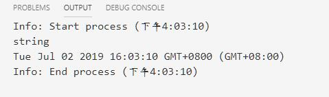
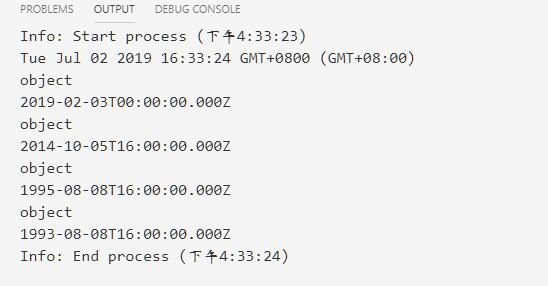

# Math与Date

## Math

是一个内置对象，它具有数学常数和函数的属性和方法。不是一个函数对象。  
与其它全局对象不同的是, Math 不是一个构造器.  Math 的所有属性和方法都是静态的. 你用到的常数pi可以用 Math.PI 表示,用 x 作参数 Math.sin(x)调用sin函数. JavaScript中的常数, 是以全精度的实数定义的.

### 属性

|属性|描述|
|:--------|:---------|
Math.E|欧拉常数，也是自然对数的底数, 约等于 2.718.
Math.LN2|2的自然对数, 约等于0.693.
Math.LN10|10的自然对数, 约等于 2.303.
Math.LOG2E|以2为底E的对数, 约等于 1.443.
Math.Log10E|以10为底E的对数, 约等于 0.434.
Math.PI|圆周率，一个圆的周长和直径之比，约等于 3.14159.
Math.SQRT1_2|1/2的平方根, 约等于 0.707.
Math.SQRT2|2的平方根,约等于 1.414.

### 方法

|方法|描述|
|:---------|:------------|
Math.abs(x)|返回x的绝对值
Math.cos(x)|返回x的余弦值
Math.cosh(x)|返回x的双曲余弦值.
Math.acos(x)|返回x的反余弦值
Math.acosh(x)|返回x的反双曲余弦值.
Math.sin(x)|返回正弦值.
Math.sinh(x)|返回x的双曲正弦值
Math.asin(x)|返回x的反正弦值
Math.asinh(x)|返回x的反双曲正弦值.
Math.atan(x)|以介于 -PI/2 与 PI/2 弧度之间的数值来返回 x 的反正切值.
Math.atanh(x)|返回 x 的反双曲正切值.
Math.atan2(y,x)|返回 y/x 的反正切值.
Math.cbrt(x)|返回x的立方根.
Math.ceil(x)|返回x向上取整后的值.
Math.clz32(x)|返回一个32位整数的前导零的数量。
Math.exp(x)|返回 Ex, 当x为参数,  E 是欧拉常数 (2.718...), 自然对数的底.
Math.expm1(x)|返回 exp(x)-1 的值.
Math.floor(x)|返回小于x的最大整数。
Math.fround(x)|返回数字的最接近的单精度浮点型表示。
Math.hypot([value1[,value2, ...]]) |函数返回它的所有参数的平方和的平方根.
Math.imul(x)|返回32位整数乘法的结果。
Math.log(x)|返回一个数的自然对数（loge， 即ln）。
Math.log1p(x)|返回 1 加上一个数字的的自然对数（loge， 即ln）。
Math.log10(x)|返回以10为底数的x的对数。
Math.log2(x)|返回以2为底数的x的对数。
Math.max(value1[,value2, ...]) |函数返回一组数中的最大值。
Math.min([value1[,value2, ...]]) |返回零个或更多个数值的最小值。
Math.pow(x,y)|返回x的y次幂.
Math.random()|返回0到1之间的伪随机数.
Math.round(x)|返回四舍五入后的整数
Math.sign(x)|返回x的符号函数, 判定x是正数,负数还是0.
Math.sqrt(x)|返回x的平方根.
Math.tan(x)|返回x的正切值.
Math.tanh(x)|返回x的双曲正切值.
Math.toSource()|返回字符串 "Math".
Math.trunc(x)|返回x的整数部分,去除小数.

## Date日期对象

* JavaScript没有日期数据类型。但是你可以在你的程序里使用 Date 对象和其方法来处理日期和时间。
* JavaScript 处理日期数据类似于Java。这两种语言有许多一样的处理日期的方法，也都是以1970年1月1日00:00:00以来的毫秒数来储存数据类型的。
* Date 对象的范围是相对距离 UTC 1970年1月1日 的前后 100,000,000 天。
* 不使用new关键字来调用Date(),会返回当前时间的字符串

````js
dt = Date()
console.log(typeof dt)
console.log(dt)
````

  

* 语法

````js
new Date();
new Date(value);
new Date(dateString);
new Date(year, monthIndex [, day [, hours [, minutes [, seconds [, milliseconds]]]]]);
````

* `var dt = new Date([paramenters])`中的paramenters的可能：
    1. 无参数：创建今天的日期和时间，例如：`dt = new Date()`
    2. 符合以下格式的表示日期字符串：
        * "月 日,年 时:分:秒"
            1. 例如：`dt = new Date("December 25, 1995 13:30:00")`如果时，分，秒没有设置默认为0；
        * new Date(年，月，日)-->`dt = Date(1995,11,25)`
        * new Date(年，月，日，时，分，秒)-->`dt = Date(2019,6,12,9,30,0)`

* 简单示例

````js
let dt = Date()
console.log(dt)

let dt1 = new Date("2019-02-03");
console.log(typeof dt1);
console.log(dt1);

let dt2 = new Date("10 06 2014");
console.log(typeof dt2);
console.log(dt2);

let dt3 = new Date("Aug 9, 1995")
console.log(typeof dt3);
console.log(dt3);

let dt4 = new Date("Wed, 09 Aug 1993 00:00:00");
console.log(typeof dt4);
console.log(dt4);
````

  

### Date对象的属性和方法

* 属性
    1. Date.prototype 属性表示Date构造函数的原型。Date对象添加属性。
    2. Date.length
* 方法
    1. Date.now() 返回自 1970-1-1 00:00:00  UTC（世界标准时间）至今所经过的毫秒数
    2. Date.parse() 解析一个表示日期的字符串，并返回从 1970-1-1 00:00:00 所经过的毫秒数。
    3. Date.UTC() 接受和构造函数最长形式的参数相同的参数（从2到7），并返回从 1970-01-01 00:00:00 UTC 开始所经过的毫秒数。

* Date.prototype中的get类方法
|方法|意义|
|:---------|:-----------|
Date.prototype.getDate()|根据本地时间返回指定日期对象的月份中的第几天（1-31）。
Date.prototype.getDay()|根据本地时间返回指定日期对象的星期中的第几天（0-6）。
Date.prototype.getFullYear()|根据本地时间返回指定日期对象的年份（四位数年份时返回四位数字）。
Date.prototype.getHours()|根据本地时间返回指定日期对象的小时（0-23）。
Date.prototype.getMilliseconds()|根据本地时间返回指定日期对象的毫秒（0-999）。
Date.prototype.getMinutes()|根据本地时间返回指定日期对象的分钟（0-59）。
Date.prototype.getMonth()|根据本地时间返回指定日期对象的月份（0-11）。
Date.prototype.getSeconds()|根据本地时间返回指定日期对象的秒数（0-59）。
Date.prototype.getTime()|返回从1970-1-1 00:00:00 UTC（协调世界时）到该日期经过的毫秒数，对于1970-1-1 00:00:00 UTC之前的时间返回负值。
Date.prototype.getTimezoneOffset()|返回当前时区的时区偏移。
Date.prototype.getUTCDate()|根据世界时返回特定日期对象一个月的第几天（1-31）.
Date.prototype.getUTCDay()|根据世界时返回特定日期对象一个星期的第几天（0-6）
Date.prototype.getUTCFullYear()|根据世界时返回特定日期对象所在的年份（4位数）.
Date.prototype.getUTCHours()|根据世界时返回特定日期对象当前的小时（0-23）
Date.prototype.getUTCMilliseconds()|根据世界时返回特定日期对象的毫秒数（0-999）.
Date.prototype.getUTCMinutes()|根据世界时返回特定日期对象的分钟数（0-59）.
Date.prototype.getUTCMonth()|根据世界时返回特定日期对象的月份（0-11）.
Date.prototype.getUTCSeconds()|根据世界时返回特定日期对象的秒数（0-59）.
Date.prototype.getYear()|根据特定日期返回年份 (通常 2-3 位数). 使用 getFullYear() .

* Date.prototype中的set类方法

|方法|意义|
|:------------|:-------------|
Date.prototype.setDate()|根据本地时间为指定的日期对象设置月份中的第几天。
Date.prototype.setFullYear()|根据本地时间为指定日期对象设置完整年份（四位数年份是四个数字）。
Date.prototype.setHours()|根据本地时间为指定日期对象设置小时数。
Date.prototype.setMilliseconds()|根据本地时间为指定日期对象设置毫秒数。
Date.prototype.setMinutes()|根据本地时间为指定日期对象设置分钟数。
Date.prototype.setMonth()|根据本地时间为指定日期对象设置月份。
Date.prototype.setSeconds()|根据本地时间为指定日期对象设置秒数。
Date.prototype.setTime()|通过指定从 1970-1-1 00:00:00 UTC 开始经过的毫秒数来设置日期对象的时间，对于早于 1970-1-1 00:00:00 UTC的时间可使用负值。
Date.prototype.setUTCDate()|根据世界时设置 Date 对象中月份的一天 (1 ~ 31)。
Date.prototype.setUTCFullYear()|根据世界时设置 Date 对象中的年份（四位数字）。
Date.prototype.setUTCHours()|根据世界时设置 Date 对象中的小时 (0 ~ 23)。
Date.prototype.setUTCMilliseconds()|根据世界时设置 Date 对象中的毫秒 (0 ~ 999)。
Date.prototype.setUTCMinutes()|根据世界时设置 Date 对象中的分钟 (0 ~ 59)。
Date.prototype.setUTCMonth()|根据世界时设置 Date 对象中的月份 (0 ~ 11)。
Date.prototype.setUTCSeconds()|根据世界时设置 Date 对象中的秒钟 (0 ~ 59)。
Date.prototype.setYear()|setYear() 方法用于设置年份。请使用 setFullYear() 方法代替。

* Date.prototype中的其他方法

|方法|意义|
|:------------|:----------|
Date.prototype.toDateString()|以人类易读（human-readable）的形式返回该日期对象日期部分的字符串。
Date.prototype.toISOString()|把一个日期转换为符合 ISO 8601 扩展格式的字符串。
Date.prototype.toJSON()|使用 toISOString() 返回一个表示该日期的字符串。为了在 JSON.stringify() 方法中使用。
Date.prototype.toGMTString() |返回一个基于 GMT (UT) 时区的字符串来表示该日期。请使用 toUTCString() 方法代替。
Date.prototype.toLocaleDateString()|返回一个表示该日期对象日期部分的字符串，该字符串格式与系统设置的地区关联（locality sensitive）。
Date.prototype.toLocaleFormat() |使用格式字符串将日期转换为字符串。
Date.prototype.toLocaleString()|返回一个表示该日期对象的字符串，该字符串与系统设置的地区关联（locality sensitive）。覆盖了 Object.prototype.toLocaleString() 方法。
Date.prototype.toLocaleTimeString()|返回一个表示该日期对象时间部分的字符串，该字符串格式与系统设置的地区关联（locality sensitive）。
Date.prototype.toSource()|返回一个与Date等价的原始字符串对象，你可以使用这个值去生成一个新的对象。重写了 Object.prototype.toSource() 这个方法。
Date.prototype.toString()|返回一个表示该日期对象的字符串。覆盖了Object.prototype.toString() 方法。
Date.prototype.toTimeString()|以人类易读格式返回日期对象时间部分的字符串。
Date.prototype.toUTCString()|把一个日期对象转换为一个以UTC时区计时的字符串。
Date.prototype.valueOf()|返回一个日期对象的原始值。覆盖了 Object.prototype.valueOf() 方法。
