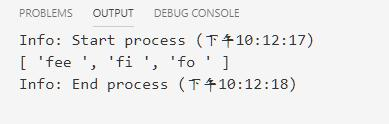

# RegExp正则表达式

## 创建一个正则表达式

* 语法
    1. `/pattern/flags`-->`/表达式/模式`
    2. `new RegExp(pattern [, flags])`-->`new RegExp(表达式，模式)`

````js
// 第一种方法
const reggex = /ab+c/; //使用两斜杠创建正则表达式
const reggex2 = /ab+c/gi; //使用两斜杠加模式创建正则表达式
const regex = /^[a-zA-Z]+[0-9]*\W?_$/gi;
//第二种方法
let regex = new RegExp("ab+c") //使用
let regex2 = new RegExp("ab+c","gi")
let regex = new RegExp("^[a-zA-Z]+[0-9]*\\W?_$", "gi");
````

### 正则表达式的常用方法

|方法|描述|
|:---------|:-------------|
exec|RegExp对象的方法。查询匹配结果。它返回一个数组(未匹配则返回null)。
test|RegExp对象的犯法。是否能匹配RegExp正则表达式。能匹配返回true否则返回false
match|String对象的方法，查找匹配结果，返回一个数组。如果未匹配到返回null。
search|String对象的方法，返回匹配到的位置索引，或者在失败时返回-1。
replace|String对象方法，使用替换的字符串，替换掉匹配的字符。
split|String对象的方法，使用正则表达式切割字符串。

* 使用exec方法匹配查找示例：

````js
var myRe = /d(b+)d/g;
var myArray = myRe.exec("cdbcdladbdaaddz");
console.log(myRe)
console.log(myArray)

var myArray = /d(b+)d/g.exec("cdbcdladbdaaddz");
console.log(myArray)

var myRe = new RegExp("d(b+)d","g");
var myArray = myRe.exec("cdbcdladbdaaddz");
console.log(myArray)
console.log(myRe)
console.log(myRe.lastIndex)
console.log(myRe.source)
````


* 上例中正则表达式执行的返回信息
    1. myArray结果对象：
        * `'dbd', 'b'`：匹配到的字符串和所有被记住的子字符串。
        * index:第一个被匹配到的字符串的索引位置。
        * input:初始字符串，被匹配的字符串
        * groups:分组信息
    2. myRe对象：
        * lastIndex:下一个匹配的索引值。
        * source:模式文本。即匹配时使用的正则表达式文本。

### 正则表达式的**标志flags**

* 正则表达式有四个可选参数进行全局和不分大小写搜索。这些参数既可以单独使用也可以一起使用在任何顺序和包含正则表达式的部分中。

|标志|描述|
|:--------|:--------------|
g|全局索引
i|不区分大小写搜索。
m|多行搜索。
y|执行"粘性"搜索，匹配从目标字符串的当前位置开始，可以使用y标志。

* 示例一使用g模式

````js
var re = /\w+\s/g;
// var re = new RegExp("\\w+\\s", "g");
var str = "fee fi fo fum";
var myArray = str.match(re);
console.log(myArray);
````




