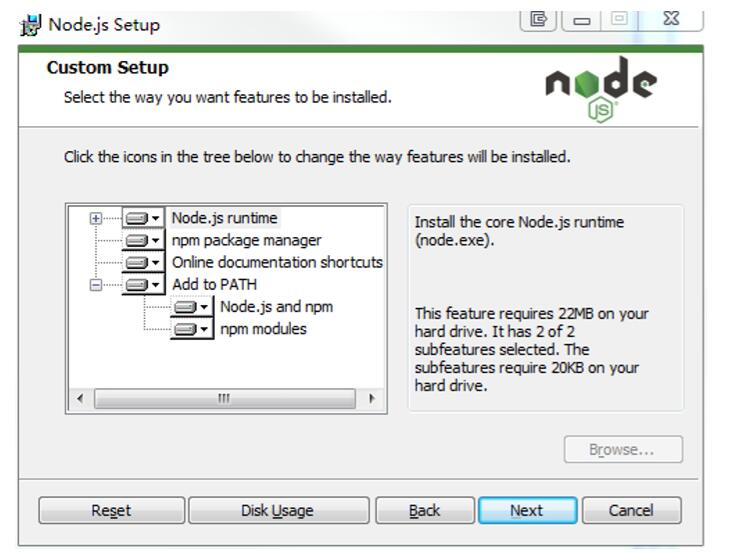
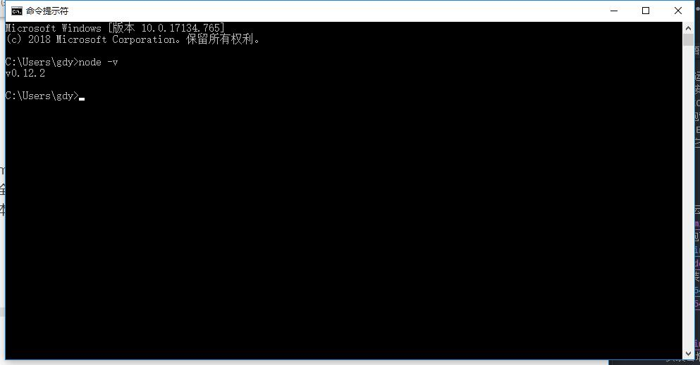
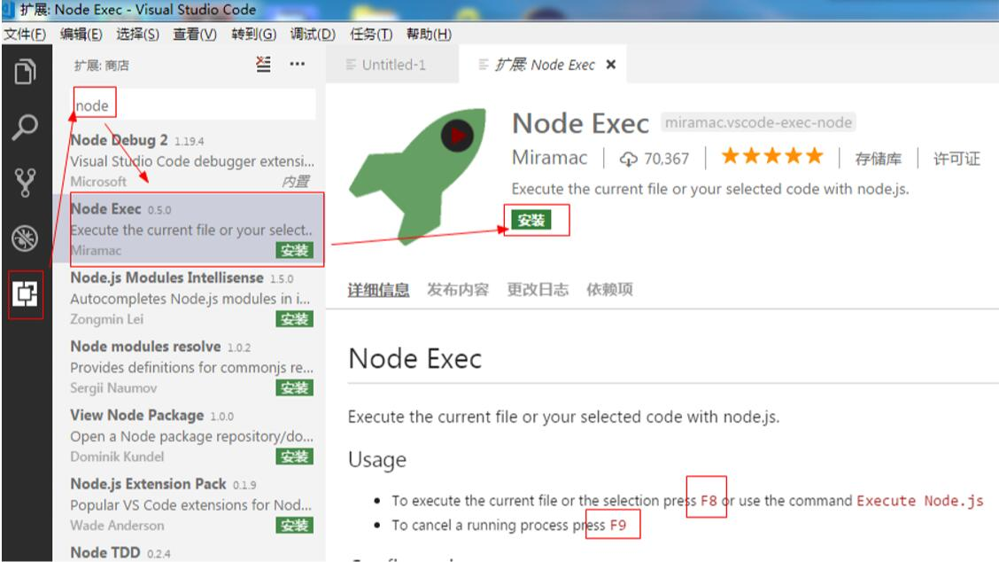
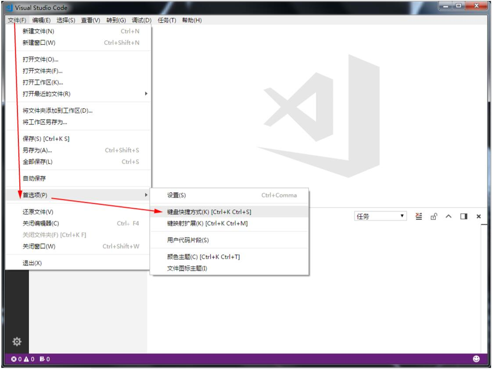
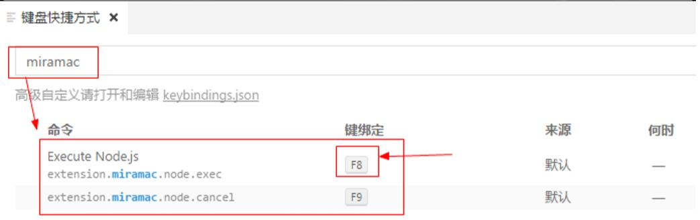

# 开发环境准备

## Nodejs

Nodejs是服务器端运行JavaScript的开源、跨平台运行环境。  
Nodejs原始作者瑞安·达尔（Ryan Dahl），于2009年发布，使用了V8引擎，并采用事件驱动、非阻塞、异步IO模型。  
2010年，npm软件包管理器诞生，通过它，可以方便的发布、分享Nodejs的库和源代码。  
Nodejs 4.0引入了ES6语言特性。  
我们学习JS，就让它跑在最新版的Nodejs上，为了调试方便，也为了使用最新的ES2017特性。  

## 安装环境

* 国内可以去阿里云镜像站[https://npm.taobao.org/mirrors/node](https://npm.taobao.org/mirrors/node)
* Linux版本安装包下载[https://npm.taobao.org/mirrors/node/latest-v10.x/node-v10.16.0-linux-x64.tar.xz](https://npm.taobao.org/mirrors/node/latest-v10.x/node-v10.16.0-linux-x64.tar.xz)
* windows版本安装包下载[https://npm.taobao.org/mirrors/node/latest-v10.x/node-v10.16.0-x64.msi](https://npm.taobao.org/mirrors/node/latest-v10.x/node-v10.16.0-x64.msi)  
* 10.16.x是LTS

  
    1. msi安装会增加path路径  
    2. 全局安装目录 `C:\Program Files\nodejs\`
    3.  本用户目录 `C:\Users\Administrator\AppData\Roaming\npm`

* 查看当前安装的版本`node -v`
  

## 开发

* **文档**
    1. 搜索MDN，Mozilla Developer Network，提供非常完善HTML、CSS、JS等的技术资料。
        * [https://developer.mozilla.org/zh-CN/docs/Web/JavaScript](https://developer.mozilla.org/zh-CN/docs/Web/JavaScript) 
        * 指南[https://developer.mozilla.org/zh-CN/docs/Web/JavaScript/Guide](https://developer.mozilla.org/zh-CN/docs/Web/JavaScript/Guide)非常好的JS文档  
    2. 使用任何一种文本编辑器，都可以开发JS，此次使用微软的Visual Studio Code开发。
* **Visual Studio Code**
    1. 下载[https://code.visualstudio.com/Download](https://code.visualstudio.com/Download)支持windows、mac、Linux等平台
    2. 新版VS Code Windows版分为System 和 User两个版本，当前用户使用安装User版即可。  
    3. 有代码自动完成功能，还可以安装Node exec插件，将写的js跑在nodejs上。  
      
    4. Node Exec插件快捷键：**F8运行js脚本，F9停止**
    5. 前端开发中，JS脚本一般来说是为了控制浏览器的网页的，这里使用了VSCode，只是为了开发调试方便  
    6. **解决快捷键冲突**
        * F8和某些软件冲突，无法使用，例如某些词典软件。  
        * 可以通过调整VSCode的快捷键设置。当然可以修改其他软件的快捷键。
          
          

