# 数据类型与运算符

## 注释

和C、Java一样  

* **单行注释**`//`
* **多行注释**`/* 注释 */`,也可以用在语句中。

````javascript
str = 'hello' + /* comment */ 'xdd'
console.log(str)
````

## 常量和变量

1. **标识符**：
    * 标识符必须是字母、下划线、美元符号$和数字，但必须是字母、下划线、美元符号开头，依然是不能数字开头。
    * 标识符**区分大小写**
2. **变量的声明**
    * var 声明一个变量 `var a = 1`。注意：var会做声明提升(即，可以先使用变量，后声明)(var会把变量提升到当前全局或函数作用域。)。
    * let 声明一个快作用域中的局部变量 `let a = 1`
    * const 声明一个常量 `const name = '张三'` **注意：常量必须声明时就赋值。(因为常量不可修改)**
        1. 如果明确知道一个标识符定义后不再修改，应该尽量声明成const常量，减少被修改的风险，减少Bug。  
    * **注意：**，JS中的变量声明和初始化时可以分开的

    ````javascript
    var a; //只声明，a变量，a为undefined
    let b;
    console.log(1,a,b,typeof(a),typeof(b))

    a = 1;
    b = "a string";
    console.log(2,a,b,typeof(a),typeof(b))

    a = "2345";
    b = 2.45;
    console.log(3,a,b,typeof(a),typeof(b))

    // const c //错误，不能这样写
    const c = 100
    // c = c + 1 #不行，const定义的是常量，会报错
    console.log(4,c)
    // c = 200 //不可修改
    ````

    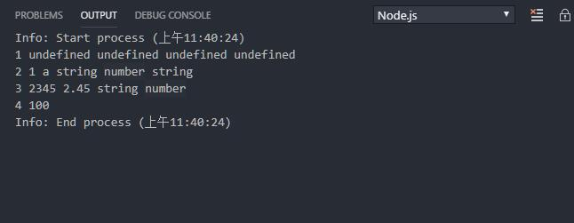  
3. **变量的声明规范**

    ````javascript
    var y //只是声明，y值为undefined
    var x = 5 //规范的声明并初始化，声明全局或局部变量
    z = 6 //不规范的初始化，不推荐。在严格模式下会产生异常。在赋值之前不能引用，因为它没有声明。一旦这样赋值就是全局作用域。
    ````

    ````javascript
    function hello()
    {
        var a //只是声明，a为undefined，作用域的函数中
        a = 100
    }
    console.log(a) //未声明变量a,异常
    ````

## 数据类型

|序号|名称|说明|示例|
|:---|:----|:---|:----|
1|number|数值型，包括整形和浮点型|`let a = 10`
2|boolean|布尔型，true和false|`let a = true`
3|string|字符串|`let a = 'abc'`
4|null|只有一个值null|`let a = null`
5|undefined|变量声明未赋值的；对象未定义的属性|`let a`
6|symbol|ES6新引入类型|
7|object类型|是以上基本类型的复合类型，是容器|`let = {a:1,b:2}`
不是基本数据类型|Array|数组，用于在单一引用中存储多个值的结构。|`let a = [1,2,3,'a','b']`

* ES是动态语言，弱类型语言。
* 虽然先声明了变量，但是变量可以重新赋值任何类型。

````javascript
// 类型转换
// 弱类型
console.log("=========string============")
console.log(a = 3 + "xdd",typeof(a)) //3xdd string
console.log(a = null + 'xdd',typeof(a)) //nullxdd string
console.log(a = undefined + 'xdd',typeof(a)) //undefinedxdd string
console.log(a = true + 'xdd',typeof(a)) //truexdd string

// 数字
console.log("========number========")
console.log(a = null + 8,typeof(a)) //8 number
console.log(a = undefined + 8,typeof(a)) //NaN number //undefined 没法转换成对应的数字
console.log(a = true + 8,typeof(a)) //9 number
console.log(a = false + 8,typeof(a)) //8 number

// boolean
console.log('=======bool=============')
console.log(a = null + true,typeof(a)) //1 number
console.log(a = null + false,typeof(a)) //0 number
console.log(a = undefined + true,typeof(a)) //NaN number
console.log(a = undefined + false,typeof(a)) //NaN number
console.log(a = null & true,typeof(a)) //0 number
console.log(a = undefined & true,typeof(a)) //0 number
console.log(a = null | true,typeof(a)) //1 number
console.log(a = undefined | true,typeof(a)) //1 number

//短路
console.log('===========短路================')
console.log(a = null && true,typeof(a)) //null object // 逻辑运算符，null 直接就是false短路 
console.log(a = false && null,typeof(a))  //false boolean // 逻辑运算符，false短路返回false 
console.log(a = false && 'xdd',typeof(a)) //false boolean // boolean 
console.log(a = true && 'xdd',typeof(a)) // 字符串
console.log(a = true && '',typeof(a)) // 字符串

// null
console.log('======null========')
console.log(a = null + undefined,typeof(a)) //NaN number
````

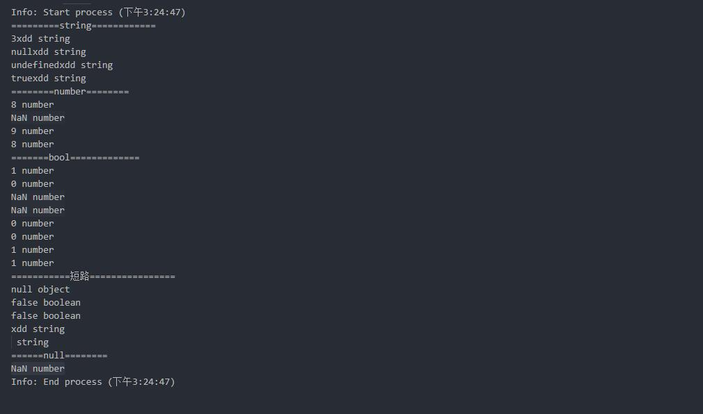  

* 弱类型，不需要强制类型转换，会隐式类型转换。  
* NaN，即Not a Number，转换数字失败。它和任何值都不等，和自己也不等，只能使用Number.isNaN(NaN)  

* **总结**
    1. 遇到字符串，加号就是拼接字符串，所有非字符串隐式转换为字符串。  
    2. 如果没有字符串，加号把其他所有类型都当数字处理，非数字类型隐式转换为数字。undefined特殊，因为它都没有定义值，所以转换数字失败得到一个特殊值NaN。  
    3. 如果运算符是逻辑运算符，短路符，返回就是短路时的类型。没有隐式转换。  
    4. 除非你十分明确，否则不要依赖隐式转换。写代码的时候，往往为了程序的健壮，请显式转换。

## 运算符

### 1.一元运算符

* 一元运算符只有一个操作数。

|符号|意义|示例|
|:----|:-----|:----|
`delete`|用来删除对象的属性|`delete a.x`
`void`|表示表达式放弃返回值|
`typeof`|运算符用来判断给定对象的类型|`typeof('ab')`
`+`|一元加运算符，将操作转换为Number类型|
`-`|一元减运算符，将操作转换为Number类型并取反|
`~`|按位取反，按位非运算符
`!`|逻辑非运算符
`++`|单目运算符,直接在自身内存所在位置增加1，效率极高
`--`|单目运算符，直接在自身内存所在位置减少1，效率极高

简单示例：  

1. **一元加法示例**

    ````javascript
    a = +'a'
    console.log(a) //NaN
    a = +false
    console.log(a) //0
    a = +true
    console.log(a) //1
    a = +undefined
    console.log(a) //NaN
    a = +NaN
    console.log(a) //NaN
    a = +[]
    console.log(a) //0
    a = +{}
    console.log(a) // NaN
    ````

    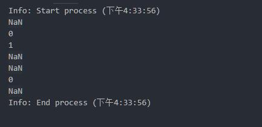  
2. **一元减法示例**

    ````javascript
    a = -'a'
    console.log(a) //NaN
    a = -false
    console.log(a) //-0
    a = -true
    console.log(a) //-1
    a = -undefined
    console.log(a) //NaN
    a = -NaN
    console.log(a) //NaN
    a = -[]
    console.log(a) //-0
    a = -{}
    console.log(a) // NaN
    ````

    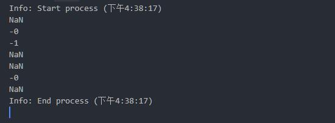  
3. 单目`++`,`--`示例
    * 单目运算符优先级高于双目运算符  
    * 加号+是双目运算符，两边的表达式必须先计算好

    ````js
    let i =0;
    let a = i++;
    console.log(a,i); //0,1
    console.log(a,i++); //0,1
    a = ++i;
    console.log(a,++i); //3,4
    ````

    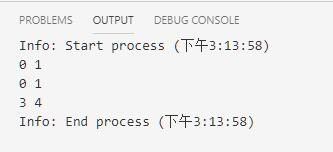  

    ````js
    i = 0;
    let a = ++i+i+++i+++i; //等价于(++i) + (i++) + (i++) + i
    console.log(a) //1 + 1 + 2 + 3
    ````

    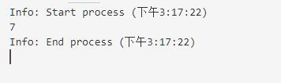  

### 2.算术运算符

* 算术运算符以二个数值(字面量或变量)作为操作数，并返回单个数值。

|符号|意义|
|:-------|:---------|
`+`|加法运算符
`-`|减法运算符
`/`|除法运算符
`*`|乘法运算符
`%`|取模运算符

### 3.关系运算符

* 比较运算符比较二个操作数并返回基于比较结果的`Boolean`值

|符号|意义|
|:--------|:----------|
`in`|判断对象是否拥有给定属性
`instanceof`|判断一个对象是否是另一个对象的实例
`<`|小于运算符
`>`|大于运算符
`<=`|小于等于运算符
`>=`|大于等于运算符。<br/>注意`=>`不是运算符，而是**箭头函数**的表示符

### 4.相等运算符

* 如果相等，操作符返回的是Boolean(布尔)类型的true,否则返回false。

|符号|意义|
|:------|:-------|
`==`|相等运算符
`!=`|不等运算符
`===`|全等运算符
`!==`|非全等运算符

````js
//宽松比较
console.log(300 == '300') // true
console.log('300' == '300')  //true

//严格比较 ===
console.log(300 === '300')  //false
console.log('300' === '300')  //true
````

* 使用宽松比较的时候，尽可能确保比较的类型相同，否则会引起隐式转换，而且隐式转换的规则很复杂不好把控。  
* 如果不知道类型是否一致，但是就是要求一定要相等，那么请使用 === 和 !==  
* 建议比较的时候，一律使用 === 和 !== 。

### 5.位移运算符

* 在二进制的基础上对数字进行移动操作

|符号|意义|
|:----|:-----|
`<<`|按位**左移**运算符
`>>`|按位**右移**运算符
`>>>`|按位无符号右移运算符。

### 6.二进制位运算符

* 二进制运算符将它们的操作数作为32个进制位(0或1)的集合，并返回标准的JavaScript数值。

|符号|意义|
|:---------|:-----------|
`&`|二进制位与(AND)
`|`|二进制位或（OR）
`^`|二进制位异或。按位取反(XOR)

### 7.二元逻辑运算符

* 逻辑运算符典型的用法是用于boolean(逻辑)值运算，它们返回boolean值
* 这些运算符和其他高级语言都一样，支持**短路**。

|符号|意义|
|:------|:----------|
`&&`|逻辑与
`||`|逻辑或

### 8.条件(三元)运算符

* `(condition ? ifTrue :ifFalse)`条件运算运算符把两个结果中其中一个符合逻辑的值返回。
* 语法：`条件表达式?真值:假值`
* 简单示例

````javascript
a = 10
b = a>11? 5:19 //如果a>11等于True则返回5，否则返回19
console.log(b)
````

### 9.赋值运算符

* 赋值运算符会将右边的操作数的值分配给左边的操作数，并将其值修改为右边操作数相等的值。
* **将符号右边的结果赋值给左边的元素**

|符号|意义|示例
|:-----|:-----|:-----|
`=`|赋值运算符|
`*=`|赋值乘积。|`a *= b`等价于`a = a*b`
`/=`|赋值商|`a /= b`等价于`a = a/b`
`%=`|赋值求余|`a %= b`等价于`a = a%b`
`+=`|赋值求和|`a += b`等价于`a = a+b`
`-=`|赋值求差|`a -= b`等价于`a = a-b`
`<<=`|左位移|`a <<= b`等价于`a = a<<b`
`>>=`|右位移|`a >>= b`等价于`a = a>>b`
`>>>=`|无符号右位移|`a >>>=`等价于`a = a>>>b`
`&=`|赋值与|`a &= b`等价于`a = a&b`
`^=`|赋值按位异或|`a ^= b`等价于`a = a^b`
`|=`|赋值或|`a |= b`等价于`a = a|b`

### 10.解构赋值

* 解构赋值，可以将属性或值从对象或数组中取出，赋值给其他变量。
* `[a,b] = [10,20]`

````javascript
var a,b,rest;
[a,b] = [10,20]
console.log(a,b) //10,20
var c,d,e;
e = [a+10,b+10];
[c,d] = e;
console.log(c,d); // 20,30
[c,d,...rest] = [1,2,3,4,5,6,7,8];
console.log(c,d,rest);
// [c,...rest,d,f] = [0,1,2,4,5,6,7,8]; //错误，可变参数必须在最后
[c,d] = [6,5,4,3,2,1]
console.log(c,d) //6,5
console.log();
[,,c,d,,] = [1,2,3,4,5,6];
console.log(c,d) // 3,4
````

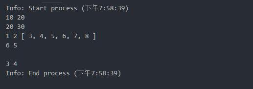  

* **解构时的默认值**
    1. 为了防止从数组中取出一个值为nudefined的对象，可以在表达式左边的数组中为任意对象域设默认值

    ````javascript
    var a,b;
    [a=5,b=7] = [1];
    console.log(a); //1
    console.log(b); //7
    ````

    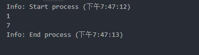  

* **变量交换**
    1. 在一个解构表达式中可以交换两个变量的值。

    ````javascript
    var a =5;
    var b = 10;

    [a,b] = [b,a];
    console.log(a,b) // 10,5
    ````

    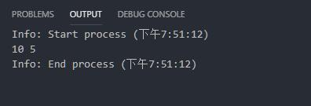  

* **对象解构**
    1. 对象解构中，需要解构的变量名必须和对象名相同

    ````javascript
    let o = {p:42,q:true};
    var {a,b} = o;
    console.log(a,b);// undefined,undefined
    var {p,q} = o;
    console.log(p,q); // 42,true
    console.log();

    o = {e:2,f:3};
    ({e,f} = o);
    console.log(e,f) //2,3

    var {e:d,d:h=10,f:j} = o;
    console.log(d,h,j); //2,10,3

    o = {a:1,b:2,c:3,d:4,e:5};
    var {a,c,...rest} = o;
    console.log(a,b,rest); //1 undefined { b: 2, d: 4, e: 5 } #不能跳过
    ({a,b,...rest} = o);
    console.log(a,b,rest); //1 2 { c: 3, d: 4, e: 5 }
    ````

    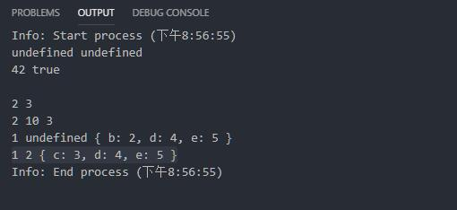  

* **对象属性计算名和解构**

    ````javascript
    // let key = "z";
    var key;
    let { [key]: foo } = { z: "bar" };
    console.log(key,foo); //undefined,undefined
    key = 'z';
    ({ [key] : foo } = { z: "bar" });
    console.log(key,foo); // 'z',"bar"
    ````

    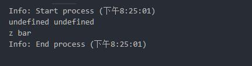  

* **函数传参时的结构**
    1. 解决默认传参问题

    ````javascript
    function drawES2015Chart({size = 'big', cords = { x: 0, y: 0 }, radius = 25} = {})
    {
    console.log(size, cords, radius);
    // do some chart drawing
    }

    drawES2015Chart({
    cords: { x: 18, y: 30 },
    radius: 30
    });
    ````

    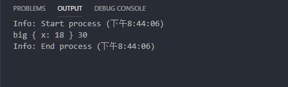  
* **结构嵌套对象和数组**

    ````javascript
    const metadata = {
    title: 'Scratchpad',
    translations: [
        {
        locale: 'de',
        localization_tags: [],
        last_edit: '2014-04-14T08:43:37',
        url: '/de/docs/Tools/Scratchpad',
        title: 'JavaScript-Umgebung'
        }
    ],
    url: '/en-US/docs/Tools/Scratchpad'
    };

    let {
    title: englishTitle, // rename
    translations: [
        {
        title: localeTitle, // rename
        },
    ],
    } = metadata;

    console.log(englishTitle); // "Scratchpad"
    console.log(localeTitle);  // "JavaScript-Umgebung"
    ````

    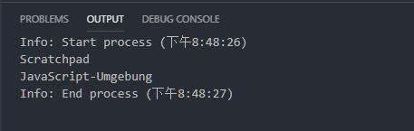  

* **For of迭代和解构**

    ````javascript
    var people = [
    {
        name: 'Mike Smith',
        family: {
        mother: 'Jane Smith',
        father: 'Harry Smith',
        sister: 'Samantha Smith'
        },
        age: 35
    },
    {
        name: 'Tom Jones',
        family: {
        mother: 'Norah Jones',
        father: 'Richard Jones',
        brother: 'Howard Jones'
        },
        age: 25
    }
    ];

    for (var {name: n, family: {father: f}} of people) {
    console.log('Name: ' + n + ', Father: ' + f);
    }

    // "Name: Mike Smith, Father: Harry Smith"
    // "Name: Tom Jones, Father: Richard Jones"
    ````

    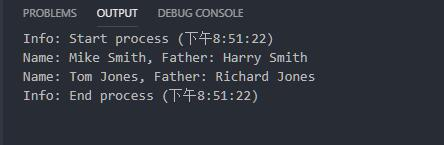  

### 11.逗号操作符

* `,`逗号操作符允许在一个判断状态中有多个表达式去进行运算并且最后返回最后一个表达式的值。
* 一行可以进行多个运算

````JavaScript
let a= 4+5,b=true,c=a>20?'t':'f';
console.log(a); //9
console.log(b); // true
console.log(c); // f

function text(){
    return 3,a+b,c = a++
}
console.log()
console.log(text())  //9
console.log(c) //9
console.log(a) //10
````

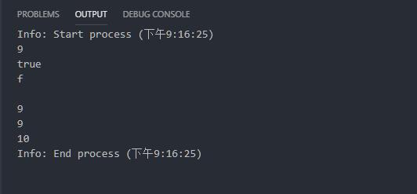  

### 其他

|名称|说明|
|:-----------|:---------------|
instanceof|判断是否属于指定类型
typeof|返回类型字符串
delete|delete操作符，删除一个对象(an object)或者一个对象的属性(an object's property)或者一个数组中某一个键值(an element at s specified Index in an array)
in|如果指定的属性在对象内，则返回true

````js
console.log('a' instanceof String) //false #原来使用的类型是string,旧类型和新类型不兼容
console.log(1 instanceof Number) //false #因为原来使用的类型是number，旧类型和新类型不兼容

a = new String('b')
console.log(a instanceof String) //true
console.log(new Number(1) instanceof Number) //true
console.log(a instanceof Object) //true

console.log(typeof('a')) //string
console.log(typeof 'a') //string
console.log(typeof a) //object
````

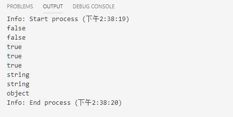  

* instanceof 要求必须明确使用类型定义变量，就是对象必须是new关键字声明创建的。它可以用于继承关系的判 断。  
* typeof就是返回对象的类型字符串。
* delete 删除对象、属性、数组元素

## 运算符的优先级

* 运算符优先级，由高到低，顺序如下：  
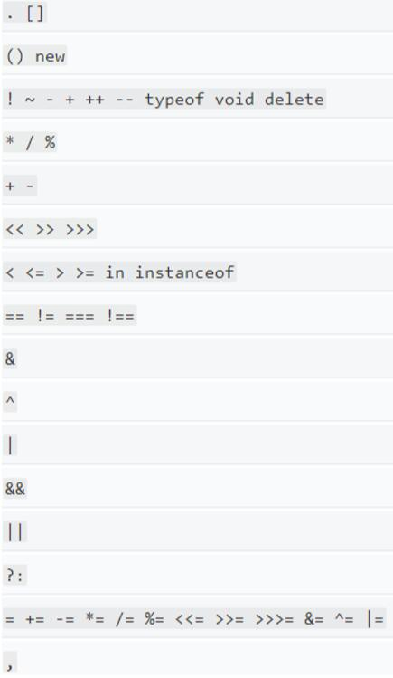  

## 表达式的值

* 在javascript中表达式是有自己的值的。表达式的值。就像逗号操作符一样，如果函数赴安徽一个逗号表达式，会返回最后一次计算的表达式的值。

````javascript
a = 1+5 //a = 5
function add(){
    let x = 0
    return x+=1 //注意这表达的值是x+1,即x+=1==>x = x+1,返回的是表达式的值，即x+1计算的值
}

add() //1

function xdd(){
    let x=0
    return x++ //返回0,后做x++
}

function xdd(){
    let x = 0
    return ++x //返回1，先做++x
}

function xdd(){
    let x = 0
    let y = 2
    return x,y,x+y,x-y; //会返回x-y的值即-2
}
````
