# 函数作用域和异常处理

## 函数

* 语法：

    ````js
    function 函数名(参数列表){
        函数体；
        return 返回值;
    }
    ````

* 示例：

    ````js
    function add(x,y){
        return x+y;
    }

    console.log(add(3,4)); // 7
    ````

## 函数表达式

* 使用表达式来定义函数，表达式中的函数名可以省略，如果这个函数名不省略，也只能用在此函数内部。

````js
// 匿名函数
const add = function (x,y) {
    return x+y;
};
console.log(add(4,6));

//有名字的函数表达式
const sum = function _sum(x){
    if (x === 1) return x;
    return x+_sum(--x); //_sum只能内部使用
};
console.log(sub(5));
````

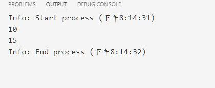  

## 函数、匿名函数、函数表达式的差异

* 函数和匿名函数，本质上都是一样的，都是函数对象，只不过函数有自己的标识符--函数名，匿名函数需要借助其他的标识符。
* 区别在于，函数会**声明提升**，函数表达式不会。

````js
console.log(add(4,5));
//函数
function add (x,y){ //add会做声明提升，所有上面的add可以调用
    return x+y;
}

// console.log(sub(5,6));//sub未定义
// 有名字的函数表达式
var sub = function (x,y){
    return x-y;
};
console.log(sub(5,3))
````

## 高阶函数

* 高阶函数：**函数作为参数或返回值是一个函数的函数**

1. **完成一个计数器counter**

    ````js
    const counter = function(n=0){
        let c = n;
        return function(){
            return ++c;
        }
    }

    const c = counter()
    console.log(c())
    console.log(c())
    console.log(c())
    ````  

    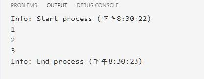  

    * 生成器版本计数器

    ````js
    const counter = function * (n=0){
        let c = n;
        while (1){
            yield c++ //只能使用c++,不支持++c
        }
    }

    c = counter(3)
    console.log(c.next());
    console.log(c.next().value);
    console.log(c.next().value);
    console.log(c.next().value);
    ````

    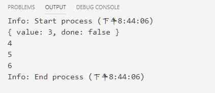  

2. **练习：完成一个map函数：可以对某一个数组的元素镜像某种处理**

    ````js
    const map = function(arr,fn){
        let newarr = [];
        for (let i of arr){
            newarr.push(fn(i));
        };
        return newarr;
    }

    arr = [1,2,3,4,5]
    console.log(map(arr,function(x){return x++})) //[ 1, 2, 3, 4, 5 ]
    console.log("- ".repeat(20))
    console.log(map(arr,function(x){return --x})) //[ 0, 1, 2, 3, 4 ]
    console.log("- ".repeat(20))
    console.log(map(arr,function(x){return x+1})) //[ 2, 3, 4, 5, 6 ]
    console.log("- ".repeat(20))
    console.log(map(arr,function(x){return x+=1})) //[ 2, 3, 4, 5, 6 ]
    ````

    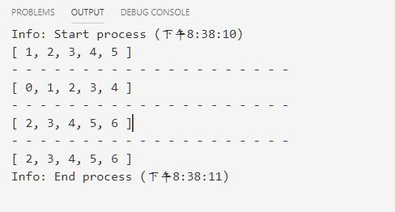  

## 箭头函数

* 箭头函数就是匿名函数,它是一种更加精简的格式。
* **箭头函数的参数**：
    1. 如果一个函数没有参数，使用()
    2. 如果只有一个参数，参数列表可以省略小括号()
    3. 多个参数不能省略小括号，且使用逗号间隔
* **箭头函数的返回值**
    1. 如果函数体部分有多行，就需要使用(),如果有返回值使用return。
    2. 如果只有一行语句，可以同时省略大括号和return.
    3. 只要有return语句，就不能省略大括号。`console.log(map([1,2,3,4],x => {return ++x}))`,有return必须有大括号。
    4. 如果只有一条非return语句，加上大括号，函数就成了无返回值了，例如`console.log(map([1,2,3,4],x => {x*2}));`加上了大括号，它不等价于`x => {return x*2}`。
    5. 箭头函数不支持生成器

1. 使用箭头函数完成上面的map函数的调用

````js
const map = (arr,fn) => {
    let newarr = [];
    for (let i of arr){
        newarr.push(fn(i));
    };
    return newarr;
}

arr = [1,2,3,4,5]
console.log(map(arr,x => x++)) //[ 1, 2, 3, 4, 5 ]
console.log("- ".repeat(20))
console.log(map(arr,(x) => {return --x})) //[ 0, 1, 2, 3, 4 ]
console.log("- ".repeat(20))
console.log(map(arr,x => x+1)) //[ 2, 3, 4, 5, 6 ]
console.log("- ".repeat(20))
console.log(map(arr,x => x+=1 )) //[ 2, 3, 4, 5, 6 ]
````

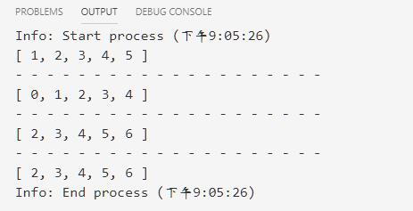  

## 函数参数

### 普通参数

* 一个参数占一个位置，支持默认参数
* **注意**：
    1. js中没有Python中的关键字传参。
    2. js只是做参数位置的对应
    3. js并不限制默认参数的位置

1. 示例

    ````js
    const add = (x,y) => x+y;
    console.log(add(4,5));  //9

    //缺省值
    const add1 = (x,y=5) => x + y;
    console.log(add1(4,7));  //11
    console.log(add1(4));  //9
    ````

    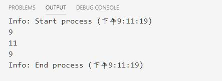  

2. 示例

    ````js
    const add2 = (x=6,y) => x+y;
    console.log(add2())
    console.log(add2(1))
    console.log(add2(y=2,z=3)) //可以第一个参数的值是y=2这个表达式的值，也就是等号右边的值，即2.同理Z=3表达式的值是3，等价于add2(2,3)
    ````

    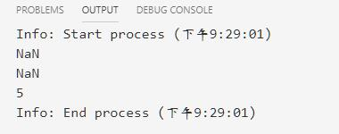  

* add2()相当于add(6,undefined)
* add2(1)相当于add(1,undefined)
* add2(y=2,z=3)相当于add2(2,3)。
    1. 因为js没有关键字传参，而表达式由表达式的值
    2. 第一个参数的值是y=2这个表达式的值，也就是等号右边的值，即2。
    3. 同理z=3表达式的值是3。

### 可变参数(rest parameters剩余参数)  

* js使用...表示可变参数(python用*收集多个参数)

````js
const sum = function(...args){
    let result = 0;
    console.log(args) //会将参数收集成一个数组
    for (let x in args){
        result += args[x]
    }
    return result
}
console.log(sum(3,6,9))
````

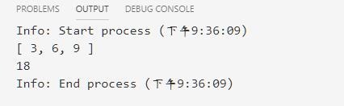  

* **arguments对象**
    1. 函数的所有参数会被保存在一个arguments的键值对对象中。
    2. ES6之前，arguments是唯一可变参数的实现。
    3. ES6开始，不推荐，建议使用可变参数。为了兼容而保留。

````js
(function(x,...args){
    console.log(args);//苏州
    console.log(x);
    console.log("- ".repeat(20));
    console.log(typeof arguments);
    console.log(arguments);//不是传入的值
    for (let x of arguments) // 该对象可以使用of遍历
    {
        console.log(x);
    }
})(...[1,2,3,4,5])
````  

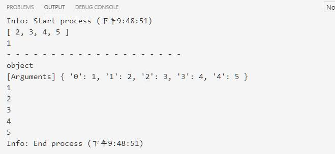  

* **注意**：使用箭头函数，取到的arguments不是我们想要的

````js
((x,...args) => {
    console.log(args);//苏州
    console.log(x);
    console.log(arguments);//不是传入的值
})(...[1,2,3,4,5])
````

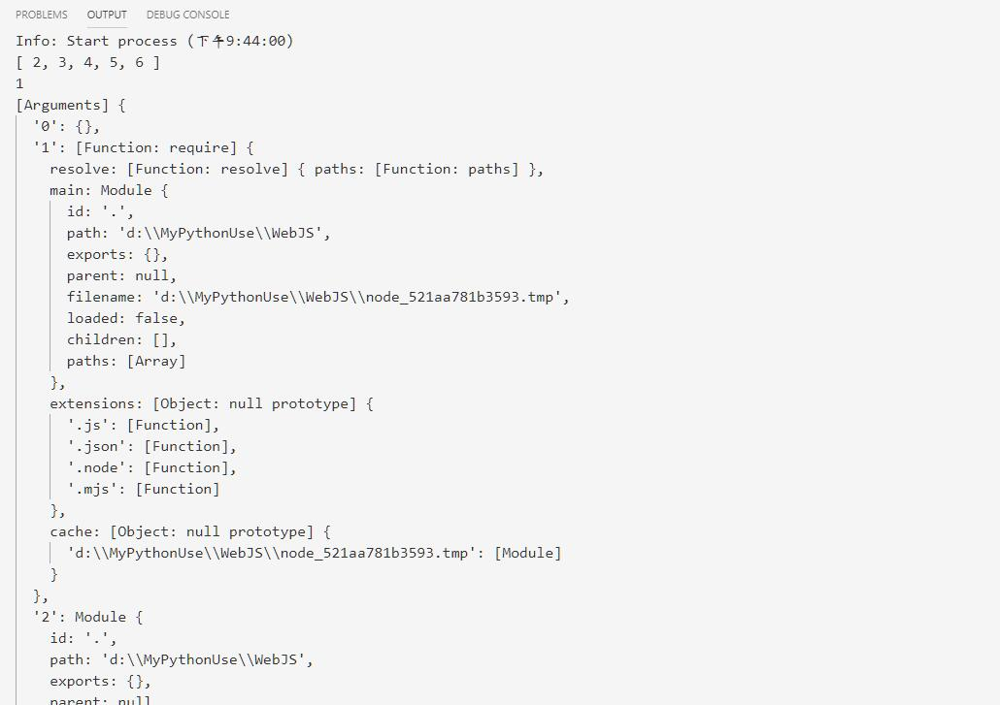  

## 参数解构

* 和Python类似，js提供了参数解构，依然使用了...符号来解构

````js
const add = (x,y) => {console.log(x,y);return x+y;};
console.log(add(...[100,200]));
console.log('- '.repeat(20));

console.log(add(...[100,200,300,3,5,3]));
console.log('- '.repeat(20));

console.log(add(...[100]));
console.log('- '.repeat(20));
````

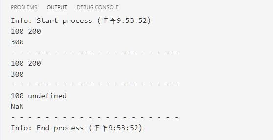  

## 函数的返回值

* python中使用`return 1,2`返回值，本质上会封装成一个元组返回。
* js中使用`return 1,2`返回值，是将`1,2`看做是逗号表达式，而表达式在js中是有自己的值。即`1,2`表达式中的值取决于最后一个逗号后面的表达式的值，即2

1. **表达式的值**
    * 类C的语言，都有一个概念----表达式的值，java,js
    * 赋值表达式的值：等号右边的值。
    * 逗号表达式的值：类c语言，都支持逗号表达式，逗号表达式的值，就是最后一个表达式的值。

````js
a = (x=5,y=6,true);
console.log(a);

b = (123,true,z='test');
console.log(b);

function c(){
    return x=5,y=6,true,'ok';
}
console.log(c())
````

* 所以，js的函数返回值依然是单值

  

## 函数的作用域

* function是函数的定义，是一个独立的作用域，其中定义的变量在函数外不可见。
    1. `var a = 100`可以提升声明，也可以突破非函数的块作用域。
    2. `a = 100`隐试声明不能提升声明，在"严格模式"下会出错，但是可以把变量隐试声明未全局变量。建议少用。
    3. `let a = 100`不能提升声明，而且不能突破任何的块作用域。推荐使用。

````js

````


