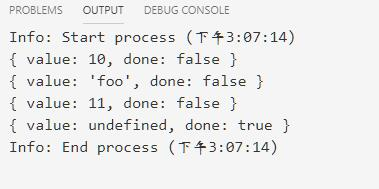
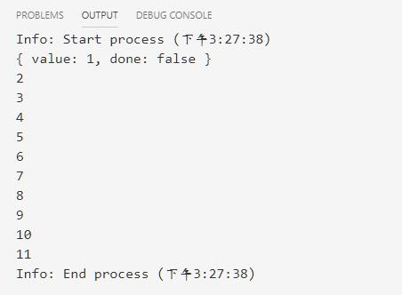
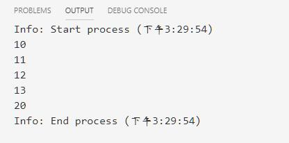

# 生成器函数(generator function)

* 注意：**数组推导式**和**生成器推导式**建议都不要使用。都是非标准语法。
* 可以使用**生成器函数(generator function)**
* 语法：  

> function* 函数名(参数){函数体}

1. 生成器函数在执行时能暂停，后面又能从暂停出继续执行。
    * 使用yield关键字可以暂停函数
2. 调用一个生成器函数，会得到生成器的**迭代器**对象。
    * 使用next()方法。被首次（后续）调用时，其内的语句会执行到第一个（后续）出现yield的位置为止，yield 后紧跟迭代器要返回的值。
    * yield*（多了个星号），则表示将执行权移交给另一个生成器函数（当前生成器暂停执行）。
    * next()-> {value:value1,done:true|false}
        1. value:表示本次返回的值，即yield表达式返回的值
        2. done：表示生成器后续是否还有`yield`语句,即生成器函数是否已经执行完毕并返回。
    * 注意：next()方法时，如果传入了参数，那么这个参数会作为**上一条直线的yield语句的返回值**

````js
function * gen(){
    yield 10;
    y = yield 'foo';
    yield y;
}

var gen_obj = gen();
console.log(gen_obj.next()); // 10
console.log(gen_obj.next());
console.log(gen_obj.next(11));
console.log(gen_obj.next());
````

  

1. 示例：计数器生成器版本

    ````js
    const num = function*(n=0){
        while (true){
            if(n>=11) return n;
            yield ++n;
        }
    }()

    console.log(num.next())
    for(let i of num){
        console.log(i)
    }
    ````

      

2. yield*的示例

````js
function* anotherGenerator(i) {
  yield i + 1;
  yield i + 2;
  yield i + 3;
}

function* generator(i){
  yield i;
  yield* anotherGenerator(i);// 移交执行权
  yield i + 10;
}

var gen = generator(10);

console.log(gen.next().value); // 10
console.log(gen.next().value); // 11
console.log(gen.next().value); // 12
console.log(gen.next().value); // 13
console.log(gen.next().value); // 20
````

  


