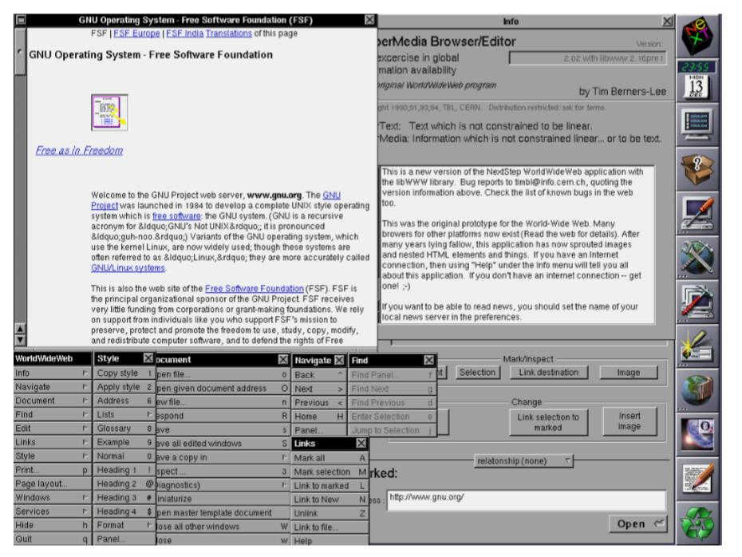
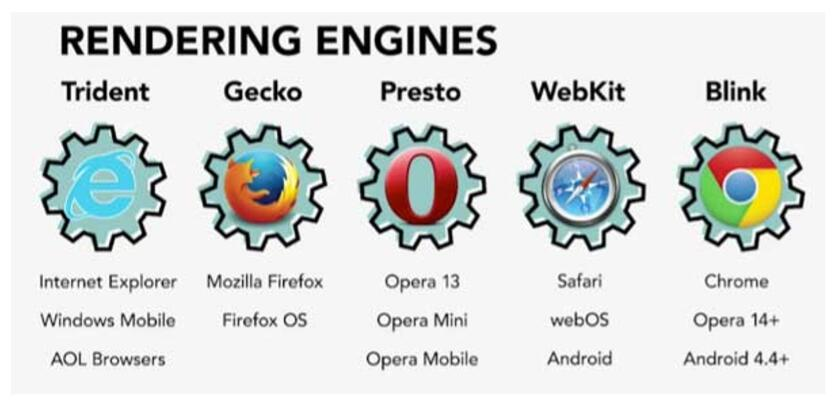

# 前端技术发展史

## HTML

HTML（HyperText Markup Language）超文本标记语言，它不同于编程语言。  
超文本就是超出纯文本的范畴，例如描述文本的颜色、大小、字体等信息，或使用图片、音频、视频等非文本内 容。  
HTML由一个个标签组成，这些标签各司其职。有的提供网页信息，有的负责图片，有的负责网页布局。  

````html
<!DOCTYPE html>
<html lang="en">
    <meta charset="UTF-8">
    <title>首页</title>
</head>
<body>
<h1>Hello word</h1>
</body>
</html>
````

超文本需要显示，就得有软件能够呈现超文本定义的排版格式，例如显示图片、表格，显示字体的大小、颜色，这 个软件就是浏览器。  
超文本的诞生是为了解决纯文本不能格式显示的问题，是为了好看，但是只有通过网络才能分享超文本的内容，所 以制定了HTTP协议。  

## 浏览器

* **历史**  

1980年代，Tim Berners-Lee为CERN（欧洲核子研究中心，当时欧洲最大的互联网节点）设计基于超文本思想的 ENQUIRE项目，以促进科研人员之间的信息共享和更新。1989年他编写了《信息化管理：建议》一文，并构建基 于Internet的Hypertext系统，并在CERN开发了World Wide Web项目，打造了世界上第一个网站，于1991年8月6 日正式上线。  
Tim Berners-Lee于1990年发明了第一个浏览器，还发明了HTTP协议。  
1994年MIT他创建了W3C。W3C万维网联盟，负责万维网持续发展。他提出W3C的标准应该基于无专利权、无版税。  

  

* Marc Andreessen于1993年发明了Mosaic浏览器，看到了这个技术的前景，不久后他成立自己的公司——网景 Netscape。1994发布了Netscape Navigator浏览器，席卷全球。
* 1995年微软发布IE，开启第一次浏览器大战，最终后来居上。
* 由于IE的捆绑销售行为，网景的单一浏览器市场萎缩，从1990年代的90%下降至2006年的1%。  
* 1999年网景被AOL收购，收购后不久，Netscape公开了浏览器代码，并创建了Mozilla组织。Mozilla组织使用 Gecko引擎重写浏览器。  
* Mozilla组织使用Gecko引擎发布了几款浏览器，最终于2004年更名为Firefox浏览器。  
* 2003年5月，网景被解散。 
* AOL于2007年12月宣布停止支持Netscape浏览器。  
* Apple的Safari于2003发布第一个测试版。  
* 2008年Google的Chrome浏览器带着 V8 引擎横空出世。  

* **网景公司的技术：**
    1. HTTP Cookie，解决HTTP无状态  
    2. JavaScript  
    3. SSL协议
    4. JAR格式文件，将Java的class文件打包压缩，并加上签名
* 2012年4月9日，微软以10亿5千6百万美元购买800项美国在线的专利或专利授权，专家们认为网景的SSL、Cookie 等专利可能是微软愿意出高价的理由之一【摘自wiki百科】  

## 浏览器技术

浏览器是一种特殊的客户端，能够基于HTTP(s)、FTP等协议和WEB服务器进行交互，呈现网页内容的软件。 可以简单的认为浏览器软件分为2个部分：  

* 外壳
    1. 外壳提供用户交互的界面  
* 内核(引擎Engine)  
    1. 提供HTML、CSS、图像的渲染引擎，提供DOM编程接口  
    2. 提供JavaScript引擎  
        * 提供浏览器内建对象
  

|排版(渲染)引擎|浏览器|说明|
|:------------|:-------|:--------|
Gecko|Firefox|C++开发并最早开源，可以支持复杂的网页效果，提供强大的浏览器 扩展接口
Trident|IE、AOL|早期未按照W3C标准实现，兼容性很差，IE9之后内核升级以符合标准
KHTML| |KDE，于1998年开发
Presto|Opera|目前公认的网页浏览速度最快的内核，但牺牲一部分兼容性
WebKit|Safari、Chrome|WebKit基于KHTML开发。网页浏览速度较快，但网页容错性不高
Blink|Chrome、Opera|基于WebKit WebCore

* 其他国内浏览器，一般都是采用了以上的一个或两个内核加上外壳实现。

* **JS引擎**
    1. 不同浏览器内核中也使用不同的JS引擎，常见的JS引擎有JScript、TraceMonkey（Firefox）、V8等。  
    2. 这些引擎差异不小，实现ECMA标准不同，甚至有不按照标准实现的。  
    3. 使用jQuery等框架来解决兼容性问题，抹平平台差异。  

## JavaScript

1. **JS**
    * Javascript 简称JS，是一种动态的弱类型脚本解释性语言，和HTML、CSS并称三大WEB核心技术，得到了几乎主流 浏览器支持。
    * 1994年，网景Netscape公司成立并发布了Netscape Navigator浏览器，占据了很大的市场份额，网景意识到WEB 需要动态，需要一种技术来实现。
    * 1995年9月网景浏览器2发布测试版本发布了LiveScript，随即在12月的测试版就更名为JavaScript。同时期，微软 推出IE并支持JScript、VBScript，与之抗衡。  
    * 1997年，网景、微软、SUN、Borland公司和其他组织在ECMA确定了ECMAScript语言标准。JS就成为 ECMAScript标准的实现之一。  
2. **ES**
    * ES，ECMAScript是由ECMA国际（前身为欧洲计算机制造商协会,英文名称是European Computer Manufacturers Association）通过ECMA-262标准化的脚本程序设计语言。该语言被广泛的应用于互联网。  
    * JavaScript是商品名，目前商标权在Oracle公司手中。ES是标准名。  
    * 根据ES标准，有很多实现引擎，其中包括JavaScript、JScript等，它们都是ECMA-262标准的实现和扩展。
    * HTML、CSS、JS技术都在发展，标准版本很多。浏览器内嵌的引擎实现不太一致，甚至有不按照标准实现，或减少 实现，或改变实现，或增加功能的实现，比如IE，这就导致了开发人员负担，很难做到一套代码可以兼容地跑在多 种浏览器中，甚至都不能跑在同一种浏览器的不同版本中。

* 1997年，制定首个版本ECMA-262。  
* 1999年12月，ES 3，支持更强大的正则表达式等。  
* ES4太激进，最终放弃。  
* 2009年，ES5发布，得到广泛支持。支持严格模式，支持Json。  
* 2015年，ES6发布，引入非常多的新的语言特性，还兼容旧版本特性。ES6之前按照版本号命名，从ES6开始使用 年份作为版本号，ES6即ECMAScript 2015。
* JavaScript 的标准是 ECMAScript 。截至 2012 年，所有的现代浏览器都完整的支持  ECMAScript 5.1，旧式 的浏览器至少支持 ECMAScript 3 标准。2015年6月17日，ECMA国际组织发布了 ECMAScript 的第六版，该 版本正式名称为 ECMAScript 2015，但通常被称为 ECMAScript 6 或者 ES6。自此，ECMAScript 每年发布一 次新标准。本文档目前覆盖了最新 ECMAScript 的草案，也就是 ECMAScript2019。【摘自MDN】

## V8引擎

就在浏览器市场一家独大的时候，Firefox、chrome异军突起。  
2008年9月2日，Google的chrome浏览器发布，一并发布的Js引擎，就是V8引擎。V8使用BSD协议开源。  
V8引擎使用 C++ 开发，将JavaScript编译成了机器码，而不是字节码，还用很多优化方法提高性能，因此，V8引擎 速度非常快。  
V8引擎还可以独立运行，可以嵌入到其他任何C++程序中。  
V8引擎的诞生，使得服务器端运行JS成为了可能且方便的事情。
2009年，基于V8引擎，诞生了Nodejs，这是服务器端运行JS的运行环境。  

## CSS(Cascading Style Sheets)层叠样式表

* HTML本身为了格式化显示文本，但是当网页呈现大家面前的时候，需求HTML提供更多样式能力。这使得HTML变 得越来越臃肿。这促使了CSS的诞生。  
* 1994年，W3C成立，CSS设计小组所有成员加入W3C，并努力研发CSS的标准，微软最终加入。  
* 1996年12月发布CSS 1.0。  
* 1998年5月发布CSS 2.0。  
* CSS 3采用了模块化思想，每个模块都在CSS 2基础上分别增强功能。所以，这些模块是陆续发布的。
* 不同厂家的浏览器使用的引擎，对CSS的支持不一样，导致网页布局、样式在不同浏览器不一样。因此，想要保证 不同用户使用不同浏览器看到的网页效果一直非常困难。  

## 动态网页技术

* JS的引入使得浏览器可以显示动态的效果，但这不是动态网页。  
* 发明WEB技术的初衷是为了分享文档，而这些内容是静态的，就是写好的不变的文件。通过URL定位到这些文档， 将内容下载到浏览器上，由浏览器呈现。
* 互联网发展，网民的需求增加，大家希望提供交互式访问。用户提交需求，服务端找到需求匹配的资源并发回浏览 器端显示。这就是动态网页。  
* 动态网页指的是网页的内容是动态的，URL不变，里面的内容变化。例如访问一个查询页面，提交的关键字不同， 下面表格的内容变化。
* 动态网页，表现的是浏览器端内容的变化，而本质上它是一种服务端动态网页技术server-side dynamic web page。  
* 最早诞生的动态网页技术有ASP、JSP、PHP等，后来几乎所有流行的高级语言都提供了开发动态网页的能力。  

## 网页布局

* 早期的网页只需要简单的显示标题、正文、图片，使用 <P> 标签分段。  
* 后来有人大量使用表格标签，可以做到很好的内容布局，也出现结构化的布局方案。但随着页面内容的堆积，出现 了成百上千个表格嵌套的情况，浏览器绘制很慢。  
* 后来出现了Div + CSS布局风格，舍弃了表格布局，加上JavaScript，使得前后端开发分离，而且可以做到很好的自 适应布局。例如流式瀑布一样的布局。  

## 同步和异步

1. **同步**
    * 早期，网页就是一页页的文本，没什么图片、样式。后来，互联网时代到来，网页内容越来越多，页面文件越来越大。浏览器渲染HTML，需要先下载CSS加载，为的是准备渲染网页。之后，下载网页内容，并逐步渲染。还要构建 DOM树，加载JS脚本并执行，JS可能需要修改DOM，网页就要重新渲染。如果JS放在网页HEAD中，还需要等待JS下载并加载。
    * 图片使用 `` 标签，是发起新的HTTP请求，如果图片返回，需要重新绘制网页。好不容易，一张网页绘制完毕。这里面发起了很多的HTTP请求。
    * 交互式网页，用户提交了请求，就是想看到查询的结果。服务器响应到来后是一个全新的页面内容，哪怕URL不 变，整个网页都需要重新渲染。例如，用户填写注册信息，只是2次密码不一致，提交后，整个注册页面重新刷 新，所有填写项目重新填写（当然有办法让用户减少重填）。这种交互非常不友好。  
    * 从代价的角度看，就是为了注册的一点点信息，结果返回了整个网页内容，不但浪费了网络带宽，还需要浏览器重 新渲染网页，太浪费资源了，影响了用户体验和感受。
    * 上面这些请求的过程，就是同步过程，用户发起请求，页面整个刷新，直到服务器端响应的数据到来并重新渲染。  
2. **异步**
    * 1996年微软实现了iframe标签，可以在一个网页使用iframe标签局部异步加载内容。  
    * 1999年微软推出异步数据传输的ActiveX插件技术，太笨重了，但是也火了很多年。有一个组件XMLHttpRequest 被大多数浏览器支持。
    * AJAX即“Asynchronous Javascript And XML”（异步JavaScript和XML），使用XMLHttpRequest组件，结合JS，数 据格式采用XML（可扩展标记语言），将这三者结合，实现网页的异步请求。AJAX是一种技术的组合，技术的重新 发现，而不是发明，但是它深远的影响了整个WEB开发。
    * 2005，google在Gmail和地图中应用Ajax，使它大受欢迎并推广开来。  
    * 有了异步请求，就可以动态的从浏览器发起请求到服务器端，服务器端返回响应的数据封装成XML（JSON）返回 给浏览器，浏览器只需要使用JS把内容加入到DOM中，局部渲染就可以了。这个过程中，整个网页不用重新刷新， 只需要局部动态改变即可。  

## 前端开发

* 早期前端开发使用网页三剑客：Dreamweaver、Firework、Flash。微软的有Frontpage。不管使用什么工具，都不能改变JS兼容、CSS兼容、浏览器版本兼容问题，非常头疼。
* 2006年 jQuery库诞生，出现了JS框架，抹平了平台差异。基于它产生了众多的插件，前端开发终于轻松了些。  
* 2008年 V8引擎伴随着Chrome浏览器发布。  
* 2009年 ES5标准发布。  
* 2009年 Nodejs发布，服务器端也可以使用JavaScript了。  
* 2009年 AngularJS诞生，之后被谷歌收购。  
* 2010年 Backbone.js诞生。  
* 2011年 React和ember诞生，React于2013年5月开源。  
* 2014年 国人 尤雨溪 的Vue.js诞生。  
* 2014年 HTML5标准发布。

* 前端工具和框架越来越多，前端开发已经不是随便使用一个什么文本编辑器就可以完成的了。如果使用框架，需要 很多工具的配合，配置好一个开发环境非常重要。

## 硬件发展

* 最初，网页就是简单的文本，计算机轻松胜任。后来，网页对多媒体的支持，动态效果的支持，都需要使用大量的CPU、内存资源，甚至是显卡的渲染能力。 所以，个人PC需要不断升级，否则浏览网页很困难。
* 移动互联网到来的早期，手机看的网页，都需要单独处理。手机屏幕小、CPU弱、内存小，能看的网页纯文本加小图。这样产生的流量也小，2G时代谈不上网速。
* 2007年第一代IPhone诞生，2008年安卓手机诞生，3G的移动互联网时代到来了。
* 手机硬件水平不断提升，手机的开发平台可以让众多开发者开发APP，用户可以下载安装使用这些APP。  
* 对于开发者来说，开发就是个问题了，是不是需要开发一套IPhone版本、再开发一套安卓，在开发一套网页的版 本呢？  
* 2013年，中国开始进入4G时代。手机硬件水平也得到了很大的提升。  
* 众多平台都在思考是否能够一套架构，解决所有前端问题。使用的还是最通用的技术网页+JS。
* 如今的前端开发已经不是以前的几个js文件、几百行代码了。为了适应需求，新框架、新编程模式不断涌现，这些 工具都大大方便了协作开发，同时解决平台兼容性问题。
