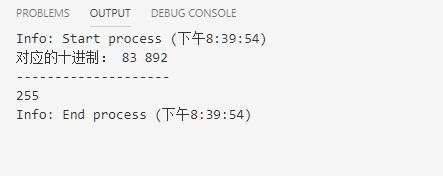
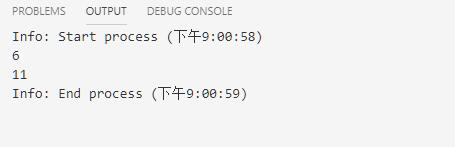
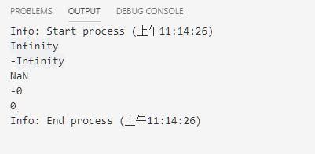
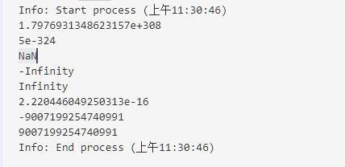

# string与number

## string字符串

* 将一个值使用`'`单引号或者`"`双引号，引用起来就是字符串。
* **ES6提供了反引号**定义一个字符串，可以支持多行，还支持插值。  

````JavaScrip
let a = 'abc';
let b = '135';
let c = `line
    line2
 line3
 `; //支持多行

 console.log(a);
 console.log(b);
 console.log(c);

 // 字符串插值，要求在反引号字符串中，python3.6支持
 let name = "tom",age = 19;
 console.log(`Hi,my name is ${name} am ${age}`);
````

  

### 转义字符

|名称|说明|
|:---------|:------------|
`\0`|Null字节，空字节，ASCII的第一个字符
`\b`|退格符
`\f`|换页符
`\n`|换行符
`\r`|回车符
`\t`|Tab(制表符)
`\v`|垂直制表符
`\'`|单引号
`\"`|双引号
`\`|反斜杠字符
`\XXX`|由0到377最多三位八进制数XXX表示的Latin-1字符。例如，\251是版权符号的八进制序列
`\xXX`|由从00和FF的两位十六进制数XX表示的Latin-1字符。例如，\xA9是版权符号的十六进制序列
`\uXXXX`|由四位十六进制数字XXXX表示的Unicode字符。例如，\u00A9是版权符号的Unicode序列。
`\u{XXXXX}`|Unicode代码点(code point)转义字符。例如，\u{2F804}相当于Unicode转义字符\uD87E\uDC04的简写

````javascript
let a = 0123; //默认是8进制，因为是0开头
let b = 0892; //由于出现了非8进制数据，所以就变为10进制892
console.log("对应的十进制：",a,b); //输出会默认转换为10进制输出
console.log("-".repeat(20));
let c = 0xff; //十六进制
console.log(c)
````

  

### 字符串操作方法

* String对象方法
    1.String对象是对元素string类型的封装。可以在String对象上使用String对象的方法，也可以使用String字面值上使用String对象的任何方法(JavaScript自动吧String字面值转换为一个临时的String对象，然后调用其相应的方法，最后丢弃临时对象。在String字面值上也可以使用String。length属性)
    2. 除非必要, 应该尽量使用String字面值, 因为String对象的某些行为可能并不与直觉一致

    ````js
    var mystring = 'abc';
    var one = new String('abc')
    // mystring这种声明时旧版本的string类型，不是新版本的String对象。
    console.log(typeof(mystring),typeof(one)); // 'string',object
    console.log(mystring instanceof String,one instanceof String); //false,ture
    console.log(mystring.length,one.length)
    ````

      

|方法|描述|
|:---------|:-----------|
charAt,CharCodeAt,codePointAt|返回字符串指定位置的字符或者字符编码。
indexOf,lastIndexOf|返回字符串中指定子串的位置或最后位置。
startWith,endsWith,includes|返回字符串是否以指定字符串开始、结束或包含指定字符串。
concat|链接两个字符串并返回新的字符串
fromCharCode,fromCodePoint|从指定的Unicode值序列构造一个字符串。这是一个String类方法，不是实例方法。
split|通过将字符串分离成一个个子串来吧一个String对象分裂到一个字符串数组中。
slice|从一个字符串提取片段作为新字符串返回。和python中的切片类似，支持正负索引，和索引超界
substring,substr|分别通过指定起始和结束位置，起始位置和长度来返回字符串的指定子集。
match,replace,search|通过正则表达式来工作
toLowerCase,toUpperCase|分别返回字符串的小写表示和大写表示。
normalize|按照指定的一种Unicode正规形式将当前字符串正规化。
repeat|将字符串内容重复指定次数后返回。
trim|去掉字符串开头和结尾的空白字符。

* 常用方法
    1. str.charAt(index=0) #返回索引为index的字符。默认index的值为0，即返回字符串的第一个字符
    2. str.charCodeAt(index=0)|codePointAt(index=0) #返回索引为index的字符所对应的字符编码。
    3. str.split(separator[,limit]) #根据指定字符切割字符串。
        * separator #分割符。注意：如果空字符串("")被用作分隔符，则字符串会在每个字符之间分割
            1. 也可以是一个正则表达式
        * limit #一个整数，切割次数。
        * 返回值Array #返回源字符串以分隔符出现位置分隔而成的一个 Array
    4. str.slice(start,end) #截取字符串根据索引,[start,end)默认截取范围是[0,length),使用方法和python的切片类似，支持正负索引。
    5. str.substring(indexStart[,indexEnd]) #返回包含给定字符串的指定部分的新字符串，截取范围[indexStart,indexEnd)
        * indexStart #需要截取的第一个字符的索引，该字符作为返回的字符串的首字母。
        * indexEnd #可选。一个0到字符串长度之间的整数，以该数字为索引的字符不包含在截取的字符串内。
    6. str.substr(start[,Length]) #返回一个字符串中从指定位置开始到指定字符数的字符。截取范围[start,start+length]
        * start #开始提取字符的位置。如果为负值，则被看做strLength + start,其中strLength为字符串的长度(例如，如果 start 为 -3，则被看作 strLength + (-3))。
        * 可选，提取的字符数。
    7. str.match(regexp) #方法检索返回一个字符串匹配正则表达式的的结果。
        * regexp #一个正则表达式对象。如果传入一个非正则表达式对象，则会隐式地使用 new RegExp(obj) 将其转换为一个 RegExp 。如果你没有给出任何参数并直接使用match() 方法 ，你将会得到一 个包含空字符串的 Array ：[""] 。
        * 返回值
            1. 如果使用g标志，则将返回与完整正则表达式匹配的所有结果（Array），但不会返回捕获组，或者未匹配 null。
            2. 如果未使用g标志，则仅返回第一个完整匹配及其相关的捕获组（Array）。 在这种情况下，返回的项目将具有如下所述的其他属性，或者未匹配 null。
        * 附加属性(如上所述，匹配的结果包含如下所述的附加属性)
            1. groups:一个不厚组数组或undefined(如果没有定义命名捕获组)
            2. index:匹配的结果的开始位置
            3. input:搜索的字符串
        * 一个Array，其内容取决于global(g)标志的存在与否，如果未找到匹配则为null。

        1. 在下例中，使用 match 查找 "Chapter" 紧跟着 1 个或多个数值字符，再紧跟着一个小数点和数值字符 0 次或多次。正则表达式包含 i 标志，因此大小写会被忽略。

            ````js
            var str = 'For more information, see Chapter 3.4.5.1';
            var re = /see (chapter \d+(\.\d)*)/i;
            var found = str.match(re);

            console.log(found);

            // logs [ 'see Chapter 3.4.5.1',
            //        'Chapter 3.4.5.1',
            //        '.1',
            //        index: 22,
            //        input: 'For more information, see Chapter 3.4.5.1' ]

            // 'see Chapter 3.4.5.1' 是整个匹配。
            // 'Chapter 3.4.5.1' 被'(chapter \d+(\.\d)*)'捕获。
            // '.1' 是被'(\.\d)'捕获的最后一个值。
            // 'index' 属性(22) 是整个匹配从零开始的索引。
            // 'input' 属性是被解析的原始字符串。
            ````

        2. 下例展示了 match 使用 global 和 ignore case 标志。A-E、a-e 的所有字母将会作为一个数组的元素返回.

            ````js
            var str = 'ABCDEFGHIJKLMNOPQRSTUVWXYZabcdefghijklmnopqrstuvwxyz';
            var regexp = /[A-E]/gi;
            var matches_array = str.match(regexp);

            console.log(matches_array);
            // ['A', 'B', 'C', 'D', 'E', 'a', 'b', 'c', 'd', 'e']
            ````

    8. str.replace(regexp|substr, newSubStr|function) #替换指定字符。返回一个由替换值（replacement）替换一些或所有匹配的模式（pattern）后的新字符串。模式可以是一个字符串或者一个正则表达式，替换值可以是一个字符串或者一个每次匹配都要调用的回调函数。
        * regexp(pattern) # 一个RegExp 对象或者其字面量。该正则所匹配的内容会被第二个参数的返回值替换掉。
        * substr(pattern) #一个将被 newSubStr 替换的字符串。其被视为一整个字符串，而不是一个正则表达式。仅第一个匹配项会被替换。
        * newSubStr(replacement) #用于替换掉第一个参数在原字符串中的匹配部分的字符串。该字符串中可以内插一些特殊的变量名。参考下面的使用字符串作为参数。
        * function(replacement) #个用来创建新子字符串的函数，该函数的返回值将替换掉第一个参数匹配到的结果。参考下面的指定一个函数作为参数。
        * **返回值**：一个部分或全部匹配由替代模式所取代的新的字符串。

        1. 替换字符串可以插入下面的特殊变量名：

            |变量名|代表值|
            |:-------|:---------|
            |`$$`|插入一个`$`。
            |`$&`|插入匹配的子串
            |$`|插入当前匹配的子串左边的内容。
            |`$'`|插入当前匹配的子串右边的内容。
            |`$n`|假如第一个参数是RegExp对象，并且n是个小于100的非负整数，那么插入第n个括号匹配的字符串。<br/>提示：索引是从1开始。

        2. 指定一个函数作为参数
            * 可以指定一个函数作为第二个参数。在这种情况下，当匹配执行后，该函数就会执行。 函数的返回值作为替换字符串。 (注意：上面提到的特殊替换参数在这里不能被使用。) 另外要注意的是，如果第一个参数是正则表达式，并且其为全局匹配模式，那么这个方法将被多次调用，每次匹配都会被调用。
            * 该函数的参数有：

            |变量名|代表值|
            |:----------|:------------|
            |match|匹配的子串。(对应于上述的$&。)
            |p1,p2,...|假如replace()方法的第一个参数是一个RegExp对象，则代表第n个括号匹配的字符串。(对应于上述的$1,$2等。)例如，如果使用`/(\a+)(\b+)/`这个类匹配，p1就是匹配的`\a+`,p2就是匹配的`\b+`。
            |offset|匹配到的子字符串在原字符串中的偏移量。比如，如果原字符串是 'abcd'，匹配到的子字符串是 'bc'，那么这个参数将会是 1）
            |string|被匹配的原字符串。
            |NamedCaptureGroup|命名捕获组匹配的对象

        3. (精确的参数个数依赖于 replace() 的第一个参数是否是一个正则表达式（RegExp）对象，以及这个正则表达式中指定了多少个括号子串，如果这个正则表达式里使用了命名捕获， 还会添加一个命名捕获的对象)
        4. 示例：下面的例子将会使 newString 变成 `'abc - 12345 - #$*%'`：

        ````js
        function replacer(match, p1, p2, p3, offset, string) {
            // p1 is nondigits, p2 digits, and p3 non-alphanumerics
            return [p1, p2, p3].join(' - ');
        }
        var newString = 'abc12345#$*%'.replace(/([^\d]*)(\d*)([^\w]*)/, replacer);
        console.log(newString);  // abc - 12345 - #$*%
        ````

    9. str.search(regexp) #搜索匹配。执行正则表达式和 String 对象之间的一个搜索匹配。
        * regexp #一个正则表达式对象，如果传入一个非正则表达式对象obj，则会使用new RegExp(obj)隐试地将其转换为正则表达式对象。
        * **返回值**：如果匹配成功，则search()返回正则表达式在字符串首次匹配项的索引;否则，返回-1。
        1. 当你想要知道字符串中是否存在某个模式（pattern）时可使用 search()，类似于正则表达式的 test() 方法。当要了解更多匹配信息时，可使用 match()（但会更慢一些），该方法类似于正则表达式的 exec() 方法。

        ````js
        var str = "hey JudE";
        var re = /[A-Z]/g;
        var re2 = /[.]/g;
        console.log(str.search(re)); // returns 4, which is the index of the first capital letter "J"
        console.log(str.search(re2)); // returns -1 cannot find '.' dot punctuation
        ````

    10. str.toLowerCase() #返回一新的字符串，将字符串转换为小写。
    11. str.toUpperCase() #将字符串转换为大写，返回一个新的字符串。
    12. str.repeat(count) #将字符串连接count次后返回一个新的字符，类似于python中str*count
    13. str.trim() #删除字符串两端空白字符。返回一个新的字符串。

* 内建函数
    1. eval(string) #将string字符串当做可以执行的javascript代码来执行。

        ````js
        let conn = "function add(x,y){return x+y};console.log(add(3,3))";
        eval(conn); //将conn的内容当初javascript代码理解
        console.log(add(4,7));
        ````

          

## number数值型

* 在js中。数据均为双精度浮点型。范围只能在$-2^{53}-1$和$2^{53}-1$之间。整形也不例外。
* 数字类型有三种符号值：
    1. +Infinity(正无穷)
    2. -Insinity(负无穷)
    3. NaN(not-a-number非数字)。

    ````js
    console.log(1/0) //正无穷大 Infinity
    console.log(-1/0) //负无穷大 -Infinity
    console.log(1*'a') //非数字NaN
    console.log(-0)
    console.log(+0)
    ````

      
* 进制数表示方法
    1. 二进制`0b0010、0B110`
    2. 八进制`0755、0655`
        * 注意：`0855`,将被认为十进制，因为8不在八进制中。
        * 注意：ES6中最好实用`0o`前缀表示八进制。
    3. 十六进制`0xAA,0Xff`
    4. 指数表示
        * `1E3`-->$1*10^3$-->1000
        * `2e-2`-->$1*10^{-2}-->0.02
* **常量属性**

    |属性|描述|
    |:------|:------|
    Number.MAX_VALUE|可表示的最大值
    Number.MIN_VALUE|可表示的最小值
    Number.NaN|特指“非数字”
    Number.NEGATIVE_INFINITY|特指“负无穷”,在溢出时返回
    Number.POSITIVE_INFINITY|特指“正无穷”,在溢出时返回
    Number.EPSILON|表示1和比最接近1且大于1的最小Number之间的差别
    Number.MIN_SAFE_INTEGER|javascript最小安全整数
    Number.MAX_SAFE_INTEGER|JavaScript最大安全整数

    ````js
    console.log(Number.MAX_VALUE);
    console.log(Number.MIN_VALUE);
    console.log(Number.NaN);
    console.log(Number.NEGATIVE_INFINITY);
    console.log(Number.POSITIVE_INFINITY);
    console.log(Number.EPSILON);
    console.log(Number.MIN_SAFE_INTEGER);
    console.log(Number.MAX_SAFE_INTEGER);
    ````

      

* 常用方法

|方法|描述|
|:--------|:---------------|
|Number.parseFloat()|把字符串参数解析成浮点数<br/>全局方法parseFloat()作用一致，是同一个对象。
|Number.parsetInt()|把字符串解析成特定基数对应的整形数字，和全局方法parseInt()作用一致，是同一个对象。
|Number.isFinite()|判断传递的值是否为有限数字。
|Number.isInteger()|判断传递的值是否为整数
|Number.isNaN()|判断传递的值是否为`NaN`,和全局方法isNaN()是同一个对象。
|Number.isSafeInteger()|判断传递的值是否为安全整数。

* 数字类型原型上的一些方法

|方法|描述|
|:---------|:-----------|
|toExponetial()|返回一个数字的指定形式的字符串<br/>如：`1.23e+2`
|toFixed()|返回指定小数位数的表示形式，<br/>`var a=123,b=a.toFixed(2)//b="123.00"`
|toPrecision()|返回一个指定精度的数字。如下例子中,a=123中，3会由于精度限制失效<br/>`var a=123,b=a.toPrecision(2)//b='1.2e+2'`
