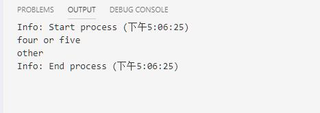

# 控制语句

@[toc]

## 语句块

* JS使用大括号构成语句块。  
* ES6 之前语句块是没有作用域的，从ES6开始支持块作用域 ，let只能在块作用域内可见

````js
function hello(){
    let a = 1;
    var b = 2;
    c = 3;
}

//let d = 100
if (1){
    let d = 4;
    var e = 5;
    f = 6;
    if (true){
        console.log(d);
        console.log(e);
        console.log(f);
        console.log("- ".repeat(10))
        g = 10
        var h = 11
    }
}

// console.log(a); //不可见
// console.log(b); // 不可见
// console.log(c); // 函数没执行，依然不可见

hello()
// console.log(a); //不可见
// console.log(b); // 不可见
console.log(c); // 3

console.log("- ".repeat(40));
// console.log(d) //块作用域使用let，不可见；但是块内的d可见
console.log(e) //块作用域使用var,可见
console.log(f) //块作用域隐式声明，可见
console.log(g) //可见
console.log(h) //可见
````

  

## 流程控制

### 条件分支

#### if条件分支

* 语法：  
    if (条件1){满足条件1执行}else if(条件2){满足条件2执行}else{都不满足条件，就执行}
* 条件false的等效值有：
    1. false
    2. undefined
    3. null
    4. 0
    5. NaN
    6. 空字符串""

````js
if (cond1){

}
else if (cond2){

}
else if (cond3){

}
else{

}
````

#### switch...case分支语句

* switch...case语句中，如果switch中的值会一个个匹配case中的值，如果匹配到，就进入对应case的语句块。如果然后穿透当前case下面的所有语句块。break会终止穿透。
* switch...case语句都可以写成多分支结构。

1. 语法

    ````js
    switch(expression){
        case label_1:
            statements_1
            [break;]
        case label_2:
            statements_2
            [break;]
        ...
        default:
            statements_def
            [break;]
    }
    ````

2. 这里最大的问题，就是穿透问题，一定要在case中恰当的使用break语句，否则就会继续顺序向下执行。

    ````js
    let x = 5

    switch (x){
        case 0:
            console.log('zero');
            break;
        case 1:
            console.log('one');
        case 2:
            console.log('two');
        case 3:
            console.log('three');
            break;
        case 5:
        case 4:
            console.log('four or five');
        default:
            console.log('other');
            //break;
    }
    ````

      

### 循环语句

#### for循环

1. **C风格for循环**
    * 语法

    ````js
    for ([initialExpression];[condition];[incrementExpression]){
        statement
    }
    ````

    * 示例

    ````js
    for (let i=0;i<5;i++){
        console.log(i)
    }
    console.log("----------------------------")

    for(var x=0,y=9;x<5;x++,y--){
        console.log(x,y)
    }
    console.log("------------------------------")

    for(let i=0;i<10;i+=3){//步长
        console.log(i)
    }
    ````

      

2. **for...in循环**
    * 语法

    ````js
    for (variable in object){
        statements
    }
    ````

    * for..in循环返回的是索引或者key，需要间接访问到值。  
    * 数组反正返回的是索引，C风格for循环操作可能方便点。根据个人喜好选择。  
    * 对象访问时for in合适

    * 示例

    ````js
    let arr = [10,20,30,40]
    console.log(arr);
    console.log(arr[1]);//20
    console.log("- ".repeat(30));

    for (let x in arr){
        console.log(x,arr[x]);
    }

    console.log(" -".repeat(20))
    //c风格
    for (let i=0;i<arr.length;i++){
        console.log(i,arr[i])
    }

    //对象
    let obj = {
        a:1,
        b:'xdd',
        c:true
    };

    console.log(obj);
    console.log(obj.b);
    console.log(" -".repeat(20))
    for (let key in obj){
        console.log(key,obj[key]) //属性名，属性值
    }
    ````  

      

3. **for...of循环**
    * ES6的新语法
    * 注意：for...of不能迭代一个普通对象。因为是，of后面必须是一个迭代器(TypeError: obj[Symbol.iterator] is not a function)
    * 可类比python中的for in,例如for x in []  

    ````js
    let arr = [1,2,3,4,5]
    let obj = {
        a:1,
        b:'xdd',
        c:true
    }

    for (let i of arr){ //返回数组的元素
        console.log(i)
    }

    // for (let i of obj){ //异常，不可迭代
    //     console.log(i)
    // }
    ````

      

### break、continue

* break 结束当前循环
* continue中断当前循环，直接进入下一次循环

### for迭代的差别

````js
function sum(arr){
    for (let x in arr){ //遍历index或对象属性
        console.log(x,typeof(x),arr[x]);
    }

    for (let x of arr){ //遍历index或对象属性
        console.log(x,typeof(x),arr[x]);
    }

    for(let x=0;x<arr.length;x++){//自己定义索引数字遍历
        console.log(x,typeof(x),arr[x]);
    }
}

sum([3,6,9])
````

  

### 练习

* 打印久久乘法表，使用js实现

````js
for (let i=1;i<10;i++){
    line = '';
    for (let j=1;j<=i;j++){
        line += `${j}*${i}=${(j*i>=10 || j==1)?j*i:j*i+" "} `;
    }
    console.log(line);
}
````

  
