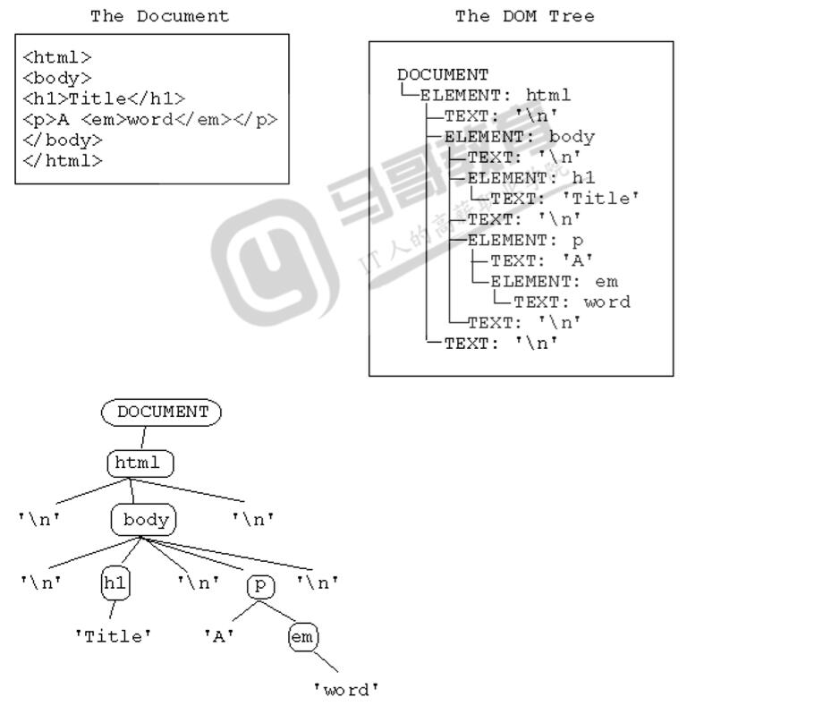
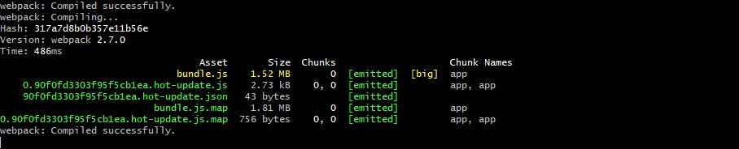
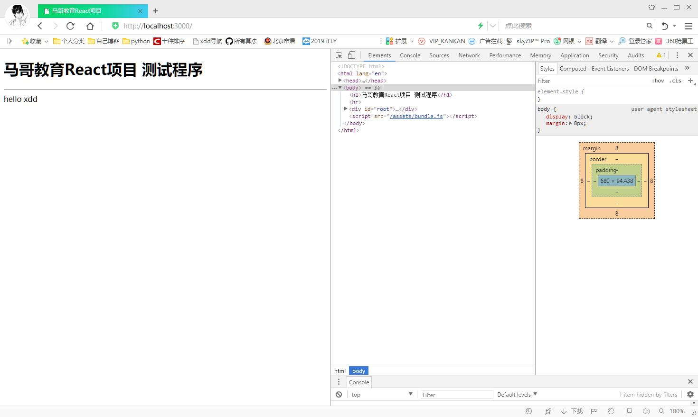
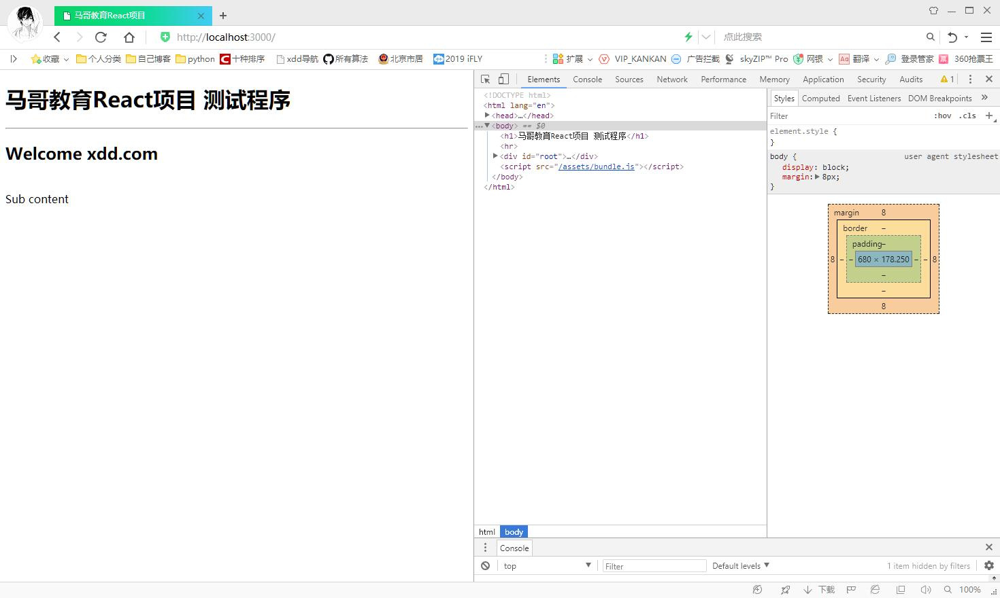
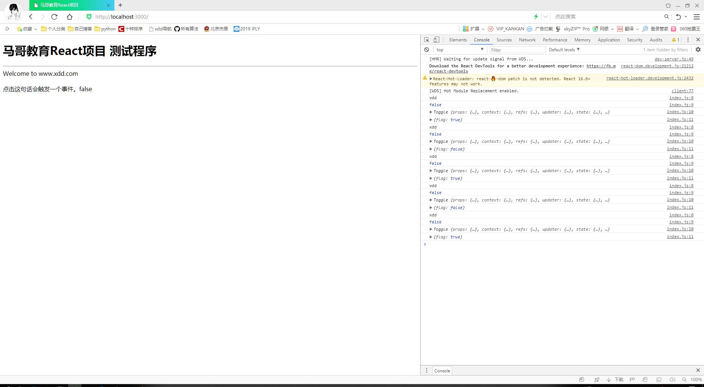
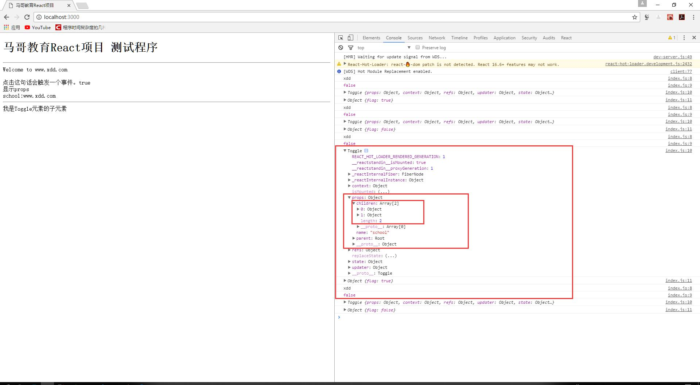
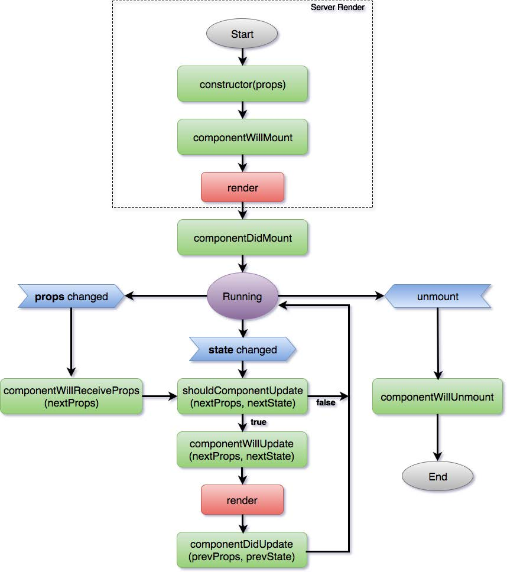
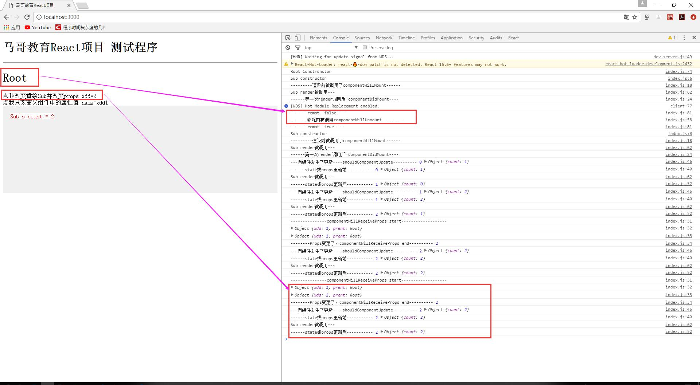

# React技术

注意：本章节运行环境在上一章节[React项目构建](./1.React项目构建.md)之上。  

## 简介

* React是Facebook开发并开源的前端框架。  
* 当时他们的团队在市面上没有找到合适的MVC框架，就自己写了一个Js框架，用来架设Instagram（图片分享社交 网络）。2013年React开源。  
* React解决的是前端MVC框架中的View视图层的问题。  

## Virtual DOM

* DOM(文档对象模型Document Object Model)  


* 将网页内所有内容映射到一棵树型结构的层级对象模型上，浏览器提供对DOM的支持，用户可以是用脚本调用DOM API来动态的修改DOM结点，从而达到修改网页的目的，这种修改是浏览器中完成，浏览器会根据DOM的改变重绘改变的DOM结点部分。
* 修改DOM重新渲染代价太高，前端框架为了提高效率，尽量减少DOm的重绘，提出了Virtual DOM。Virtual DOM是一个JavaScript对象，性能更高。所有的修改都是先生成一个新的Virtual DOM,通过比较算法比较新旧Virtual DOM,得到差异化Virtual DOM,将这部分差异更新到浏览器DOM,浏览器只需要渲染这部分变化就行了。
React实现了DOM Diff算法可以高效比对Virtual DOM。

## 支持JSX语法

JSX是一种JavaScript和XML混写的语法，是JavaScript的扩展。

````jsx
React.render(
    <div>
        <div>
            <div>content</div>
        <div/>
    </div>,
    document.getElementById('example')
)
````

## 测试程序

* 替换`/src/index.js`为先的代码

````js
import React from 'react';
import ReactDom from 'react-dom';

class Root extends React.Component{
  render(){
    return <div>hello xdd</div>
  }
}

ReactDom.render(<Root/>,document.getElementById("root"))
````

* 保存文件后，会自动编译，并重新装载刷新浏览器端页面。

  


### 程序解释

1. `import React from 'react';`导入react模块
2. `import ReactDOM from 'react-dom';`导入react的DOM模块
3. `class Root extends React.Component`**组件**类定义，从React.Component类上继承。这个类生成JSXElement对象即React元素。
4. `render()`渲染函数。返回组件中渲染的内容。注意，只能返回**唯一一个顶级元素**回去。
5. `ReactDom.render(<Root/>,document.getElementById('root'));`第一个参数是JSXElement对象，第二个是DOM的Element元素。将React元素添加到DOM的Element元素中并渲染。

* 还可以使用React.createElement创建react元素，第一个参数是React组件或者一个HTML的标签名称(例如div、span)。

````js
return React.createElement('div',null,'hello hello xdd');
ReactDom.reader(React.createElement(Root),document.getElementById("root"));
````

* 很明显JSX更简洁易懂，推荐使用JSX语法。

* **增加一个子元素**

````js
import React from 'react';
import ReactDom from 'react-dom';

class SubEle extends React.Component{
  render(){
    return <div>Sub content</div>;
  }
}

class Root extends React.Component{
  render(){
    return(<div><h2>Welcome xdd.com</h2><br/> <SubEle/></div>);
  }
}

ReactDom.render(<Root />,document.getElementById('root'));
````



* 注意：
    1. React组件的render函数return返回，只能是一个顶级元素
    2. JSX语法是XML,要求所有元素必须闭合，注意`<br />` 不能写成`<br>`

## JSX规范

* 约定标签中首字母小写就是html标记，首字母大写就是组件
* 要求严格的HTML标记，要求所有标签都必须闭合。`br`也应该写成`<br />`,`/`前留一个空格。
* 单商省略小括号，多行请使用小括号
* 元素有嵌套，建议多行，注意缩进
* **JSX表达式**：表达式使用`{}`括起来，如果大括号内使用了引号，会当做字符串处理，例如`<div>{'2>1?true:false'}</div>`里面的表达式成了字符串了。

## 组件状态state

* 每一个**React组件**都有一个**状态属性state**,它是一个JavaScript对象，可以为它定义属性来保存值。如果状态变化了，会触发UI的重新渲染。使用setState()方法可以修改state值。
* 注意：state是每一个组件自己内部使用的，是组件自己的属性。

* 1.示例：依然修改`/src/index.js`

````js
import React from 'react';
import ReactDom from 'react-dom';

class Root extends React.Component{
  //定义一个对象
  state = {p1:'www.hao123',p2:'.com'};//构造函数中定义state
  render(){
    this.state.p1 = 'python.xdd';// 可以修改属性值
    // this.setState(p1:'python.xddabc');//不可用对还在更新中的state使用setState。会触发递归调用render函数
    // Warning: setState(...): Cannot update during an existing state transition (such as within render). 
    setTimeout(()=> this.setState({p1:'python.xdd'}),1000);
    return(
      <div>
        <div>Welcome to {this.state.p1}{this.state.p2}</div>
      </div>
    );
  }
}

ReactDom.render(<Root />,document.getElementById('root'));
````

* 2.复杂例子  

先看一个网页  

````html
<html>

<head>
    <script type="text/javascript">
        function getEventTrigger(event) {
            x = event.target; // 从事件中获取元素
            alert("触发的元素的id是：" + x.id);
        }
    </script>
</head>

<body>
    <div id="t1" onmousedown="getEventTrigger(event)"> 点击这句话，会触发一个事件，并弹出一个警示框 </div>
</body>

</html>
````

* div的id是t1，鼠标按下事件捆绑了一个函数，只要鼠标在对象上按下就会触发调用getEventTrigger函数，浏览器 会送给它一个参数event。event是事件对象，当事件触发时，event包含触发这个事件的对象。

* **HTML DOM的JavaScript事件**

|属性|此事件发生在何时|
|:---|:-------------|
|onabort|图像加载被中断|
|onblur|元素失去焦点|
|onchange|域的内容被改变|
|**onclick**|**当用户点击某个对象时调用的事件句柄**|
|ondblclick|当用户双击某个对象时调用的事件句柄|
|onerror|在加载文档或图像时发生错误|
|onfocus|元素获得焦点|
|onkeydown|某个键盘按键被按下|
|onkeypress|某个键盘按键被按下并松开|
|onkeyup|某个键盘按键被松开|
|onload|一张页面或一幅图像完成加载|
|onmousedown|鼠标按钮被按下|
|onmousemove|鼠标被移动|
|onmouseout|鼠标从某元素移开|
|onmouseover|鼠标移到某元素之上|
|onmouseup|鼠标按键被松开|
|onreset|重置按钮被点击|
|onresize|窗口或框架被重新调整大小|
|onselect|文本被选中|
|onsubmit|确认按钮被点击|
|onunload|用户退出页面|

* 使用React实现上面的传统的HTML

````js
import React from 'react';
import ReactDom from 'react-dom';

class Toggle extends React.Component{
  state = {flag:true}; //类中定义state

  handleClick(event){
    console.log(event.target.id);
    console.log(event.target === this);
    console.log(this);
    console.log(this.state);
    this.setState({flag:!this.state.flag});
  }

  render(){
    /*注意一定要绑定this onClick写成小驼峰 */
    return <div id='xdd' onClick={this.handleClick.bind(this)}>
      点击这句话会触发一个事件。{this.state.flag.toString()}
    </div>;
  }
}

class Root extends React.Component {
  //定义一个对象
  state = {p1:'www.xdd',p2:'.com'};//构造函数中定义state
  render(){
    return(
      <div>
        <div>Welcome to {this.state.p1}{this.state.p2}</div>
        <br />
        <Toggle />
      </div>
    )
  }
}

ReactDom.render(<Root />,document.getElementById('root'))
````



1. **Toggle类分析**  
    1. 它有自己的state属性
    2. 当render完成后，网页上有一个div标签，div标签对象捆绑了一个click事件的处理函数，div标签内有文本内容。如果通过点击左键，就触发了click方法关联的handleClick函数，在这个函数里将状态值改变。  
        * 使用`this.state.flag = !this.state.flag`方式改变，不会触发render函数执行
        * 使用`this.setSatte({flag:!this.state.flag})`方式，会触发该组件和其子组件render函数的执行
    3. 状态值state的改变将引发render重绘。
    4. 如果组件自己的state变了，只会触发自己的render方法重绘。

* 注意：
  1. `{this.handleClick.bind(this)}`,不能外加引号
  2. `this.handleClick.bind(this)`**一定要绑定this**,否则当触发捆绑的函数时，this是函数执行的上下文决定的，this已经不是触发事件的对象了。
  3. `console.log(event.target.id)`,取回的参数事件的对象的id，但是这不是我们封装的组件对象。所以，`console.log(event.target===this)`是false。所以这里一定要用this,而这个this是通过绑定来的。
  4. this写在类中，始终指的是React组件示例本身。

* **React中的事件**
    1. 使用小驼峰命名
    2. 使用JSX表达式，表达式中指定事件处理函数
    3. 不能使用return false，如果要阻止事件默认行为，使用event.preventDefault()

## 属性props

* props就是组件的属性properties。
* 把React组件当做标签使用，可以为其增加属性。如：`<Toggle name="school" parent={this} />`
  1. 为上面的Toggle元素增加属性：
      * `name = "school"`，这个属性会作为一个单一的对象传递给组件，加入到组件的props属性中
      * `parent = {this}`,注意这个this是在Root元素中，指的是Root组件本身
      * 在Root中为使用JSX语法为Toggle增加子元素，这些子元素也会被加入Toggle组件的props.children中

````js
import React from 'react';
import ReactDom from 'react-dom';

class Toggle extends React.Component{
  state = {flag:true}; //类中定义state

  handleClick(event){
    console.log(event.target.id);
    console.log(event.target === this);
    console.log(this);
    console.log(this.state);
    this.setState({flag:!this.state.flag});
  }

  render(){
    /*注意一定要绑定this onClick写成小驼峰 */
    return <div id='xdd' onClick={this.handleClick.bind(this)}>
      点击这句话会触发一个事件。{this.state.flag.toString()}<br />
      显示props<br />
      {this.props.name}:{this.props.parent.state.p1}{this.props.parent.state.p2}
      {this.props.children}
    </div>;
  }
}

class Root extends React.Component {
  //定义一个对象
  state = {p1:'www.xdd',p2:'.com'};//构造函数中定义state
  render(){
    return(
      <div>
        <div>Welcome to {this.state.p1}{this.state.p2}</div>
        <br />
        <Toggle name= "school" parent={this} >{/*自定义2个属性通过props传给Togle组件对象 */}
          <hr />{/*子元素通过props.children访问 */}
          <span>我是Toggle元素的子元素</span>{/*子元素通过props.children访问 */}
        </Toggle>
      </div>
    )
  }
}

ReactDom.render(<Root />,document.getElementById('root'))
````

  

注意：props中的属性值不能被修改，否则会抛出 `TypeError: Cannot assign to read only property 'name' of object '# <Object>`异常。也就是说Props在组件内部不能修改，只读。但可以通过重绘组件重新定义props内的属性。  

> 应该说state是私有private的，属于组件自己的属性，组件外无法直接访问。可以修改state，但是建议使用setState方法。  
> props是共有public属性，组件外也可以访问，但组件内只读。  
> props是一种组件外部传入向组件内部传入数据的一种方式，只不过采用标签属性的方式。  

## 构造器constructor

* 使用ES6的构造器，要提供一个参数props，并把这个参数使用super传递给父类

````js
import React from 'react';
import ReactDom from 'react-dom';

class Toggle extends React.Component{
  // state = {flag:true}; //类中定义state

  constructor(props){
    super(props);//一定要调用super父类构造器，否则会报错
    this.state = {flag:true}; //类中定义state
  }

  handleClick(event){
    console.log(event.target.id);
    console.log(event.target === this);
    console.log(this);
    console.log(this.state);
    this.setState({flag:!this.state.flag});
  }

  render(){
    /*注意一定要绑定this onClick写成小驼峰 */
    return <div id='xdd' onClick={this.handleClick.bind(this)}>
      点击这句话会触发一个事件。{this.state.flag.toString()}<br />
      显示props<br />
      {this.props.name}:{this.props.parent.state.p1}{this.props.parent.state.p2}
      {this.props.children}
    </div>;
  }
}

class Root extends React.Component {
  //定义一个对象
  state = {p1:'www.xdd',p2:'.com'};//构造函数中定义state
  render(){
    return(
      <div>
        <div>Welcome to {this.state.p1}{this.state.p2}</div>
        <br />
        <Toggle name= "school" parent={this} >{/*自定义2个属性通过props传给Togle组件对象 */}
          <hr />{/*子元素通过props.children访问 */}
          <span>我是Toggle元素的子元素</span>{/*子元素通过props.children访问 */}
        </Toggle>
      </div>
    )
  }
}

ReactDom.render(<Root />,document.getElementById('root'))
````

## 组件的声明周期

* 组件的生命周期可分成三个状态：
  1. **Mounting:已插入真实DOM**
  2. **Updating: 正在被重新渲染**
  3. **Unmounting: 已移出真实DOM**
* 组件的生命周期状态，说明在不同时机访问组件，组件正处在生命周期的不同状态上。
* 在不同的生命周期状态访问，就产生不同的方法。
* 生命周期方法如下：
  1. **装载组件时触发**
      * componentWillMount在渲染前调用，在客户端也在服务端。只会在装载之前调用一次。
      * componentDidMount:在第一次渲染后调用，只在客户端。之后组件已经生成了对应的DOM结构，可以通过this.getDOMNode()来进行访问。如果你想和其他JavaScript框架一起使用，可以在这个方法中调用setTimeout,setInterval或者发送AJAX请求等操作(防止异步操作阻塞UI)。只在装载完成后调用一次，在render之后。
  2. **更新组件触发**。这些方法不好在首次render组件的周期调用。
      * componentWillReceiveProps(nextProps)在组件接收到一个新的prop时被调用。这个方法在初始化render时补回被调用。
      * shouldComponentUpdate(nextProps,nextState)返回一个布尔值。在组件接收到新的props或者state时被调用。初始化时或者使用forceUpdate时不被调用。
        * 可以在你确认不需要更新组件时使用。
        * 如果设置为false，就是不允许更新组件，那么componentWillUpdate、componentDidUpdate不会执行。
      * componentWillUpdate(nextProps,nextState)在组件接收到新的props或者state但还没有render时被调用。在初始化时补回被调用。
      * componentDidUpdate(prevProps,prevState)在组件完成更新后立即调用。在初始化时不会被调用。
  3. **卸载组件触发**
      * componentWillUnmount在组件从DOM中移除的时候立刻被调用。  

  

由图可知：  

* constructor构造器是最早执行的函数。
* 组件构建好之后，如果更新组件的state或props(注意在组件内props是只读的)，就会在render渲染前触发一系列的**更新声明周期函数**。
* 重新编写`/src/index.js`构造两个组件，在子组件Sub中，加入所有生命周期函数。下面例子添加是装载、卸载的生命周期函数  

````js
import React from 'react';
import ReactDom from 'react-dom';

class Sub extends React.Component{
  constructor(props){
    console.log('Sub constructor');
    super(props);
    this.state = {count:0};
  }

  handleClick(){
    this.setState({count:this.state.count+1});
  }

  /* 组件实例化后被调用。。 */
  componentWillMount(){
    // constructor之后，第一次render之前
    console.log('---------渲染前被调用了componentWillMount------')
  }

  /**第一次render调用后 */
  componentDidMount(){
    // 第一次render后
    console.log('------第一次render调用后 componentDidMount----')
  }

  /* Props被改变，将要更新才调用 */
  componentWillReceiveProps(nextProps){
    // props变更时，接到新props了，交给shouldComponentUpdate
    // props组件内只读，只能从外部改变
    console.log('---------------componentWillReceiveProps start-------------------')
    console.log(this.props);
    console.log(nextProps);
    console.log("--------Props变更了，componentWillReceiveProps end----------",this.state.count)
  }

  /**将要更新，同意更新后，真正更新前，之后调用render */
  componentWillUpdate(nextProps,nextState){
    // 是否组件更新，props或state方式改变时，返回布尔值，true才会更新
    console.log('------state或props更新前-----------',this.state.count,nextState)
  }

  /**是否组件更新，props或者state方式改变时，返回布尔值，true才会更新Dom界面。阻止不了值的变化 */
  shouldComponentUpdate(nextProps,nextState){
    // 是否组件更新，props或state方式改变时，返回布尔值，true才会更新
    console.log('---有组件发生了更新----shouldComponentUpdate----------',this.state.count,nextState);
    return true; //return false将拦截Dom的更新
  }

  componentDidUpdate(prevProps,prevState){
    //同意更新后，真正更新后，在render之后调用
    console.log('------state或props更新后-----------',this.state.count,prevState)
  }

  /**移除才调用 */
  componentWillUnmount(){
    //清理工作
    console.log('-------移除前被调用componentWillUnmount----------')
  }

  render(){
    console.log('Sub render被调用---');
    return (
      <div id="sub"  style={{ height: 200 + 'px', color: 'red', backgroundColor: '#f0f0f0', padding:'20px' }} 
      onClick={this.handleClick.bind(this)}>
        <a style={{backgroundColor: 'white'}} onClick = {this.handleClick.bind(this)}>Sub's count = {this.state.count}</a>
      </div>
    )
  }
}

class Root extends React.Component{
  constructor(props){
    console.log('Root Construnctor');
    super(props);
    this.state = {remot:false,xdd:1,name:'xdd'};
  }

  remot(){
    this.setState({remot:!this.state.remot})
    console.log('-------remot--'+this.state.remot.toString()+'----')
  }

  handleClick(){
    this.setState({xdd:this.state.xdd +1});
  }

  handleClick2(){
    this.setState({name:this.state.name+1})
  }

  render(){
    if (this.state.remot){
      return <div>
        <h1>Root</h1><a onClick={this.remot.bind(this)}>点我重新加载</a>
      </div>
    }
    else{
      return (<div onDoubleClick = {this.remot.bind(this)}>
        <h1>Root</h1>
        <div onClick={this.handleClick.bind(this)}>点我改变重绘Sub并改变props  xdd={this.state.xdd}</div>
        <a onClick={this.handleClick2.bind(this)}>点我只改变父组件中的属性值 name={this.state.name}</a>
        <Sub xdd={this.state.xdd} prent={this} />{/**父组件的render，会引起下以及组件的更新流程，导致props重新发送，即使子组件props没有改变过。 */}
        </div>)
    }
  }
}

ReactDom.render(<Root />,document.getElementById('root'))
````

  

* componentWillMount 第一次装载，在首次render之前。例如控制state、props
* componentDidMount 第一次装载结束，在首次render之后。例如控制state、props
* componentWillReceiveProps 在组件内部，props是只读不可变的，但是这个函数可以接收到新的props，可以对 props做一些处理，this.props = {name:'roooooot'};这就是偷梁换柱。componentWillReceiveProps触发，也会 走shouldComponentUpdate。  
* shouldComponentUpdate 判断是否需要组件更新，就是是否render，精确的控制渲染，提高性能。 
* componentWillUpdate 在除了首次render外，每次render前执行，componentDidUpdate在render之后调用。
* 不过，大多数时候，用不上这些函数，这些钩子函数是为了精确的控制。
* 如果子组件和父组件使用了相同的事件，可以认为点击子组件也是点击了父组件，父组件重绘，就会把子组件 props更新，引起子组件组件更新流程，就会从componentWillReceiveProps开始执行。如果子组件自己修改自己 的state，不会执行componentWillReceiveProps。 

## 函数试组件

* React从15.0开始支持函数式组件，定义如下：

````js
import React from 'react';
import ReactDom from 'react-dom';

function Root(props){
  return <div>{props.scholName}</div>
}

ReactDom.render(<Root scholName='xdd' />,document.getElementById("root"))
````

* 开发中，很多情况下，组件其实很简单，不需要state状态，也不需要使用生命周期函数。
* 函数式组件的函数应该提供一个参数props,返回一个React元素。
* 函数式组件的函数本身就是render函数。

1. 改写上面示例代码

````js
import React from 'react';
import ReactDom from 'react-dom';

let Root = props => <div>{props.scholName}</div>

ReactDom.render(<Root scholName='xdd' />,document.getElementById("root"))
````  

以前函数式组件还有名字叫stateless components无状态组件。当前React发布了16.8,已经可以在函数式组件中使用state了，所有官方建议叫函数式组件。
