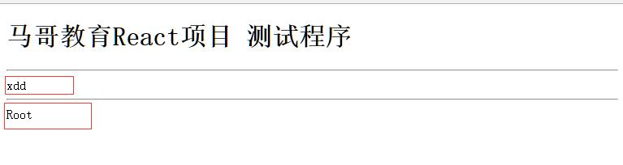
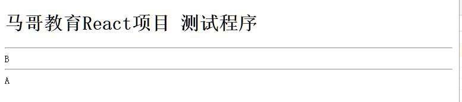
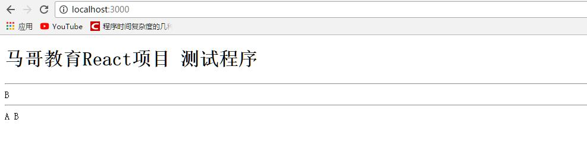
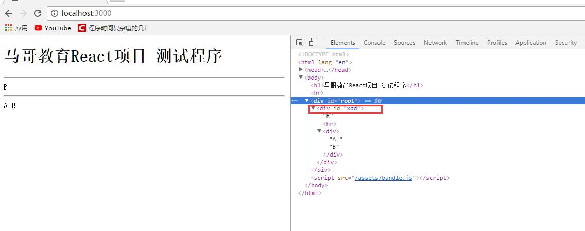

# React之高阶组件

注意：本章节运行环境在上一章节[React项目构建](./1.React项目构建.md)之上。  

@[toc]

## 高阶组件

1. `let Root = props => <div>{props.schoolName}</div>;`如果要在Root组件进行增强，例如将Root外部再加入其它div。

    ````js
    import React from 'react';
    import ReactDom from 'react-dom';

    let Wrapper = function (Component){
    function _wrapper(props){
        return (
        <div>
            {props.scholName}<hr />
            <Component />
        </div>
        );
    }
    return _wrapper;
    }
    let Root = props => <div>Root</div>;

    let NewComp = Wrapper(Root) //返回一个包装后的元素

    ReactDom.render(<NewComp scholName="xdd" />,document.getElementById("root"));
    ````

    * 在_wrapper(props)中本身就是一个无状态组件，内部包囊这一个传入的组件，可以看做增强了传入的组件。传入的组件作为返回的新组件的子组件
2. 简化高阶组件

    ````js
    import React from 'react';
    import ReactDom from 'react-dom';

    let Wrapper = Component => props => (
        <div>
            {props.scholName}<hr />
            <Component />
        </div>
        );

    let Root = props => <div>Root</div>;

    let NewComp = Wrapper(Root) //返回一个包装后的元素

    ReactDom.render(<NewComp scholName="xdd" />,document.getElementById("root"));
    ````

  

## 装饰器

* 新版ES2016中增加了装饰器的支持，因此可以使用装饰器来改造上面的代码。
* **ES 2016的装饰器只能装饰类，不能装饰函数**

````js
import React from 'react';
import ReactDom from 'react-dom';

let Wrapper = Component => props => (
      <div>
        {props.scholName}<hr />
        <Component />
      </div>
    );


@Wrapper // 等价于 A = Wrapper(A)
class A extends React.Component{
  render(){
    return <div>A</div>
  }
}

ReactDom.render(<A scholName="B" />,document.getElementById("root"));
````

  

* 让Toot也显示出schoolName的值

````js
import React from 'react';
import ReactDom from 'react-dom';

let Wrapper = Component => props => (
      <div>
        {props.scholName}<hr />
        <Component {...props} />
      </div>
    );


@Wrapper // 等价于 A = Wrapper(A)
class A extends React.Component{
  render(){
    return <div>A {this.props.scholName}</div>
  }
}

ReactDom.render(<A scholName="B" />,document.getElementById("root"));
````

  

* 使用`<Component {...props} />`相当于给组件增加了属性

## 带参装饰器

* 上面例子中如果想给装饰器添加其他参数，可以如下实现

````js
import React from 'react';
import ReactDom from 'react-dom';

let Wrapper = id => Component => props => (
      <div id = {id}>
        {props.scholName}<hr />
        <Component {...props} />
      </div>
    );


@Wrapper("xdd") // 带参装饰器
class A extends React.Component{
  render(){
    return <div>A {this.props.scholName}</div>
  }
}

ReactDom.render(<A scholName="B" />,document.getElementById("root"));
````

  


