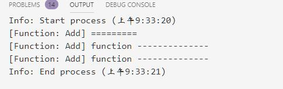
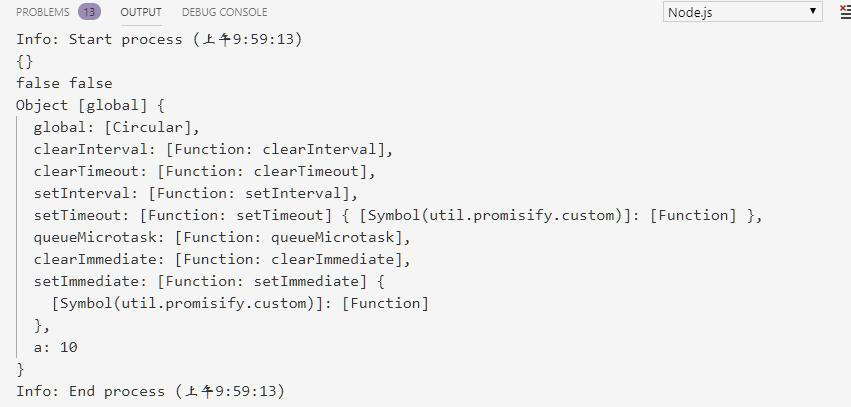
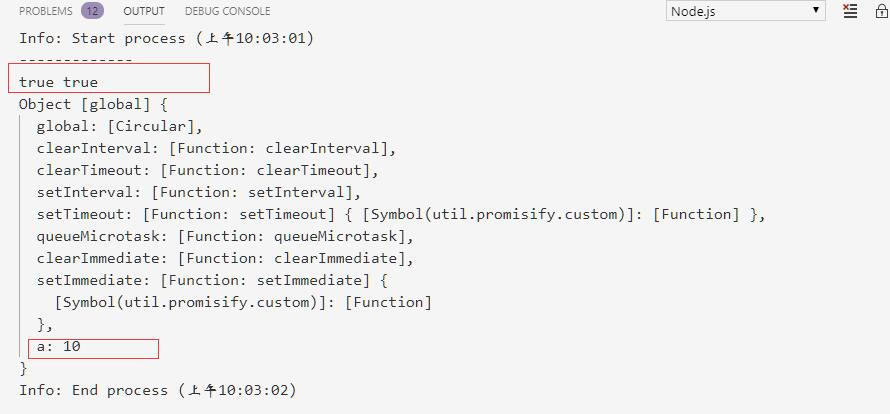
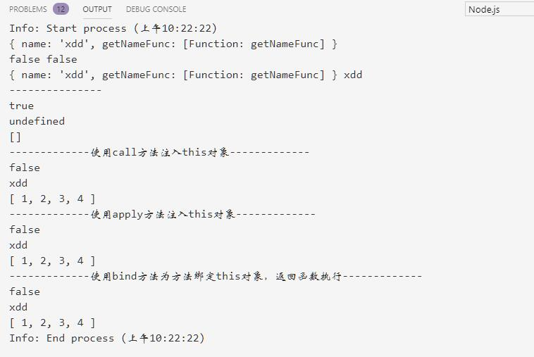
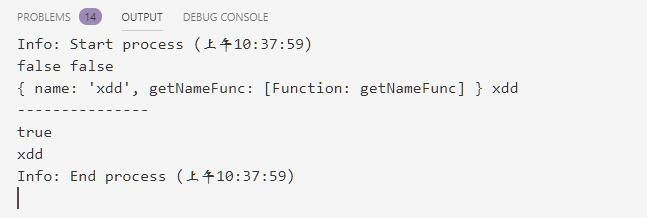
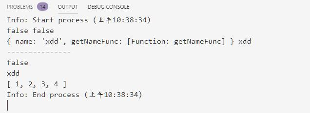
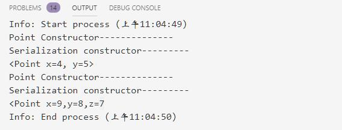
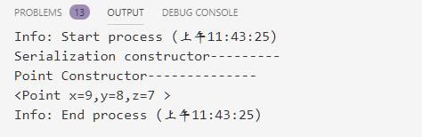

# 对象模型

@[toc]

JavaScript是一种基于原型（Prototype）的面向对象语言，而不是基于类的面向对象语言。  
C++、Java有类Class和实例Instance的概念，类是一类事物的抽象，而实例则是类的实体。  

* JS是基于原型的语言，它只有原型对象的概念。  
    1. 原型对象就是一个模板，新的对象从这个模板构建从而获取最初的 属性。任何对象在运行时可以动态的增加属性。而且，任何一个对象都可以作为另一个对象的原型，这样后者就可 以共享前者的属性。  

## 定义类

### 1.字面式声明方式(也称为字面值创建对象。)

* js1.2开始支持
* 语法：

````js
var obj = {
    property_1:value_1,
    property_2:value_2,
    ...,
    "property n":value_n
}
````

* 示例：

````js
var obj = {
    x:1,
    1:'abc',
    'y':'123'
}

for (let s in obj){
    console.log(s,typeof(s),obj[s])
}
````

  

### 2.ES6之前----构造器构造类

1. 定义一个函数(构造器)对象，函数名首字母大写
2. 使用this定义属性
3. 使用new和构造器创建一个新对象
4. 如果继承，需要调用继承对象的call方法，第一个参数传入this来实现继承。

````js
//定义类，构造器
function Point(x,y){
    this.x = x;
    this.y = y;
    this.show = ()=>{console.log(this,this.x,this.y)}
    console.log('Point~~~~~~')
}

console.log(Point);
p1 = new Point(1,2);
console.log(p1)
console.log('--------------------');
//继承
function Point3D(x,y,z){
    Point.call(this,x,y); //"继承Point,需要调用Point的call方法"
    this.z = z;
    console.log("Point3D~~~~~~~~~~~~~~");
}

console.log(Point3D)
p2 = new Point3D(14,15,16);
console.log(p2);
p2.show()
````

  

* new构建一个新的通用对象，new操作符会将新对象的this值传递给Point3D构造函数，函数为这个对象创建z属性。
* 使用new后可以得到一个对象，使用这个对象的this来调用构造器。
* 使用Point3D对象的this来执行Point的构造器，所以使用call方法，传入子类的this。
* 最后完成构造后，将对象赋值给p2
* **注意**：如果不使用new关键字，就是一次普通的函数调用，this不代表实例。

### 3.ES6中的class关键字

从ES6开始，新提供了class关键字，使得创建对象更加简单、清晰。  

1. **类定义使用class关键字。创建的本质上还是函数，是一个特别的函数**
2. 一个类只能拥有一个名为constructor的构造器方法。如果没有显式的定义一个构造方法，则会添加一个默认的constuctor方法。
3. 继承使用extends关键字
4. 一个构造器可以使用super关键字来调用一个父类的构造函数
5. 类没有私有属性
6. **注意**：js中没有多继承。

````js
class Point{
    constructor(x,y){
        this.x = x;
        this.y = y;
        console.log("Point被初始化")
    }

    show(){ //show方法
        console.log(this,this.x,this.y)
    }
}

let p1 = new Point(10,11);
p1.show()

// 继承
class Point3D extends Point{
    constructor(x,y,z){
        super(x,y);
        this.z = z;
        console.log("Point3D被初始化")
    }
}

let p2 = new Point3D(20,21,22)
p2.show()
````

  

* **继承中方法的重写**
    1. 子类中直接重写父类的方法。
    2. 如果需要使用父类的方法，使用super.method()的方式调用

````js
class Point{
    constructor(x,y){
        this.x = x;
        this.y = y;
        console.log("Point被初始化")
    }

    show(){ //show方法
        console.log(this,this.x,this.y)
    }
}

let p1 = new Point(10,11);
p1.show()

// 继承
class Point3D extends Point{
    constructor(x,y,z){
        super(x,y);
        this.z = z;
        console.log("Point3D被初始化")
    }

    show(){ // 重写
        console.log(this,this.x,this.y,this.z)
    }
}

let p2 = new Point3D(20,21,22)
p2.show()
````

  

* **对象中属性和方法的访问顺序**
    1. 在对象中属性的访问顺序高于方法的访问顺序。
    2. 如果一个对象中定义了个和方法相同的属性名，并且该属性指向一个函数对象，那么该属性的访问会优先与对象中方法的访问
    3. **注意**：类在实例化时，会先为示例对象添加方法，在添加属性。所以会导致属性覆盖方法。即属性的访问顺序优于方法的访问顺序。
    4. 父类、子类使用同一种方式类定义属性或者方法，子类覆盖父类。  
    5. 访问同名属性或方法时，优先使用属性。  

````js
class Point{
    constructor(x,y){
        this.x = x;
        this.y = y;
        this.show = ()=> console.log('Point~~~~show',this) //会将类中的方法替换
        console.log("Point被初始化")
    }

    show(){ //show方法
        console.log(this,this.x,this.y)
    }
}

let p1 = new Point(10,11);
p1.show()

// 继承
class Point3D extends Point{
    constructor(x,y,z){
        super(x,y);
        this.z = z;
        console.log("Point3D被初始化")
    }

    //无法实现对属性的重写，需要重写必须重新定义属性
    show(){ // 重写
        console.log(this,this.x,this.y,this.z)
    }
}

let p2 = new Point3D(20,21,22)
p2.show() //是属性的访问
console.log(p1) //实质上是替换了类中的方法
console.log(p2) //实质上是替换了类中的方法
````

  

* **静态属性**
    1. 静态属性目前还没有得到很好的支持。
* **静态方法**
    1. 在方法名上加上static，就是静态方法了。类似于python中的类变量。
    2. 静态方法中的this是类本身对象。而不是类实例的对象。
    3. 可以通过类名直接访问类中的静态方法
    4. 实例对象访问静态方法需要通过constructor属性访问类中的静态方法。

````js
class Add{
    constructor(x,y){
        this.x = x;
        this.y = y;
    }

    static print(){
        console.log(this,typeof this,'--------------')
    }
}

add = new Add(3,4);
console.log(Add,'=========');
Add.print();
// add.print(); // 实例不能直接访问静态方法，和C++,Java一致
add.constructor.print();//可以通过constructor访问静态方法
````

  

## this的不同作用域

* js和C++,Java一样有this,但是js的表现是不通的。因为C++,Java是静态编译型语言，this是编译期绑定，而js是动态语言，运行期绑定。
* 在js中函数执行时，会开启新的执行上下文环境ExecutionContext。this属性是什么需要看函数是怎么调用的了。
    1. 普通函数调用方式，this指向**全局对象**。全局对象是nodejs的global或者浏览器中的window。
    2. js文件根中的this。初始是一个空对象。即object.
    3. 通过实例对象调用实例方法，实例方法中的this指代的是该实例对象。
    4. call和apply方法调用，会传递一个this对象给调用的方法。

* 全局中的this不是global对象

````js
a = 10;
var b = 100;
let c = 20;
const d = 30;
function add(){};

console.log(this);
console.log(this == global,this === global);
console.log(global);
````

  

* 方法中的this就是global对象

````js
a = 10;
var b = 100;
let c = 20;
const d = 30;
function add(){
    console.log('-------------');
    console.log(this == global,this === global);
    console.log(this)
};

add();
````

  

* 实例对象中的this是对象的实例本身

````js
var school = {
    name :'xdd',
    getNameFunc : function (){ //由于是类对象的属性方法，即方法中的this就是类对象，而不是global
        console.log(this == global,this === global); // false,false
        console.log(this,this.name);
        console.log("---------------")
        return function(...arrs){ // 没有使用new关键字，即只是一个普通的函数
            console.log(this === global); //返回的是一个函数，而不是实例对象的函数。即this激素global
            console.log(this.name);
            console.log(arrs)
        }
    }
}

console.log(school);
const fun = school.getNameFunc();
fun();
console.log('-------------使用call方法注入this对象-------------')
fun.call(school,1,2,3,4) //call方法传参可以直接传参
console.log('-------------使用apply方法注入this对象-------------')
fun.apply(school,[1,2,3,4]) // apply方法传参需要使用数组
console.log('-------------使用bind方法为方法绑定this对象，返回函数执行-------------')
fun.bind(school)(1,2,3,4)
````

  

school对象中函数返回的方法中的this不是实例本身。它已经不是C++,java的指向实例本身了。this的问题，这是历史遗留问题，为了兼容，新版本保留了。而我们使用时，有时候需要明确的让this必须是我们期望的对象。有如下解决方法  

1. 显示传入this对象，即在方法中接受一个that对象，让调用者传入this。

    ````js
    var school = {
        name :'xdd',
        getNameFunc : function (){ //由于是类对象的属性方法，即方法中的this就是类对象，而不是global
            console.log(this == global,this === global); // false,false
            console.log(this,this.name);
            console.log("---------------")
            return function(that){ // 没有使用new关键字，即只是一个普通的函数
                console.log(this === global); //返回的是一个函数，而不是实例对象的函数。即this激素global
                console.log(that.name);
            }
        }
    }
    school.getNameFunc()(school)
    ````

      

2. ES3(ES-262第三版)引入了apply、call方法(上面例子已经体现了)
    * apply、call方法都是函数对象的方法，第一参数都是传入对象引入的。
    * apply传入其它参数需要数组。
    * call传入其它参数需要使用可变参数收集。
3. ES5引入了bind方法
    * bind方法来设置函数的this值。会返回一个绑定了的函数。
    * bind方法是为函数先绑定this，调用时直接使用。
4. ES6引入支持this的箭头函数
    * ES6新技术，就不需要兼容this问题。

    ````js
    var school = {
        name :'xdd',
        getNameFunc : function (){ //由于是类对象的属性方法，即方法中的this就是类对象，而不是global
            console.log(this == global,this === global); // false,false
            console.log(this,this.name);
            console.log("---------------")
            return (...args)=>{ // 没有使用new关键字，即只是一个普通的函数
                console.log(this === global); //返回的是一个函数，而不是实例对象的函数。即this激素global
                console.log(this.name);
                console.log(args)
            }
        }
    }
    school.getNameFunc()(1,2,3,4)
    ````

      

* 以上解决this问题的方法，bind方法最常用。

## 高阶对象、高阶类、或称Mixin模式

Mixin模式，混合模式。这是一种不用继承就可以复用的技术。主要还是为了解决多重继承的问题。多继承的继承路径问题。

* js是基于对象的，类和对象都是对象模板。
* 混合mixin,指的是将一个对象的全部或者部分拷贝到另外一个对象上去。其实就是属性了。
* 可以将多个类或对象混合成一个类或对象。

### 继承实现

````js
class Serialization{
    constructor(){
        console.log("Serialization constructor---------");
        if (typeof(this.stringify) !== 'function'){ //检测顺序是否是一个方法
            throw new ReferenceError('should define stringify.')
        }
    }
}

class Point extends Serialization{
    constructor(x,y){
        console.log('Point Constructor--------------');
        super();//调用父类的构造器
        this.x = x;
        this.y = y;
    }
}

// s = new Serialization(); // 构造Serialization失败。
// p = new Point(4,5);// 构造类对象时，调用父类构造器执行也会失败。
````

* 上面例子中父类构造器函数中，要求具有数学是stringify的序列化函数，如果没有则抛出异常。
* 完善代码如下：

````js
class Serialization{
    constructor(){
        console.log("Serialization constructor---------");
        if (typeof(this.stringify) !== 'function'){ //检测顺序是否是一个方法
            throw new ReferenceError('should define stringify.')
        }
    }
}

class Point extends Serialization{
    constructor(x,y){
        console.log('Point Constructor--------------');
        super();//调用父类的构造器
        this.x = x;
        this.y = y;
    }

    stringify(){
        return `<Point x=${this.x}, y=${this.y}>`;
    }
}

class Point3D extends Point{
    constructor(x,y,z){
        super(x,y);
        this.z = z;
    }

    stringify(){
        return `<Point x=${this.x},y=${this.y},z=${this.z}`;
    }
}

// s = new Serialization(); // 构造Serialization失败。
p = new Point(4,5);// 构造类对象时，调用父类构造器执行也会失败。
console.log(p.stringify())
p3d = new Point3D(9,8,7);
console.log(p3d.stringify())
````

  

### 高阶对象实现

* 将类的继承构造成箭头函数

````js
//Mixi类属性检测，检查子类是否有特定属性
const Serialization = Sup => class extends Sup{
    constructor(...args){
        console.log("Serialization constructor---------");
        super(...args)
        if (typeof(this.stringify) !== 'function'){ //检测顺序是否是一个方法
            throw new ReferenceError('should define stringify.')
        }
    }
}

// 顶级父类
class Point{
    constructor(x,y){
        console.log('Point Constructor--------------');
        this.x = x;
        this.y = y;
    }
}

// 强制约束了Point3D方法必须重写stringif方法
class Point3D extends Serialization(Point){
    constructor(x,y,z){
        super(x,y);
        this.z = z;
    }

    stringify(){
        return `<Point x=${this.x},y=${this.y},z=${this.z} >`;
    }
}

p3d = new Point3D(9,8,7);
console.log(p3d.stringify())
````

  

* **注意**：
    1. Serialization(Point)这个一步实际上是一个匿名箭头函数调用，返回了一个新的类型。Point3D继承自这个新的匿名类型，增强了功能。
    2. React框架大量使用了这种Mixin技术。


