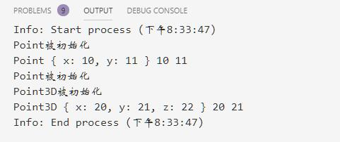

# 对象模型

@[toc]

JavaScript是一种基于原型（Prototype）的面向对象语言，而不是基于类的面向对象语言。  
C++、Java有类Class和实例Instance的概念，类是一类事物的抽象，而实例则是类的实体。  

* JS是基于原型的语言，它只有原型对象的概念。  
    1. 原型对象就是一个模板，新的对象从这个模板构建从而获取最初的 属性。任何对象在运行时可以动态的增加属性。而且，任何一个对象都可以作为另一个对象的原型，这样后者就可 以共享前者的属性。  

## 定义类

### 1.字面式声明方式(也称为字面值创建对象。)

* js1.2开始支持
* 语法：

````js
var obj = {
    property_1:value_1,
    property_2:value_2,
    ...,
    "property n":value_n
}
````

* 示例：

````js
var obj = {
    x:1,
    1:'abc',
    'y':'123'
}

for (let s in obj){
    console.log(s,typeof(s),obj[s])
}
````

  

### 2.ES6之前----构造器构造类

1. 定义一个函数(构造器)对象，函数名首字母大写
2. 使用this定义属性
3. 使用new和构造器创建一个新对象
4. 如果继承，需要调用继承对象的call方法，第一个参数传入this来实现继承。

````js
//定义类，构造器
function Point(x,y){
    this.x = x;
    this.y = y;
    this.show = ()=>{console.log(this,this.x,this.y)}
    console.log('Point~~~~~~')
}

console.log(Point);
p1 = new Point(1,2);
console.log(p1)
console.log('--------------------');
//继承
function Point3D(x,y,z){
    Point.call(this,x,y); //"继承Point,需要调用Point的call方法"
    this.z = z;
    console.log("Point3D~~~~~~~~~~~~~~");
}

console.log(Point3D)
p2 = new Point3D(14,15,16);
console.log(p2);
p2.show()
````

  

* new构建一个新的通用对象，new操作符会将新对象的this值传递给Point3D构造函数，函数为这个对象创建z属性。
* 使用new后可以得到一个对象，使用这个对象的this来调用构造器。
* 使用Point3D对象的this来执行Point的构造器，所以使用call方法，传入子类的this。
* 最后完成构造后，将对象赋值给p2
* **注意**：如果不使用new关键字，就是一次普通的函数调用，this不代表实例。

### 3.ES6中的class关键字

从ES6开始，新提供了class关键字，使得创建对象更加简单、清晰。  

1. **类定义使用class关键字。创建的本质上还是函数，是一个特别的函数**
2. 一个类只能拥有一个名为constructor的构造器方法。如果没有显式的定义一个构造方法，则会添加一个默认的constuctor方法。
3. 继承使用extends关键字
4. 一个构造器可以使用super关键字来调用一个父类的构造函数
5. 类没有私有属性
6. **注意**：js中没有多继承。

````js
class Point{
    constructor(x,y){
        this.x = x;
        this.y = y;
        console.log("Point被初始化")
    }

    show(){ //show方法
        console.log(this,this.x,this.y)
    }
}

let p1 = new Point(10,11);
p1.show()

// 继承
class Point3D extends Point{
    constructor(x,y,z){
        super(x,y);
        this.z = z;
        console.log("Point3D被初始化")
    }
}

let p2 = new Point3D(20,21,22)
p2.show()
````

  

* **继承中方法的重写**
    1. 子类中直接重写父类的方法。
    2. 如果需要使用父类的方法，使用super.method()的方式调用

````js
class Point{
    constructor(x,y){
        this.x = x;
        this.y = y;
        console.log("Point被初始化")
    }

    show(){ //show方法
        console.log(this,this.x,this.y)
    }
}

let p1 = new Point(10,11);
p1.show()

// 继承
class Point3D extends Point{
    constructor(x,y,z){
        super(x,y);
        this.z = z;
        console.log("Point3D被初始化")
    }

    show(){ // 重写
        console.log(this,this.x,this.y,this.z)
    }
}

let p2 = new Point3D(20,21,22)
p2.show()
````

  

* **对象中属性和方法的访问顺序**
    1. 在对象中属性的访问顺序高于方法的访问顺序。
    2. 如果一个对象中定义了个和方法相同的属性名，并且该属性指向一个函数对象，那么该属性的访问会优先与对象中方法的访问
    3. **注意**：类在实例化时，会先为示例对象添加方法，在添加属性。所以会导致属性覆盖方法。即属性的访问顺序优于方法的访问顺序。
    4. 父类、子类使用同一种方式类定义属性或者方法，子类覆盖父类。  
    5. 访问同名属性或方法时，优先使用属性。  

````js
class Point{
    constructor(x,y){
        this.x = x;
        this.y = y;
        this.show = ()=> console.log('Point~~~~show',this) //会将类中的方法替换
        console.log("Point被初始化")
    }

    show(){ //show方法
        console.log(this,this.x,this.y)
    }
}

let p1 = new Point(10,11);
p1.show()

// 继承
class Point3D extends Point{
    constructor(x,y,z){
        super(x,y);
        this.z = z;
        console.log("Point3D被初始化")
    }

    //无法实现对属性的重写，需要重写必须重新定义属性
    show(){ // 重写
        console.log(this,this.x,this.y,this.z)
    }
}

let p2 = new Point3D(20,21,22)
p2.show() //是属性的访问
console.log(p1) //实质上是替换了类中的方法
console.log(p2) //实质上是替换了类中的方法
````

  

* **静态属性**
    1. 静态属性目前还没有得到很好的支持。
* **静态方法**
    1. 在方法名上加上static，就是静态方法了。类似于python中的类变量。
    2. 静态方法中的this是类本身对象。而不是类实例的对象。


