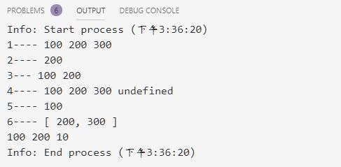
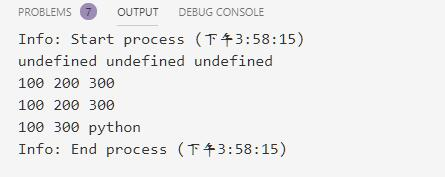
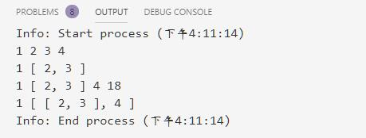
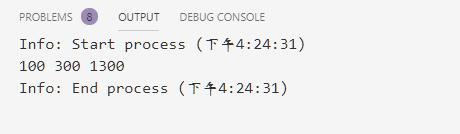
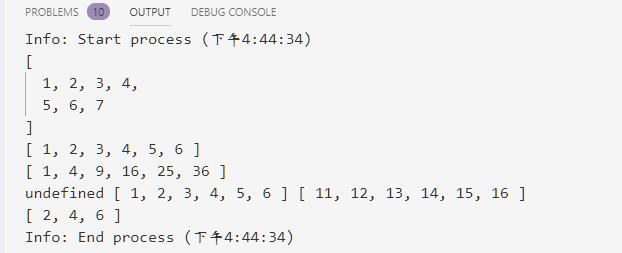
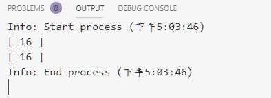
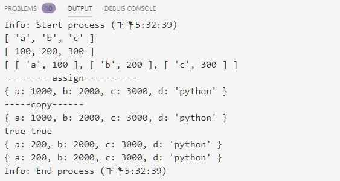

# 解构及数组对象操作

@[toc]

JS的结构很灵活，参考：  
[https://developer.mozilla.org/zh-CN/docs/Web/JavaScript/Reference/Operators/Spread_syntax](https://developer.mozilla.org/zh-CN/docs/Web/JavaScript/Reference/Operators/Spread_syntax)  

* 搜集多个参数使用`【...变量名】`表示
* 结构参数使用`【...需要解构的变量名】`表示

## 解构

### 列表解构

````js
var parts = ['shoulder','knees'];
var lyrics = ['head',...parts,'and','toes'];//使用...结构
console.log(lyrics) // [ 'head', 'shoulder', 'knees', 'and', 'toes' ]
````

### 参数解构

````js
function f(x,y,z){
    console.log(x+y+z);
}

var args = [2,3,4];
f(...args);//9
````

### 数组解构

* 解构的时候，变量从左到右和元素对齐，可变参数放到最右边。  
* 能对应到数据就返回数据，对应不到数据的返回默认值，如果没有默认值返回undefined。

````js
const arr = [100,200,300];
let [x,y,z] = arr;
console.log('1----',x,y,z);

//丢弃
const [,b,] = arr;
console.log('2----',b);
// b=5 //异常，b声明未const

//少于数组元素
const [d,e] = arr;
console.log('3---',d,e);

//多余数组元素
const [m,n,o,p] = arr;
console.log('4----',m,n,o,p);

//可变变量
const [f,...args] = arr
console.log('5----',f);
console.log('6----',args)

//支持默认值
const [j=1,k,,,i=10] = arr;
console.log(j,k,i)
````



### 对象解构

1. 简单对象解构
    * 解构时需要提供对象的属性名，会根据属性名找到对应的值。没有找到的返回缺省值，没有缺省值则返回 undefined。  

    ````js
    const obj={
        a:100,
        b:200,
        c:300
    }

    var {x,y,z} = obj;
    console.log(x,y,z) // undefined undefined undefined

    var {a,b,c} = obj;
    console.log(a,b,c); // 100,200,300

    var {a:m,b:n,c}=obj; //重命名
    console.log(m,n,c); //100,200,300

    var {a:M,c:N,d:D='python'} = obj; //缺省值
    console.log(M,N,D);// 100,300,python
    ````

      
2. 复杂解构

    ````js
    const arr= [1,[2,3],4];

    const [a,[b,c],d] = arr;
    console.log(a,b,c,d);// 1,2,3,4

    const [e,f] = arr;
    console.log(e,f);//1,[2,3]

    const [g,h,i,j=18] = arr;
    console.log(g,h,i,j);//1,[2,3] 4,18

    const [k,...y] = arr;
    console.log(k,y);// 1,[[2,3],4]
    ````

      

    * 对象解构

    ````js
    var data = {
        a:100,
        b:[
            {
                c:200,
                d:[],
                a:300
            },
            {
                c:1200,
                d:[1],
                a:1300
            }
        ],
        c:500
    }

    var {a:m,b:[{a:n},{a:n1}]} = data;
    console.log(m,n,n1)
    ````

      

## 数组操作

|方法|描述|
|:--------|:--------|
|push(...items)|尾部增加多个元素
|pop()|移除最后一个元素，并返回它
|map|引入处理函数来处理数组中每一个元素，返回新的数组
|filter|引入处理函数处理数组中每一个元素，此处理函数返回true的元素保留，否则该元素被过滤掉，保留的元素构成新的数组返回。
|foreach|迭代所有元素，无返回值

````js
const arr = [1,2,3,4,5];
arr.push(6,7);
console.log(arr);
arr.pop();
console.log(arr);

//map 
const powerArr = arr.map(x => x*x); //新数组
console.log(powerArr);

newarr2 = []
const newarr = arr.forEach(x => newarr2.push(x+10));// 无返回值
console.log(newarr,arr,newarr2)

console.log(arr.filter(x => x%2==0)) //新数组
````

  

* 练习：有一个数组[1,2,3,4,5],要求算出所有元素平方值是偶数且大于10的平方值

````js
const arr = [1,2,3,4,5];

//第一种思路
low = Math.sqrt(10);
newarr = arr.filter(x => x>low && (x & 1) == 0).map(x => x*x);
console.log(newarr)

//第二种思路
newarr2 = []
low = Math.sqrt(10);
arr.forEach(x=> (x>low && (x & 1) == 0)?newarr2.push(x*x):'');
console.log(newarr2)
````

  

## 对象的操作

|Object的静态方法|描述|
|:------------|:------|
|Object.keys(obj)|ES5开始支持，返回所有key
|Object.values(obj)|返回所有值，试验阶段，支持较差
|Object.entries(obj)|返回所有值，试验阶段，支持较差
|Object.assign(target,...sources)|使用多个source对象，来填充target对象，返回target对象

````js
var obj = {
    a:100,
    b:200,
    c:300
};

console.log(Object.keys(obj));// key,ES5
console.log(Object.values(obj)); //值，实验性
console.log(Object.entries(obj)); //键值对，实验性

console.log('---------assign----------')
var o1 = Object.assign({},obj,
    {a:1000,b:2000},/* 覆盖 */
    {c:'abc'},/*覆盖 */
    {c:3000,d:'python'} /*覆盖，新增 */
    );
console.log(o1);

console.log('-----copy------')

var o2 = new Object(o1); //是同一个对象
console.log(o2)
console.log(o2 === o1,o2 == o1)
o1.a = 200;
console.log(o1);
console.log(o2);
````

  
