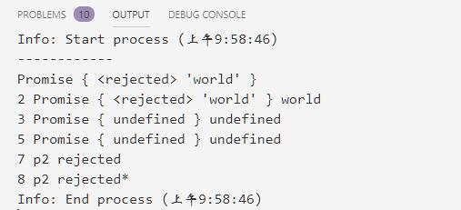
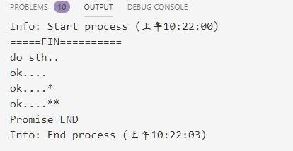

# Promise与流程控制和异步

@[toc]

* ES6开始支持。  
* Promise对象用于一个异步操作的最终完成(包括成功和失败)及结果值的表示。
* 简单说，就是处理异步请求的。之所以叫做Promise，就是承诺，如果成功则怎么处理，失败则怎么处理。

* 语法：

````js
//语法
new Promise(
    /* 下面定义的函数是executor*/
    function(resolve,reject){...}
);
````

1. **executor**
    * executor是一个带有resolve和reject**两个参数的函数**。
    * executor函数在Promise构造函数执行时立即执行，被传递resolve和reject函数(executor函数在Promise构造函数返回新建对象前被调用)。
    * executor内部通常会执行一些异步操作，一旦完成。可以调用resolve函数来将promise状态改成fulfilled即完成，或者在发生错误时将它的状态改为rejected即失败。
    * 如果在executor函数中抛出一个错误，那么该promise状态为rejected。executor函数的返回值被忽略
    * executor中，resolve或reject只能执行其中一个函数
2. Promise的状态
    * pending:初始状态，不是成功或失败状态。
    * fulfilled:意味着操作成功完成。
    * rejected:意味着操作失败。
3. Promise.then(onFulfilled,onRejected)
    * 参数是2个函数，根据Promise的状态来调用不同的函数，fulfilled走onFulfilled函数，rejected状态走onRejected函数。fulfilled状态走onFulfilled函数。
    * then的返回值是一个新的promise对象，执行任意一个函数，对这个promise对象来说就是其返回值。
    * 调用任何一个函数后，其返回值都可以被后续的then方法继续捕捉。
4. catch(onRejected)
    * 为当前Promise对象添加一个拒绝回调，返回一个新的Promise对象
5. Promise提供2个方法：
    1. Promise.resolve(value)返回 状态为fulfilled状态的Promise对象
    2. Promise.reject(reason)返回 状态为rejected状态的Promise对象

````js
function fun(resolve,reject){
    //resolve('hello')
    console.log('------------')
    reject('world')
}
var myPromise = new Promise(fun);

console.log(myPromise);

//消息处理
var p1 = myPromise.then(
    /*如果成功则显示结果*/
    (value) => console.log(1,myPromise,value),
    /*失败则显示原因 */
    (reason) => console.log(2,myPromise,reason)
)

//处理后消息可以继续传递
const resolve = (value)=>console.log(3,p1,value);
const reject = (reason)=>console.log(4,p1,reason);
var p2 = p1.then(resolve,reject);

// 继续传递消息
p2.then(
    value => {
        console.log(5,p2,value);
        return Promise.reject('p2 rejected') //重新改变状态 rejected
    },
    reason => console.log(6,p2,reason)
).catch(//如果状态是rejected就进入
    reason =>{
        console.log(7,reason);
        return Promise.resolve(reason + '* ');// 重新改变状态resolved
    }
).then(
    value => console.log(8,value),//处理
    reason => console.log(9,reason)
)
````



## 异步实例

````js
function runAsync(fun){
    return new Promise(function(resolve,reject){
        //异步操作
        setTimeout(function(){
            console.log('do sth..');
            resolve('ok....')
        },3000);
    });
}

//调用
runAsync().then(
    value =>{
        console.log(value);
        return Promise.reject(value + '*');
    }
).catch(
    reason => {
        console.log(reason);
        return Promise.resolve(reason + '*');
    }
).then(
    value => {
        console.log(value);
        console.log('Promise END');
    }
)

console.log('=====FIN==========')
````




