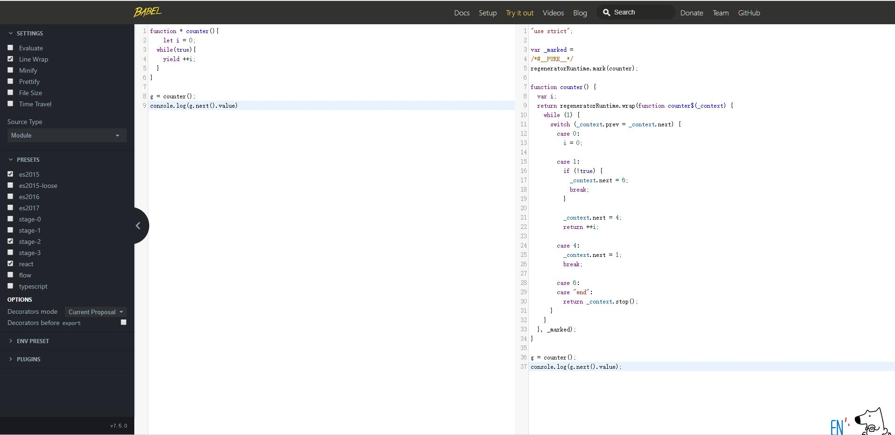

# 模块化

ES6之前，js没有出现模块化系统。  

* JS主要在前端的浏览器中使用，js文件下载缓存到客户端，在浏览器中执行。比如简单的表单本地验证，漂浮一个广告。服务器端使用ASP、JSP等动态网页技术，将动态生成数据嵌入一个HTML模板，里面夹杂着JS后使用 `<script>` 标 签，返回浏览器端。这时候的JS只是一些简单函数和语句的组合。  
* 2005年之后，随着Google大量使用了AJAX技术之后，可以异步请求服务器端数据，带来了前端交互的巨大变化。 前端功能需求越来越多，代码也越来也多。随着js文件的增多，灾难性的后果产生了。由于习惯了随便写，js脚本 中各种全局变量污染，函数名冲突，无法表达脚本之间的依赖关系，因为都是用脚本文件先后加载来实现的。亟待 模块化的出现。  
* 2008年V8引擎发布，2009年诞生了Nodejs，支持服务端JS编程，但没有模块化是不可以的。  
* 之后产生了commonjs规范。commonjs规范，使用全局require函数导入模块，使用exports导出变量。为了将这种模块化规范向前端开发迁移，又演化出其它的规范。例如AMD。
* AMD（Asynchronous Module Definition）异步模块定义，使用异步方式加载模块，模块的加载不影响它后面语 句的执行。所有依赖这个模块的语句，都需要定义在一个回调函数，回调函数中使用模块的变量和函数，等模块加 载完成之后，这个回调函数才会执行，就可以安全的使用模块的资源了。其实现就是AMD/RequireJs。AMD虽然是 异步，但是会预先加载和执行。
* CMD（Common Module Definition），使用seajs，作者是淘宝前端玉伯，兼容并包解决了RequireJs的问题。 CMD推崇as lazy as possible，尽可能的懒加载。  
* 由于社区的模块化呼声很高，ES6开始提供支持模块的语法，但是浏览器目前支持还不够。  

## ES6模块化

* import语句，导入另一个模块导出的绑定。
* export语句，从模块中导出函数、对象、值的，供其他模块import导入用。

### 导出

* 建立一个模块目录src,然后在这个目录下新建一个moda.js，内容如下：  

````js
//缺省导出
export default class A{
    constructor(x){
        this.x = x;
    }
    show(){
        console.log(this.x)
    }
}

//导出函数
export function foo(){
    console.log('foo function');
}

//导出常量
export const CONSTA = 'aaa';
````

* 在src目录中建立text.js导入moda.js中的内容，并使用，如下：

````js
import {A,foo} from "./moda"
import * as mod_a from "./moda"
````

VS Code可以很好的语法支持了，但是运行环境，包括V8引擎，都不能很好的支持模块化语法。  

## 转译工具

转译就是从一种语言代码转换到另一个语言代码，当然也可以从高版本转译到低版本的支持语句。  
由于JS存在不同版本，不同浏览器兼容的问题。可以使用transpiler转译工具解决。

### babel

* 开发中可以使用较新的ES6语法，通过转译器转换为指定的某些版本代码。  
* 官网[https://babeljs.io/](https://babeljs.io/)
* 参考文档[https://babeljs.io/docs/en/6.26.3/index.html](https://babeljs.io/docs/en/6.26.3/index.html)注意当前版本7.x已经有了较大的变化，请参看6.x文档
* 在`Try it out`。中可测试代码
  

### 预设

1. 有如下一些预设presets，我们先看看有哪些，一会儿再进行预设的安装和配置
    * presets:
        1. `babel-preset-env`当前环境支持的代码，新target
    * ES2015转码规则
        1. `npm install --save-dev babel-preset-es2015`
    * react转码规则
        1. `npm install --save-dev babel-preset-react`
    * ES7不同阶段语法提案的转码规则(共4个阶段)，选装一个
        1. `npm install --save-dev babel-preset-stage-0`
        2. `npm install --save-dev babel-preset-stage-1`
        3. `npm install --save-dev babel-preset-stage-2`
        4. `npm install --save-dev babel-preset-stage-3`

### 离线转译安装配置

#### 1.初始化npm

* 打开cmd命令窗口，进入项目根目录。输入`npm init`初始化项目根目录

````cmd
PS D:\MyPythonUse\WebJS> npm init
This utility will walk you through creating a package.json file.
It only covers the most common items, and tries to guess sensible defaults.

See `npm help json` for definitive documentation on these fields
and exactly what they do.

Use `npm install <pkg>` afterwards to install a package and
save it as a dependency in the package.json file.

Press ^C at any time to quit.
package name: (webjs) test
version: (1.0.0)
description: babel
entry point: (test.js)
test command:
git repository:
keywords:
author: xdd
license: (ISC)
About to write to D:\MyPythonUse\WebJS\package.json:

{
  "name": "test",
  "version": "1.0.0",
  "description": "babel",
  "main": "test.js",
  "scripts": {
    "test": "echo \"Error: no test specified\" && exit 1"
  },
  "author": "xdd",
  "license": "ISC"
}


Is this OK? (yes) yes
PS D:\MyPythonUse\WebJS>
````

* 在项目根目录下会生成package.json文件，内容就是上面花括号的内容。  

#### 2.设置镜像

* `.npmrc`文件。修改npm安装软件时默认连接仓库为淘宝的npm仓库。
    1. 可以放到npm的目录下npmrc文件中
    2. 可以放到用户家目录中
    3. 可以放到项目根目录中
* 本次放到项目根目录黄总，内容如下：
    1. 在项目更目录中新建一个文件名为`.npmrc`的文件。写入`registry=https://registry.npm.taobao.org`
        * `$ echo "registry=https://registry.npm.taobao.org" > .npmrc`

#### 3.安装

* 项目根目录下执行`npm install babel-core babel-cli --save-dev`
    1. --save--dev说明：当你为你的模块安装一个依赖模块时，正常情况下你得先安装他们（在模块根目录下npm install module-name），然 后连同版本号手动将他们添加到模块配置文件package.json中的依赖里（dependencies）。开发用。--save和--save-dev可以省掉你手动修改package.json文件的步骤。
    2. `spm install module-name --save` 自动把模块和版本号添加到dependencies部分
    3. `spm install module-name --save-dev` 自动把模块和版本号添加到devdependencies部分
* 安装完后，在项目根目录下出现`node_modules`目录 ，里面有babel相关模块及依赖的模块。  
  

#### 4.修改package.json

* 修改package.json文件中scripts的部分，添加`"build": "babel src -d lib"`。
    1. `"build": "babel src -d lib"`从src目录中转译后的文件输出到lib目录
    2. 修改`"license": "ISC"`为`"license": "MIT"`

  

#### 5.准备目录

* 项目根目录下建立src和lib目录。
    1. src是源码文件目录。
    2. lib是目标目录。

#### 6.配置babel和安装依赖

* 在目录根目录下创建`.babelrc`文件，Json格式。

````json
{
    "presets":["env"]
}
````

* `env`可以根据当前环境自动选择。
* 安装依赖`npm install babel-preset-env --save-dev`  
  

#### 7.准备js文件

1. 在src中的mod.js

    ````js
    // 缺省导出
    export default class A{
        constructor(x){
            this.x = x;
        }

        show(){
            console.log(this.x);
        }
    }

    export function foo(){
        console.log('foo function');
    }
    ````

2. 在src目录下的index.js

    ````js
    import A,{foo} from './mod'

    var a = new A(100);
    a.show();

    foo();
    ````

    * index.js这段代码在vs Code的环境下执行出错。估计很难有能够正常运行的环境。所以，要转义为ES5的代码。

#### 8.转义js文件

1. 在项目根目录下执行命令`npm run build`

    ````shell
    $ npm run build

    > js@1.0.0 build D:\MyPythonUse\WebJS
    > babel src -d lib

    src\index.js -> lib\index.js
    src\mod.js -> lib\mod.js

    gdy@gdy MINGW64 /d/MyPythonUse/WebJS
    $
    ````

    * 可以看到两个文件被转义,运行转义文件`node lib/index.js`

    ````shell
    $ node lib/index.js
    100
    foo function

    gdy@gdy MINGW64 /d/MyPythonUse/WebJS
    ````

    * 使用babel等转译器转译JS非常流行。开发者可以在高版本中使用新的语法特性，提高开发效率，把兼容性问题交给转译器处理。

#### 9.可能出现的错误

* `.babelrc`文件错误。重新删除`.babelrc`文件后再重新建立一个该文件。

1. 错误信息

    ````shell
    gdy@gdy MINGW64 /d/MyPythonUse/WebJS
    $ npm run build

    > js@1.0.0 build D:\MyPythonUse\WebJS
    > babel src -d lib

    SyntaxError: D:\MyPythonUse\WebJS\.babelrc: Error while parsing JSON - Unexpected '�' at line 1 column 2 of the JSON5 data. Still to read: "��{\u0000\r\u0000\n\u0000\t\u0000\"\u0000p\u0000r\u0000e\u0000s\u0000"
        at error (D:\MyPythonUse\WebJS\node_modules\json5\lib\json5.js:56:25)
        at word (D:\MyPythonUse\WebJS\node_modules\json5\lib\json5.js:393:13)
        at value (D:\MyPythonUse\WebJS\node_modules\json5\lib\json5.js:493:56)
        at Object.parse (D:\MyPythonUse\WebJS\node_modules\json5\lib\json5.js:508:18)
        at ConfigChainBuilder.addConfig (D:\MyPythonUse\WebJS\node_modules\babel-core\lib\transformation\file\options\build-config-chain.js:150:65)
        at ConfigChainBuilder.findConfigs (D:\MyPythonUse\WebJS\node_modules\babel-core\lib\transformation\file\options\build-config-chain.js:96:16)
        at buildConfigChain (D:\MyPythonUse\WebJS\node_modules\babel-core\lib\transformation\file\options\build-config-chain.js:61:13)
        at OptionManager.init (D:\MyPythonUse\WebJS\node_modules\babel-core\lib\transformation\file\options\option-manager.js:354:58)
        at File.initOptions (D:\MyPythonUse\WebJS\node_modules\babel-core\lib\transformation\file\index.js:212:65)
        at new File (D:\MyPythonUse\WebJS\node_modules\babel-core\lib\transformation\file\index.js:135:24)
    npm ERR! code ELIFECYCLE
    npm ERR! errno 1
    npm ERR! js@1.0.0 build: `babel src -d lib`
    npm ERR! Exit status 1
    npm ERR!
    npm ERR! Failed at the js@1.0.0 build script.
    npm ERR! This is probably not a problem with npm. There is likely additional logging output above.

    npm ERR! A complete log of this run can be found in:
    npm ERR!     C:\Users\gdy\AppData\Roaming\npm-cache\_logs\2019-07-06T13_06_31_034Z-debug.log
    ````

2. 解决办法

    ````shell
    gdy@gdy MINGW64 /d/MyPythonUse/WebJS
    $ rm .babelrc

    gdy@gdy MINGW64 /d/MyPythonUse/WebJS
    $ echo "{\"presets\": [\"env\"]}" >.babelrc

    gdy@gdy MINGW64 /d/MyPythonUse/WebJS
    $ cat .babelrc
    {"presets": ["env"]}

    gdy@gdy MINGW64 /d/MyPythonUse/WebJS
    $ npm run build

    > js@1.0.0 build D:\MyPythonUse\WebJS
    > babel src -d lib

    src\index.js -> lib\index.js
    src\mod.js -> lib\mod.js

    gdy@gdy MINGW64 /d/MyPythonUse/WebJS
    $
    ````

### 导入导出

* 说明：导出代码都在src/mod.js中，导入代码都写在src/index.js中。

#### 缺省导入导出

* 只允许一个缺省导出，缺省导出可以是变量、函数、类，但不能使用let、var、const关键字作为默认导出。
* 缺省导入，不需要在import后使用花括号。
* 缺省导入的时候，可以自己重新命名，可以不需要和缺省导出时的名称一致，但最好一致。
* 可以使用`import * as 新名称 from '模块'`语法来导入所有导出。

1. src/mod.js中

    ````js
    //缺省导出 匿名函数
    export default function() {
        console.log('我是缺省导出')
    }
    ````

2. src/index.js中

    ````js
    //缺省导入
    import defaultFunc from './mod'
    defaultFunc();
    ````

3. 控制台执行命令：

    ````shell
    $ npm run build

    > js@1.0.0 build D:\MyPythonUse\WebJS
    > babel src -d lib

    src\index.js -> lib\index.js
    src\mod.js -> lib\mod.js

    gdy@gdy MINGW64 /d/MyPythonUse/WebJS
    $ node lib/index.js
    我是缺省导出

    gdy@gdy MINGW64 /d/MyPythonUse/WebJS
    $
    ````

* 第二种示例

    ````js
    // mod模块中
    // 缺省导出 命名函数
    export default function xyz(){
        console.log('default export function')
    }

    // index模块中
    //缺省导入
    import defaultFunc from './mod'
    defaultFunc();
    ````

* 命名导入和导出

1. src/mod.js中

    ````js
    /**
     * 导出举例
     */

    //缺省导出 类
    export default class {
        constructor(x){
            this.x = x;
        }
        show(){
            console.log(this.x);
        }
    }

    // 命名导出 函数
    export function foo(){
        console.log('我是函数foo');
    }

    // 定义函数
    function bar(){
        console.log("我是函数bar()");
    }

    // 变量常量定义
    let x = 100;
    var y = 200;
    const z = 300;

    //导出
    export {bar,x,y,z}
    ````

2. src/index.js中

    ````js
    /**
     * 导入举例
     * as 设置别名
     */

    import defaultCls,{foo,bar,x,y,z as CONST_C} from './mod';

    foo();
    bar();
    console.log(x); //x只读，不可修改，x++会出现异常
    console.log(y); //y只读
    console.log(CONST_C);

    let fun =new defaultCls(1000);
    fun.show();
    ````

3. cmd命令行中执行

    ````shell
    $ npm run build

    > js@1.0.0 build D:\MyPythonUse\WebJS
    > babel src -d lib

    src\index.js -> lib\index.js
    src\mod.js -> lib\mod.js

    gdy@gdy MINGW64 /d/MyPythonUse/WebJS
    $ node ./lib/index.js
    我是函数foo
    我是函数bar()
    100
    200
    300
    1000

    gdy@gdy MINGW64 /d/MyPythonUse/WebJS
    $
    ````

* 在index.js文件中也可以使用下面形式，导入所有导出，但是会定义一个新的名词空间。使用名词空间可以避免冲突。

    ````js
    import * as newmod from './mod';

    newmod.foo();
    newmod.bar();
    new newmod.default(2000).show();
    ````


