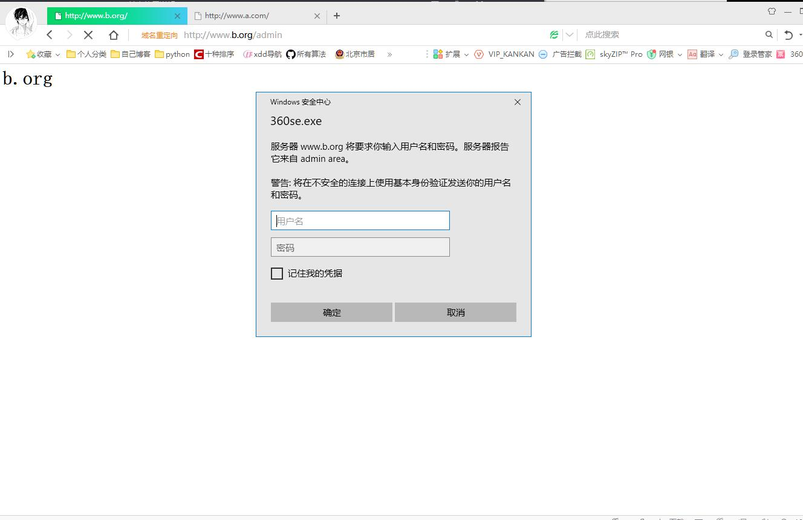
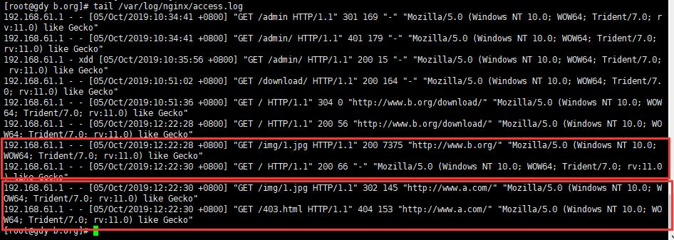
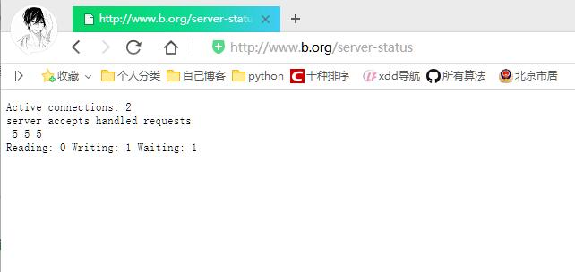

# nginx安装及配置

[toc]

* nginx的三大功能
    1. web service(static content静态内容)工作在应用层的服务
    2. web reverse proxy(http的反向代理)
    3. cache(缓存)

* web服务器使用调查[https://www.netcraft.com/](https://www.netcraft.com/)  
* nginx下载网站[http://nginx.org/](http://nginx.org/)  
* nginx官方文档[http://nginx.org/en/docs/](http://nginx.org/en/docs/)

1. http protocol(http 协议)：request(请求)--》response(响应)
    * 请求报文：
        * `<method> <URL> <version> <headers>  <body>`
    * 响应报文：
        * `<version> <status code> <reason phrase> <headers> <body>`
    * 响应码：
        * `1xx` 提示信息，表示请求已被成功接收，继续处理
        * `2xx` 表示正常响应
            * `200` 表示返回了网页内容,即请求成功
        * `3xx` 重定向
            * `301` 页面永久性移走，永久重定向。返回新的URL，浏览器会根据返回的url发起新的request请求
            * `302` 临时重定向
            * `304` 资源未修改，浏览器使用本地缓存
        * `4xx` 客户端请求错误
            * `404` Not Found,问也找不到，客户端请求的资源有错
            * `400` 请求语法错误
            * `401` 请求要求身份验证
            8 `403` 服务器拒绝请求
        * `5xx` 服务器端错误
            * `500` 服务器内部错误
            * `502` 上游服务器错误，例如nginx反向代理的时候
2. stateless:无状态
    * 每一个web页面，是有许多个web对象组成。每一个web对象都是需要单独获取。
    * http协议是基于tcp协议，每次tcp的传输都需要三次握手，四次断开。
    * keepalive:能在同一tcp穿传输通道中不间断的获取不同的请求资源。  
        1. 时间上控制：timeout保持链接时长
        2. 数量：同时开启的请求数量限制
3. IO模型
    * 同步柱塞
    * 同步非阻塞
    * IO复用
        1. select(),poll()
        2. prefork:select()
    * 事件通知
    * 异步
    * mmap:数据由磁盘直接以页面形式映射进入内存中。
4. (并发编程)处理并发用户请求：
    1. 单进程模型：串行方式响应
    2. 多进程模型：prefork，一个进程响应一个用户请求，并发使用多个进程实现：
    3. 多进程模型：worker,一个进程生成多个线程，一个线程响应一个用户请求：并发使用多个线程实现：n个进程，n*m个线程；
    4. 事件模型：event,一个线程响应多个用户请求，基于事件驱动机制来维持多个用户请求。

## nginx特性

* nginx：非阻塞模型，事件驱动机制，一个master多个worker,一个worker响应多个用户请求

* 基本功能：
    1. 服务于静态资源的web服务器，能缓存打开的文件描述符
    2. 反向代理服务器，缓存、负载均衡
    3. 支持FastCGI
    4. 模板化机制，非DSO机制，支持多种过滤器：gzip,SSI和图像大小调整等。
    5. 支持SSL
* 扩展功能：
    1. 基于名称和IP做虚拟主机
    2. 支持keepalive
    3. 支持平滑配置更新或程序版本升级
    4. 支持定制访问日志，支持使用日志缓存以提高性能
    5. 支持url rewrite(url地址重写)
    6. 支持路径别名
    7. 支持基于IP及用户的认证
    8. 支持速率限制，并发限制等
* **nginx的基本架构**
    1. 一个master,生成一个或多个worker
    2. 事件驱动：kqueue,epoll,/dev/poll
        * 消息通知：select,poll,rt signals
    3. 支持sendfile,sendfile64
    4. 支持AIO
    5. 支持mmap

## nginx模块类别

* 核心模块
* 标准http模块
* 可选http模块
* 邮件模块
* 第三方扩展模块

## nginx的安装及配置

* nginx安装包下载地址[http://nginx.org/packages/centos/6/x86_64/RPMS/nginx-1.14.2-1.el6.ngx.x86_64.rpm](http://nginx.org/packages/centos/6/x86_64/RPMS/nginx-1.14.2-1.el6.ngx.x86_64.rpm)  
* nginx各个版本下载地址[http://nginx.org/en/download.html](http://nginx.org/en/download.html)

1. 安装编译环境
    * `yum -y groupinstall "Development Tools" "Server Platform Development"`
    * `yum -y install pcre-devel openssl openssl-devel`
2. 下载nginx安装包
    * `wget http://nginx.org/download/nginx-1.16.1.tar.gz`
3. 解压安装包
    * `tar xf nginx-1.16.1.tar.gz`
    1. 进入nginx的源码目录，可以查看安装配置信息
        * `./configure --help`

        ````txt
        --prefix=PATH                      安装路径
        --sbin-path=PATH                   nginx的核心程序，即安装路径
        --modules-path=PATH                主配置文件
        --conf-path=PATH                   nginx.conf的配置路径
        --error-log-path=PATH              错误日志路径
        --pid-path=PATH                    nginx.pid文件路径
        --lock-path=PATH                   nginx.lock文件路径，锁文件路径

        --user=USER                        以哪个普通用户运行worker
        --group=GROUP                      以哪个普通组运行worker

        --build=NAME                       set build name
        --builddir=DIR                     set build directory

        --with-select_module               安装实时信号模块
        --without-select_module            不安装select模块，默认是安装的
        --with-poll_module                 安装poll模块
        --without-poll_module              不安装poll模块

        --with-threads                     enable thread pool support

        --with-file-aio                    支持文件的AIO机制

        --with-http_ssl_module             enable ngx_http_ssl_module
        --with-http_v2_module              enable ngx_http_v2_module
        --with-http_realip_module          enable ngx_http_realip_module
        --with-http_addition_module        enable ngx_http_addition_module
        --with-http_xslt_module            enable ngx_http_xslt_module
        --with-http_xslt_module=dynamic    enable dynamic ngx_http_xslt_module
        --with-http_image_filter_module    enable ngx_http_image_filter_module
        --with-http_image_filter_module=dynamic
                                            enable dynamic ngx_http_image_filter_module
        --with-http_geoip_module           enable ngx_http_geoip_module
        --with-http_geoip_module=dynamic   enable dynamic ngx_http_geoip_module
        --with-http_sub_module             enable ngx_http_sub_module
        --with-http_dav_module             enable ngx_http_dav_module
        --with-http_flv_module             enable ngx_http_flv_module
        --with-http_mp4_module             enable ngx_http_mp4_module
        --with-http_gunzip_module          enable ngx_http_gunzip_module
        --with-http_gzip_static_module     enable ngx_http_gzip_static_module
        --with-http_auth_request_module    enable ngx_http_auth_request_module
        --with-http_random_index_module    enable ngx_http_random_index_module
        --with-http_secure_link_module     enable ngx_http_secure_link_module
        --with-http_degradation_module     enable ngx_http_degradation_module
        --with-http_slice_module           enable ngx_http_slice_module
        --with-http_stub_status_module     enable ngx_http_stub_status_module

        --without-http_charset_module      disable ngx_http_charset_module
        --without-http_gzip_module         disable ngx_http_gzip_module
        --without-http_ssi_module          disable ngx_http_ssi_module
        --without-http_userid_module       disable ngx_http_userid_module
        --without-http_access_module       disable ngx_http_access_module
        --without-http_auth_basic_module   disable ngx_http_auth_basic_module
        --without-http_mirror_module       disable ngx_http_mirror_module
        --without-http_autoindex_module    disable ngx_http_autoindex_module
        --without-http_geo_module          disable ngx_http_geo_module
        --without-http_map_module          disable ngx_http_map_module
        --without-http_split_clients_module disable ngx_http_split_clients_module
        --without-http_referer_module      disable ngx_http_referer_module
        --without-http_rewrite_module      disable ngx_http_rewrite_module
        --without-http_proxy_module        disable ngx_http_proxy_module
        --without-http_fastcgi_module      disable ngx_http_fastcgi_module
        --without-http_uwsgi_module        disable ngx_http_uwsgi_module
        --without-http_scgi_module         disable ngx_http_scgi_module
        --without-http_grpc_module         disable ngx_http_grpc_module
        --without-http_memcached_module    disable ngx_http_memcached_module
        --without-http_limit_conn_module   disable ngx_http_limit_conn_module
        --without-http_limit_req_module    disable ngx_http_limit_req_module
        --without-http_empty_gif_module    disable ngx_http_empty_gif_module
        --without-http_browser_module      disable ngx_http_browser_module
        --without-http_upstream_hash_module
                                            disable ngx_http_upstream_hash_module
        --without-http_upstream_ip_hash_module
                                            disable ngx_http_upstream_ip_hash_module
        --without-http_upstream_least_conn_module
                                            disable ngx_http_upstream_least_conn_module
        --without-http_upstream_random_module
                                            disable ngx_http_upstream_random_module
        --without-http_upstream_keepalive_module
                                            disable ngx_http_upstream_keepalive_module
        --without-http_upstream_zone_module
                                            disable ngx_http_upstream_zone_module

        --with-http_perl_module            enable ngx_http_perl_module
        --with-http_perl_module=dynamic    enable dynamic ngx_http_perl_module
        --with-perl_modules_path=PATH      set Perl modules path
        --with-perl=PATH                   set perl binary pathname

        --http-log-path=PATH               set http access log pathname
        --http-client-body-temp-path=PATH  set path to store
                                            http client request body temporary files
        --http-proxy-temp-path=PATH        set path to store
                                            http proxy temporary files
        --http-fastcgi-temp-path=PATH      set path to store
                                            http fastcgi temporary files
        --http-uwsgi-temp-path=PATH        set path to store
                                            http uwsgi temporary files
        --http-scgi-temp-path=PATH         set path to store
                                            http scgi temporary files

        --without-http                     disable HTTP server
        --without-http-cache               disable HTTP cache

        --with-mail                        enable POP3/IMAP4/SMTP proxy module
        --with-mail=dynamic                enable dynamic POP3/IMAP4/SMTP proxy module
        --with-mail_ssl_module             enable ngx_mail_ssl_module
        --without-mail_pop3_module         disable ngx_mail_pop3_module
        --without-mail_imap_module         disable ngx_mail_imap_module
        --without-mail_smtp_module         disable ngx_mail_smtp_module

        --with-stream                      enable TCP/UDP proxy module
        --with-stream=dynamic              enable dynamic TCP/UDP proxy module
        --with-stream_ssl_module           enable ngx_stream_ssl_module
        --with-stream_realip_module        enable ngx_stream_realip_module
        --with-stream_geoip_module         enable ngx_stream_geoip_module
        --with-stream_geoip_module=dynamic enable dynamic ngx_stream_geoip_module
        --with-stream_ssl_preread_module   enable ngx_stream_ssl_preread_module
        --without-stream_limit_conn_module disable ngx_stream_limit_conn_module
        --without-stream_access_module     disable ngx_stream_access_module
        --without-stream_geo_module        disable ngx_stream_geo_module
        --without-stream_map_module        disable ngx_stream_map_module
        --without-stream_split_clients_module
                                            disable ngx_stream_split_clients_module
        --without-stream_return_module     disable ngx_stream_return_module
        --without-stream_upstream_hash_module
                                            disable ngx_stream_upstream_hash_module
        --without-stream_upstream_least_conn_module
                                            disable ngx_stream_upstream_least_conn_module
        --without-stream_upstream_random_module
                                            disable ngx_stream_upstream_random_module
        --without-stream_upstream_zone_module
                                            disable ngx_stream_upstream_zone_module

        --with-google_perftools_module     enable ngx_google_perftools_module
        --with-cpp_test_module             enable ngx_cpp_test_module

        --add-module=PATH                  enable external module
        --add-dynamic-module=PATH          enable dynamic external module

        --with-compat                      dynamic modules compatibility

        --with-cc=PATH                     set C compiler pathname
        --with-cpp=PATH                    set C preprocessor pathname
        --with-cc-opt=OPTIONS              set additional C compiler options
        --with-ld-opt=OPTIONS              set additional linker options
        --with-cpu-opt=CPU                 build for the specified CPU, valid values:
                                            pentium, pentiumpro, pentium3, pentium4,
                                            athlon, opteron, sparc32, sparc64, ppc64

        --without-pcre                     disable PCRE library usage
        --with-pcre                        force PCRE library usage
        --with-pcre=DIR                    set path to PCRE library sources
        --with-pcre-opt=OPTIONS            set additional build options for PCRE
        --with-pcre-jit                    build PCRE with JIT compilation support

        --with-zlib=DIR                    set path to zlib library sources
        --with-zlib-opt=OPTIONS            set additional build options for zlib
        --with-zlib-asm=CPU                use zlib assembler sources optimized
                                            for the specified CPU, valid values:
                                            pentium, pentiumpro

        --with-libatomic                   force libatomic_ops library usage
        --with-libatomic=DIR               set path to libatomic_ops library sources

        --with-openssl=DIR                 set path to OpenSSL library sources
        --with-openssl-opt=OPTIONS         set additional build options for OpenSSL

        --with-debug                       enable debug logging
        ````

4. 添加用户nginx，实现以之运行nginx服务进程
    * `groupadd -r nginx`
    * `useradd -r -g nginx nginx`
5. 开始编译和安装

    ````sh
    # ./configure \
        --prefix=/usr \
        --sbin-path=/usr/sbin/nginx \
        --conf-path=/etc/nginx/nginx.conf \
        --error-log-path=/var/log/nginx/error.log \
        --http-log-path=/var/log/nginx/access.log \
        --pid-path=/var/run/nginx/nginx.pid \
        --lock-path=/var/lock/nginx.lock \
        --user=nginx \
        --group=nginx \
        --with-http_ssl_module \
        --with-http_flv_module \
        --with-http_stub_status_module \
        --with-http_gzip_static_module \
        --http-client-body-temp-path=/var/tmp/nginx/client/ \ #用户上传文件等，使用缓存
        --http-proxy-temp-path=/var/tmp/nginx/proxy/ \ #反向代理，时使用的缓存
        --http-fastcgi-temp-path=/var/tmp/nginx/fcgi \
        --http-uwsgi-temp-path=/var/tmp/nginx/uwsgi \
        --http-scgi-temp-path=/var/tmp/nginx/scgi \
        --with-pcre | tee /tmp/nginx.out
    # make && make install
    ````

    * 说明：
    1. Nginx可以使用Tmalloc(快速，多线程的malloc库及优秀性能分析工具)来加速内存分配，使用此功能需要事先安装gperftools,而后在编译nginx添加--with-google_perftools_module选项即可。
    2. 如果想使用nginx的perl模块，可以通过为configure脚本添加--with-http_perl_module选项来实现，但目前此模块仍处于实验性使用阶段，可能会在运行中出现意外，因此，其实现方式这里不再介绍。如果想使用基于nginx的cgi功能，也可以基于FCGI来实现，具体实现方法请参照网上文档。
6. 选项说明`nginx -h`

    ````txt
    nginx version: nginx/1.16.1
    Usage: nginx [-?hvVtTq] [-s signal] [-c filename] [-p prefix] [-g directives]

    Options:
    -?,-h         : 查看帮助
    -v            : 查看版本信息
    -V            : 显示版本和配置选项，然后退出
    -t            : 测试配置和退出
    -T            : 测试配置，转储并退出
    -q            : 在配置测试期间禁止非错误消息
    -s signal     : 向主进程发送信号:停止、退出、重新打开、重新加载
    -p prefix     : 设置前缀路径(默认:/usr/)
    -c filename   : 设置配置文件(默认:/etc/nginx/nginx.conf)
    -g directives : 从配置文件中设置全局指令
    ````

7. 测试安装配置`nginx -t`
    * 发现需要建立目录`mkdir /var/tmp/nginx`

    ````sh
    [root@gdy nginx-1.16.1]# nginx -t
    nginx: the configuration file /etc/nginx/nginx.conf syntax is ok
    nginx: [emerg] mkdir() "/var/tmp/nginx/client/" failed (2: No such file or directory)
    nginx: configuration file /etc/nginx/nginx.conf test failed
    [root@gdy nginx-1.16.1]# mkdir /var/tmp/nginx
    [root@gdy nginx-1.16.1]# nginx -t
    nginx: the configuration file /etc/nginx/nginx.conf syntax is ok
    nginx: configuration file /etc/nginx/nginx.conf test is successful
    [root@gdy nginx-1.16.1]# 
    ````

8. 启动nginx,直接运行`nginx`
    * 可以使用`ss -tnl`查看启动后的80端口
    * 可以使用`ps -aux | grep nginx`查询相关信息
9. 下载配置nginx.vim
    * 在当前用户家目录下`mkdir .vim/syntax -pv`
    * 下载nginx.vim文件`wget https://www.vim.org/scripts/download_script.php?src_id=19394`
    * 在~/.vim/filetype.vim文件中添加如下内容：`au BufRead,BufNewFile /etc/nginx/*,/usr/local/nginx/conf/* if &ft == '' | setfiletype nginx | endif`
    * 此时编辑/etc/nginx/nginx.conf文件会有vim的颜色区分

### nginx的配置文件

1. nginx基本配置的类别：
    * 用于调试、定位问题
    * 正常运行的必备配置
    * 优化性能的配置
    * 事件类的配置
2. worker进程应该以普通用户身份运行：通常是nginx用户，nginx组
    * HTTP的方法：GET，HEAD,POST,PUT,DELETE,OPTIONS,TRACE

### nginx的配置

* 相关配置官网介绍[http://nginx.org/en/docs/ngx_core_module.html](http://nginx.org/en/docs/ngx_core_module.html)

1. **正常运行的必备配置**
    1. `user username [groupname];`指定运行worker进程的用户和组
    2. `pid /path/to/pidfile_name;`指定nginx的pid文件
    3. `worker_rlimit_nofile number;`指定一个worker进程所能够打开的最大文件句柄数。
    4. `worker_rlimit_sigpending number;`设定每个用户能够发往worker进程的信号的数量
2. **优化性能相关配置**
    1. `worker_processes number;`worker进程的个数(通常其数值应为CPU的物理核心数减1)
    2. `worker_cpu_affinity cpumask(cpu掩码);`
        * cpumask(cpu掩码),假如有4个cpu，那么表示为0000
            1. `0001`表示对应在1位置上的cpu
            2. `0011`表示使用2个CPU
            3. `0100`表示使用1个cpu
        * 例如：假如cpu有8个物理核心，只使用其中6个cpu核心

            ````txt
            worker_processes 6;
            worker_cpu_affinity 00000001 00000010 00000100 00001000 00010000 00100000;一共使用6个cpu核心
            ````

    3. `ssl_engine device;`存在ssl硬件加速器的服务器上，指定所使用的ssl硬件加速设备
    4. `timer_resolution interval(间隔时间);`每次内核事件调用返回时，都会使用gettimeofday()来更新nginx缓存时钟：timer_resolution用于定义每隔多久才会由gettimeofday()更新一次缓存时钟，目前x86-64系统上，gettimefday()代价已经很小，可以忽略此配置。
    5. `worker_priority nice;`为工作进程定义调度优先级
        * nice取值范围[-20,19],nice值越小优先级越高。
3. **事件相关配置**
    1. `accept_mutex [on|off];`是否打开Ningx的负载均衡锁；此锁能够让多个worker进程轮流地、序列化地与新客户端建立连接；而通常当一个worker进程的负载达到其上限的7/8,master就尽可能不再将请求调度此worker:
    2. `lock_file /path/to/lock_file;` lock锁2文件，如果没有第一项，此项也没有用
    3. `accept_mutex_delay #ms;`accept锁模式中，一个worker进程为取得accept锁的等待时长：如果某worker进程在某次试图取得锁时失败了，至少要等待#ms才能再一次请求锁；
    4. `multi_accept on|off;` 是否允许一次性第响应多个用户请求：默认为off
    5. `use [epoll|rtsig|select|poll];`定义使用的事件模型，建议让nginx自动选择
    6. `worker_connections number;`每个worker能够并发响应最大请求数,通常要小于worker_rlimit_nofile的配置数
4. **用于调试、定位问题**只调试nginx时使用
    1. `daemon [on|off];`是否让nginx运行在后台，默认为on，调试时可以设置为off，使得所有信息直接输出控制台
    2. `master_process on|off`是否以master/worker模式运行nginx：默认为on:调试时可设置为off以方便追踪
    3. `error_log /path/to/error_log level;`错误日志文件及其级别：调试时可以使用debug级别，单要求在编译时必须使用--with-debug启动debug功能
        * level 通常默认为error级别

### nginx的http功能

* 必须使用虚拟主机来配置站点：每一个虚拟主机使用一个`server {}`段配置：
* 非虚拟主机的配置或公共配置，需要定义在server之外，http之内：

    ````conf
    http {
        directive value;
        ...

        server {
            listen 80; #监听的地址和端口
            server_name localhost; 主机名
            localhost / { #路径映射
                root    html;
                index   index,html index.htm;
            }
        }

        server {

        }
    }
    ````

* 相关配置官网介绍[http://nginx.org/en/docs/http/ngx_http_core_module.html](http://nginx.org/en/docs/http/ngx_http_core_module.html)  
    1. 注意：语法中context表示该名能出现的在那种段落中

    ````txt
    Syntax: server_name name ...;
    Default:
    server_name "";
    Context:    server #表示只能出现在server段落中
    ````

1. `server {}`定义一个虚拟主机：nginx支持使用基于主机名或IP的虚拟主机
    1. `listen`
        * `listen address[:port];`监听指定地址的指定端口
        * `listen port;`监听所有地址的指定端口
        * `listen unix:socket_file_path;`监听在unix套接字文件上
        * listen的可选部分参数：
            * `default_server`:定义此server为http中默认的server;如果所有server中没有任何一个listen使用此参数，那么第一个个server即为默认server
            * `rcvbuf=SIZE`接收缓冲大小
            * `sndbuf=SIZE`发送缓冲大小
            * `ssl`这是一个https的server
    2. `server_name [name ...]`设定主机名，可以设置多个主机名，名称中可以使用通配符和正则表达式。当nginx收到一个请求时，会取出其首部的server的值，而后跟众server_name进行比较：
        * 比较方式：
            1. 先做精确匹配：www.xdd.com
            2. 左侧通配符匹配:*.xdd.com
            3. 右侧通配符匹配:www.*
            4. 正则表达式匹配:~^.*\.xdd\.com$
    3. `server_name_hash_bucket_size 32|64|128;`为了实现快速主机查找，nginx使用hash来保存主机名
    4. `localhost`
        * 语法：

            ````txt
            Syntax: location [ = | ~ | ~* | ^~ ] uri { ... } #第一种语法
                    location @name { ... }#第二种语法
            Default:    —
            Context:    server, location
            ````

        * `location [ = | ~ | ~* | ^~ ] uri { ... }`
            1. 功能：允许根据用户请求的URI来匹配指定的各location以进行访问配置；匹配到时，将被location快中的配置所处理：比如`http://www.xdd.com/images/logo.gif`
            * `=`：精确匹配
            * `~`：正则表达式模式匹配，匹配时区分字符大小写
            * `~*`：正则表达式模式匹配，匹配时忽略字符大小写
            * `^~`：URI前半部分匹配，不检查正则表达式
            * 匹配优先级：
                1. 按字符字面量最精确匹配
                2. 正则表达式检索匹配(由第一个匹配到所处理)
                3. 按字符字面量匹配

            * 示例：

                ````js
                location = / {
                    [ configuration A ]
                }

                location / {
                    [ configuration B ]
                }

                location /documents/ {
                    [ configuration C ]
                }

                location ^~ /images/ {
                    [ configuration D ]
                }

                location ~* \.(gif|jpg|jpeg)$ {
                    [ configuration E ]
                }

                请求：`http://www.xdd.com/`将会被A匹配
                请求：`http://www.xdd.com/indx.html`将会被B匹配
                请求：`http://www.xdd.com/document/indx.html`会被C匹配到
                请求：`http://www.xdd.com/images/index.html`会被D匹配到
                请求：`http://www.xdd.com/images/a.jpg`会被E匹配到
                ````

### 文件路径定义

1. `root path`设置web资源路径：用于指定请求的根文档目录
    * 语法：

        ````txt
        Syntax: root path;
        Default: root html;
        Context:    http, server, location, if in location
        ````

    * 简单示例

    ````txt
    location / {
        root /www/htdocs;
        index index.html index.htm;
    }

    location ^~ /images {
        root /web;
    }

    * 访问`http://www.xdd.com/a.html`会在linux目录中/www/htdocs目录下寻找a.html文件
    * 访问`http://www.xdd.com/images/b.html`会在linux目录中/web/images目录下寻找b.html文件
    ````

2. `alias path`只能用于location中，用于路径别名

    ````txt
    location / {
        root /www/htdocs;
        index index.html index.htm;
    }

    location ^~ /images {
        alias /web;
    }

    * 访问`http://www.xdd.com/images/b.html`会在linux目录中/web目录下寻找b.html
    ````

3. `index file ...;`定义默认页面，可以跟多个值，从左向右匹配。
4. `error_page code ... [=[response]] uri;`错误页面重定向。当对于某个请求返回错误时，如果匹配上了error_page指令中设定的code,则重定向到新的URI中。
    * `error_page 404 405 406 /404.html;` 不改变状态码，重定向到404.html页面中
    * `error_page 404 405 406 =200 /404.html;`改变状态码为200，重定向到404.html页面中
5. `try_files path1 [path2 ...] uri;`从左到右尝试读取由path所指定路径，在第一次找到即停止并返回；如果所有path均不存在，则返回最后一个uri;

    ````txt
    localhost /documents {
        root /www/htdocs;
        try_files $uri /temp.html; # 如果匹配到的路径后方为的页面不存在，会跳转到/temp.html中
    }

    localhost ~* ^/document/(.*)$ {
        root /www/htdocs;
        try_files $uri /docu/$1 /temp.html
    }
    ````

### 网络连接相关的设置

1. `keepalive_timeout time;`保持链接的超时时长，默认为75秒
2. `keepalive_requests n;`在一次长链接上允许承载的最大请求数
3. `keepalive_disable [msie6 | safari | none];`对指定的浏览器禁止使用长链接
4. `tcp_nodelay on|off;`对keepalive链接是否使用TCP_NODELAY选项，默认为on
    * 是否开启同一回复多批确认报文。(tcp是个分段发生，回复时是否开启一个请求中恢复多个确认报文已经收到)
5. `client_header_timeout time;`读取http请求首部时的超时时长
6. `client_body_timeout time;`读取http请求包体的超时时长
7. `send_timeout time;`发送响应的超时时长

### 对客户端请求的限制

1. `limit_except method ... {...}`指定对范围之外的使用方法的访问控制：
    * 例如：

        ````txt
        limit_excet GET {
            allow 172.16.0.0/16;
            deny all;
        } #除了GET以外的其他方法要想使用，只能使用allow网段的地址访问
        ````

2. `client_max_body_size size;`http请求包体的最大值；常用于限定客户所能够请求的最大包体；根据请求首部中的Content-Length来检测，以避免无用的传输
3. `limit_rate speed;`限制客户端每秒钟传输的字节数：默认为0，表示没有限制；
4. `limit_rate_after time;`nginx向客户端发送响应报文时，如果时长超出了此处指定的时长，则后续的发送过程开始限速。
    * 能限制服务端向客户端发送数据响应的速度

### 文件操作的优化

1. `sendfile on|off;`是否启用sendfile功能
2. `aio on|off;`是否启用aio功能
3. `open_file_cache max=N [inactive=time]|off`是否打开文件缓存功能
    * max：允许打开的缓存条目的最大值，当满了以后将根据LRU算法进行置换
    * inactive：某缓存条目在指定时长时没有被访问过时，将自动被删除：默认为60s;
    * 缓存的信息包括：
        1. 文件句柄：文件大小和上次修改时间
        2. 已经打开的目录结构
        3. 没有找到或没有访问权限的信息
4. `open_file_cache_errors on|off;`是否缓存文件找不到或没有权限访问等相关信息；
5. `open_file_cache_valid time;`多长时间检查一次缓存中的条目是否超出非活动时长；默认为60s
6. `open_file_cache_min_use number;`在inactive指定的时长内被访问超出此处指定的次数，才不会被删除；

### 对客户端请求的特殊处理

1. `ignore_invalid_headers on|off;`是否忽略不合法的http首部；默认为on;off意味着请求首部中出现不合规的首部将拒绝响应；只能用于server和http;
2. `log_not_found on|off;`是否将文件找不到的信息也记录进错误日志中
3. `resolver address;`指定nginx使用的dns服务器地址
4. `resover_timeout time;`指定DNS解析超时时长，默认为30秒；
5. `server_tokens on|off;` 是否在错误页面显示nginx版本号

### http核心模块的内置变量

1. `$uri`:当前请求的uri，不带参数
2. `$request_uri`:请求的uri，带完整参数；
3. `$host`:http请求报文中host首部；如果请求中没有host首部，则以处理此请求的虚拟主机的主机名代替
4. `$hostname`:nginx服务运行在的主机的主机名
5. `$remote_addr`:客户端IP
6. `$remote_port`:客户端Port
7. `$remote_user`:使用用户认证时客户端用户输入的用户名
8. `$request_filename`:用户请求中的URI经过本地root或alias转换后映射的本地文件路径
9. `$request_method`:请求方法
10. `$server_addr`:服务器地址
11. `$server_name`:服务器名称
12. `$server_port`:服务器端口
13. `$server_protocol`:服务器向客户端发送响应时的协议，如http/1.1,http/1.0
14. `$scheme`:在请求中使用scheme,如`https://www.xdd.com/`中的https
15. `$http_HEADER`:匹配请求报文中指定的HEADER,`$http_host`匹配请求报文中的host首部,注意：HEADER是对应Header中名称的小写
16. `$sent_http_HEADER`:匹配响应报文中指定的HEADER,名称必须小写。
    * 例如：`$http_content_type`匹配响应报文中的content-type首部。
17. `document_root`当前请求映射到的root配置

## 配置使用nginx

### 简单配置

1. `mkdir /www/{a.com,b.org}`建立两个文件夹
2. `vim /www/a.com/index.html`新建html文件
3. `vim /www/b.org/index.html`新建html文件
4. `vim /etc/nginx/nginx.conf`配置nginx.conf

    ````conf
    http {
        include       mime.types;
        default_type  application/octet-stream;

        sendfile        on;

        keepalive_timeout  5;

        server {
            listen       80;
            server_name  www.a.com;

            location / {
                root   /www/a.com;
                index  index.html index.htm;
            }

            error_page   500 502 503 504  /50x.html;
            location = /50x.html {
                root   html;
            }
        }

        server {
            listen 80 default_server;
            server_name www.b.org;
            root /www/b.org;
        }
    ````

5. 启动nginx，执行`nginx`
6. 修改本地web访问的host配置，做路由
    * 修改`C:\Windows\System32\drivers\etc\hosts`文件，添加如下内容
    * `192.168.61.109 www.a.com www.b.org`
7. 访问
    * `http://www.b.org/`
        
    * `http://www.a.com/`
        

### 访问控制配置

* **基于ip做访问控制，access模块**

    ````conf
    server {
        listen 80 default_server; #默认端口和默认server
        server_name www.b.org; #域名控制
        root /www/b.org; #文件目录

        ### 综合以下：允许172.16段的所有地址访问，但是拒绝172.16.100.8地址访问，再次之外所有地址都无法访问
        deny 172.16.100.8; #拒绝172.16.100.8这台主机访问
        allow 172.16.0.0/16; #允许172.16端的地址访问
        deny all; #拒绝所有地址访问
    }
    ````

* **基于用户做访问控制**
    1. 修改配置文件：

        ````conf
        server {
            listen 80 default_server; #默认端口和默认server
            server_name www.b.org; #域名控制
            root /www/b.org; #文件目录

            location /admin/ {#对/www/b.org/admin目录中的文件做访问控制
                root /www/b.org;
                auth_basic "admin area"; #提示信息
                auth_basic_user_file /etc/nginx/.htpasswd; #指定用户名，密码文件
            }
        }
        ````

    2. 创建文件夹`mkdir /www/b.org/admin`和文件`vim /www/b.org/admin/index.html`
    3. 安装`yum install httpd`插件中的htpasswd命令
        * htpasswd命令参数
            1. `-c`：创建密码文件，没有密码文件时，需要使用。第一次时使用
            2. `-m`:使用md5加密
    4. `htpasswd -c -m /etc/nginx/.htpasswd tom`#创建tom用户，回车后输入密码
    5. `htpasswd -m /etc/nginx/.htpasswd xdd`创建第二个用户xdd
    6. 启动nginx
    7. 访问`http://www.b.org/admin`
              
        * 输入用户名和密码后可以看到如下界面：
              

### 建立下载站点autoindex模块

1. 相关指令参数：
    * `autoindex`当没有主页文件时，将所有文件都列出显示
    * `autoindex_exact_size`显示每个文件的精确大小
    * `autoindex_locatime`显示本地时间

2. 修改配置文件

    ````conf
    server {
        listen 80 default_server; #默认端口和默认server
        server_name www.b.org; #域名控制
        root /www/b.org; #文件目录

        location /download/ {
            root /www/b.org/;
            autoindex on;
        }
    }
    ````

3. 创建download目录`mkdir /www/b.org/download`
4. 启动nginx,并访问`http://www.b.org/download/`
      

### 防盗链

1. 相关指令
    * `valid_referers none | blocked | server_name | string ...;`定义合规的引用
        * `none`:表示为空，即可以直接通过浏览器访问。
        * `blocked`：用户请求首部中有Refere字段(refere来源于那个页面)，但是Refere字段内容被清除。可能出现的值为：`http://`和`https://`
        * `server_name`：“Referer”请求头字段包含一个服务器名;
    * 拒绝不合规的引用

        ````conf
        if ($invalid_referer) { #不符合上面valid_referers中定义的条件时：
            rewrite #地址重写，即重定向
        }
        ````

    1. 修改配置文件：

        ````conf
        server {
            listen       80;
            server_name  www.a.com;

            location / {
                root   /www/a.com;
                index  index.html index.htm;
            }
        }

        server {
            listen 80 default_server; #默认端口和默认server
            server_name www.b.org; #域名控制
            root /www/b.org; #文件目录

            location /download/ {
                root /www/b.org/;
                autoindex on;
            }

            location ~* \.(jpg|png|gif|jpeg)$ {
                root /www/b.org;
                valid_referers none blocked www.b.org *.b.org;
                if ($invalid_referer) { #如果不是指定域名访问，直接跳转
                    rewrite ^/ http://www.b.org/403.html;
                }
            }
        }
        ````

    2. 建立img文件夹，并拷贝图片1.jpg`mkdir /www/b.org/img`
    3. 修改`vim /www/b.org/index.html`内容如下

        ````html
        <h1>b.org</h1>
        
        ````

    4. 修改`vim /www/a.com/index.html`内容如下

        ````html
        <h1>www/a.com/index</h1>
        
        ````

    5. 启动nginx，并访问
        * `http://www.b.org/`
          
        * `http://www.a.com/`
          
    6. 查看nginx日志信息`tail /var/log/nginx/access.log`
          

2. URL rewrite,url重写
    * `rewrite regex replacement [flag];`
        * flag:
            1. `last`:一旦被当前规则匹配并重写后立即停止检查后续的其它rewrite的规则，而后通过重写后的规则重新发起请求；
            2. `break`:一旦被当前规则匹配并重写后立即停止后续的其它rewrite的规则，而后继续由nginx进行后续操作。(即直接处理，不在做重新匹配)
            3. `redirect`:返回302临时重定向
            4. `permanent`:返回301永久重定向
    * `rewrite_log on|off;`是否把重写过程记录在错误日志中：默认为notice级别；默认为off;
    * `return code;`用于结束rewrite规则，并且为客户返回状态码：可以使用状态码有204,400,402-406,500-504等。

    ````conf
    location / {
        root /www/b.org;
        rewrite ^/images/(.*)$ /imgs/$1;
        # rewrite ^/images/(.*)$ /imgs/$1 last;表示这条匹配到后，立即重写发起请求。
        # rewrite ^/imgs/(.*)$ /images/$1; 如果打开会出现死循环，nginx最多循环10次，超出后返回500错误
    }

    # 用户访问http://www.b.org/images/a.jpg 会重定向到http://www.b.org/imgs/a.jpg
    ````

    * 测试：

        ````conf
        server {
            listen 80 default_server; #默认端口和默认server
            server_name www.b.org; #域名控制
            root /www/b.org; #文件目录

            location /download/ {
                root /www/b.org/;
                autoindex on;
                #将download目录下，以.jpg,.gif,.jpeg,.png结尾的路径全部转换为/images/下寻找
                rewrite ^/download/(.*\.(jpg|gif|jpeg|png))$ /images/$1 last;
            }
        }
        ````

    * **注意**：一般将rewrite写在location中时都使用break标志，或将rewrite写在if上下文中

### if条件语句

在location中使用if语句可以实现条件判断，其通常有一个return语句，且一般与有着last或break标记的rewrite规则一同使用。但其也可以按需使用在多种场景下，需要注意的是，不当的使用可能会导致不可预料的后果。

````conf
location / {
    if ($request_method == "PUT") {
        proxy_pass http://upload.xdd.com:8080;
    }

    if ($request_uri ~ "\.(jpg|gif|jpeg|png)$") {
        proxy_pass http://imageservers;
        break;
    }
}

upstream imageservers {
    server 172.16.100.8:80 weight 2;
    server 172.16.100.9:80 weight 3;
}
````

1. **if语句中的判断条件**
    * 正则表达式匹配：
        1. `~`:与指定正则表达式模式匹配时返回“真”，区分字符串大小写；
        2. `~*`与指定正则表达式模式匹配时返回“真”，不区分字符串大小写；
        3. `!~`与指定正则表达式模式匹配时返回“否”，区分字符串大小写；
        4. `!~*`与指定正则表达式模式匹配时返回“否”，不区分字符串大小写；
        5. `==`：等值比较
    * 文件及目录匹配判断
        1. `-f，!-f`：判断指定的路径是否为存在且为文件；
        2. `-d，!-d`：判断指定的路径是否为存在且为目录；
        3. `-e，!-e`：判断指定的路径是否存在，文件或目录均可以;
        4. `-x，!-x`：判断指定路径的文件是否存在且可执行;

### server状态信息

1.名词解析：
    * `Active connections`：所有的活动链接数，即所有代开的链接
    * `server accepts handled requests`：服务器已经接受并处理的请求：有三个值
        1. 第一个：`nginx accepted`接受链接的总数(正在读取的，和已经读取过的请求)
        2. 第二个：`handled connections`处理过的链接总数(正在链接状态的，和过去已经断开的链接数)
        3. 第三个：`requests`通过这些链接用户发起的请求总数(正在处理的，和过去已经处理的请求数)
    * `Reading: 0 Writing: 1 Waiting: 1`当下正在处理的。三个值等于或小于`nginx accepted`的值
        1. Reading：正在读取的请求个数
        2. Writing：正在处理的请求(正在读取请求的主体部分，或正在构建响应报文的请求，或把响应报文发送给客户的的部分)
        3. Waiting：长链接中，处于活动状态的链接个数waiting = active - (reding + writing)

````conf
server {
    listen 80 default_server; #默认端口和默认server
    server_name www.b.org; #域名控制
    root /www/b.org; #文件目录

    location /server-status {
        stub_status on;
    }
}
````

* 访问`http://www.b.org/server-status`
      

### 压缩

nginx将响应报文发送至客户端之前可以启用压缩功能，这能够有效地节约宽带，并提高响应至客户端的速度。通常编译nginx默认会附带gzip压缩的功能，因此，可以直接启用。

````conf
http {
    gzip on;
    gzip_http_version 1.0;
    gzip_comp_level 2;
    gzip_types text/plain text/css application/x-javascript text/xml application/xml application/xml+rss text/javascript application/javascript application/json;
    gzip_disable msie6;
}
````  

* gzip_proxied指令可以定义对客户端请求类对象启用压缩功能，如“expired”表示对由于使用了expire首部定义而无法缓存的对象启用压缩功能，其他可接受的值还有"no-cache","no-store","private","no_last_modified","no_etag"和"auth"等，而"off"则表示关闭压缩功能。


