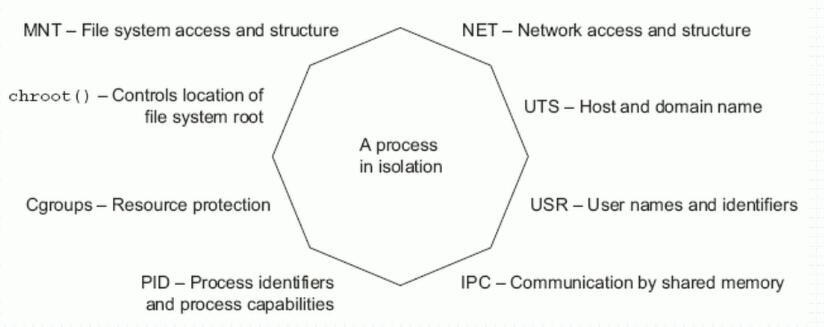

# Docker中的Registry与系统资源限制

[toc]

* Registry用于保存docker镜像，包括镜像的层次结构和元数据
* 用户可自建Registry，也可使用官方的Docker Hub
* 分类
    1. Sponsor Registry:第三方的registry,客户和Docker社区使用
    2. Mirror Registry:第三方的registry,只让客户使用
    3. Vendor Registry:由发布Docker镜像的供应商提供的registry
    4. Private Registry:通过设有防火墙和额外的安全层的私有实体提供的registry
* docker-registry镜像地址[https://hub.docker.com/_/registry?tab=tags](https://hub.docker.com/_/registry?tab=tags)

1. 相关命令
    * `yum info docker-registry`查看registry的版本信息
    * `yum install docker-registry`安装docker的registry,会默认安装最新版本。
    * `rpm -ql docker-distribution`查看registry安装的配置文件路径。
    * `vim /etc/docker-distribution/registry/config.yml` registry的配置文件信息：

        ````conf
        version: 0.1
        log:
        fields:
            service: registry
        storage:
            cache:
                layerinfo: inmemory
            filesystem:
                rootdirectory: /var/lib/registry
        http:
            addr: :5000
        ````

    * `systemctl start docker-distribution`启动registry服务
    * `ss -tnl`可以查看registry服务在5000端口上
    * `docker tag myweb:v0.3-8 192.168.61.109:5000/myweb:v0.3-11`将镜像重新达标为指定格式
    * `vim /etc/docker/daemon.json`修改daemon.json文件添加如下信息
        1. `"insecure-registries": ["192.168.61.109:5000"]`,指定不安全的registry服务器，可以支持http协议，docker客户端默认是https协议。
        2. `systemctl restart docker`修改配置后，需要重启docker服务
    * `docker push 192.168.61.109:5000/myweb:v0.3-11`推送仓库

2. Registry存储和索引
    * Repository
        1. 由某特定的docker镜像的所有迭代版本组成的镜像仓库
        2. 一个Registry中可以存在多个Repository
            * Repository可分为“顶层仓库”和“用户仓库”
            * 用户仓库名称格式为“用户名/仓库名”
        3. 每个仓库可以包含多个Tag(标签)，每个标签对应一个镜像
    * index
        1. 维护用户账户、镜像的校验以及公共命名空间的信息
        2. 相当于为Registry提供了一个完成用户认证等功能的检索接口

3. Harbor
    * Project Harbor是一个开源的可信云本地注册表项目，用于存储、签名和扫描内容。
        1. Harbor通过添加安全、dentity和管理等用户通常需要的功能，扩展了开源Docker发行版。
        2. Harbor支持高级特性，如用户管理、访问控制、活动监视和实例间复制
4. Feathers
    * 多租户内容签名和验证(Multi-tenant content signing and validation)
    * 安全性和漏洞分析(Security and vnlnerability analysis)
    * 审计日志记录(Audit logging)
    * 身份集成和基于角色的访问控制(ldentity integration and role-based access control)
    * 实例之间的映像复制(Image replication between instances)
    * 可扩展APl和图形用户界面(Extensible API and graphical UI)
    * 国际化(目前中英文)(Internationalization (currently English and Chinese))

## Docker Compose(单机编排工具)

* 网址[https://docs.docker.com/compose/](https://docs.docker.com/compose/)相关指令用法。
* harbor仓库地址[https://github.com/goharbor/harbor](https://github.com/goharbor/harbor)
* 相关命令
    1. `yum info docker-compose`查看compose版本信息
    2. `wget https://storage.googleapis.com/harbor-releases/release-1.8.0/harbor-offline-installer-v1.8.2.tgz`下载安装包
    3. `tar -xf harbor-offline-installer-v1.8.2.tgz -C /usr/local/`解压
        * 配置文件：`/usr/local/harbor.yml`,将配置里面的主机名修改为自己主机的主机名
        * 安装文件`/usr/local/install.sh`
    4. `yum install docker-compose`安装Compose
    5. `/usr/local/harbor/install.sh`安装harbor
        * 安装完成后，可以直接访问宿主机的80端口查看web界面。
        * 管理员账户：admin/Harbor12345(默认情况，可以在配置文件中修改)
* docker-compose操作命令
    1. `docker-compose pause`暂停compose
    2. `docker-compose unpause`继续运行compose

## Docker的资源限制及验证

1. Limit a container's resources(限制容器支援)
    * 默认情况下，容器没有资源约束，并且可以在主机的内核调度程序允许的情况下尽可能多地使用给定的资源。
    * Docker提供了控制容器可以使用多少内存、CPU或块IO的方法，设置Docker run命令的运行时配置标志。
    * 这些特性中有许多要求内核支持Linux功能。
        1. 要检查是否支持，可以使用docker info命令。
2. Resource allowances(资源津贴)
    * Eight-sided containers
      
3. Memory(存储)
    * 在Linux主机上，如果内核检测到没有足够的内存来执行重要的系统功能，它会抛出一个OOME或Out Of memory异常，并开始杀死进程来释放内存。
        1. 一旦发生OOME，任何进程都有可能被杀死，包括docker daemon在内
        2. 为此，Docker特地调整了docker daemon的OOM优先级，以免它被内核“正法”，但容器的优先级并未被调整

4. 限制容器使用资源选项

    | 选项|含义|
    |:----|:---|
    |`-m or --memory=`|容器可以使用的最大内存量。如果您设置此选项，最小允许值为4m (4 mb)。|
    |`--memory-swap *`|此容器允许交换到磁盘的内存量。看到-memory-swap细节。|
    |`--memory-swappiness`|默认情况下，主机内核可以交换容器使用的匿名页面的百分比。您可以将`--memory-swappiness`设置为0到100之间的值，以调整这个百分比。看到`--memory-swappiness`细节。|
    |`--memory-reservation`|允许您指定一个小于`--memory`的软限制，当Docker检测到主机上的争用或内存不足时，内存将被激活。如果使用`--memory-reservation`，则必须将其设置为低于`--memory`，以便它优先。因为它是一个软限制，所以不能保证容器不超过这个限制|
    |`--kernel-memory`|容器可以使用的最大内核内存量。最小允许值为4m，因为内核内存不能交换出去，缺少内核内存的容器可能会阻塞主机资源，这可能对主机和其他容器产生副作用。查看`--kernel-memory`信息|
    |`--oom-kill-disable`|默认情况下，如果发生内存不足(OOM)错误，内核将终止容器中的进程。要更改此行为，请使用`--oom-kill-disable`选项。只在还设置了`-m/--memory`选项的容器上禁用OOM杀手。如果没有设置`-m`标志，主机可能会耗尽内存，内核可能需要杀死主机系统的进程来释放内存。

    * memory-swap
        1. 当容器耗尽所有可用的RAM时，使用swap允许容器将多余的内存需求写入磁盘。
        2. `--memory-swap`是一个修饰符标志，只有在`--memory`也被设置时才有意义。

        |`--MEMORY-SWAP`|`--memory`|功能|
        |正数S|正数M|容器可用总控件为S，其中ram为M，swap为(S-M),若S=M,则无可用swap资源|
        |0|正数M|相当于未设置swap(unset)|
        |unset|正数M|若主机(Docker Host)启用了swap,则容器的可用swap为2*M|
        |-1|正数M|若主机(Docker Host)启用了swap,则容器可使用最大至主机上的所有swap空间swap资源|

        * 注意：在容器内使用free命令可以看到的swap空间并不具有其所展现的控件指示意义。
5. CPU
    * 默认情况下，每个容器对主机的CPU周期的访问是无限制的
    * 您可以设置各种约束来限制给定容器对主机CPU周期的访问。
    * 大多数用户使用并配置默认的CFS调度程序。
    * 在Docker 1.13及更高版本中，还可以配置实时调度程序。
    * CPU的资源限定

    |选项|含义|
    |:--------|:-----------|
    |`--cpus=<value>`|指定容器可以使用多少可用CPU资源。例如，如果主机有两个cpu，并且您设置了`--cpu="1.5"`，那么容器最多保证有一个半cpu。这相当于设置`--cpu-period="10000"`和`--cpu-quota="150000"`。可在Docker 1.13或更高版本中使用。|
    |`--cpu-period=<value>`|指定CPU CFS调度程序周期，它与`--cpu-quota`一起使用。默认为100微秒。大多数用户不会从默认值更改此值。如果使用Docker 1.13或更高版本，请使用`--cpus`。|
    |`--cpuset-cpus`|限制容器可以使用的特定cpu或核心。如果您有多个CPU，则容器可以使用逗号分隔的列表或连字符分隔的CPU范围。第一个CPU编号为0。有效值可以是`0-3`(使用第一个、第二个、第三个和第四个CPU)或1、3(使用第二个和第四个CPU)。|
    |`--cpu-shares`|将此标志设置为一个大于或小于默认值1024的值，以增加或减少容器的权重，并允许它访问主机CPU周期的更大或更小的比例。只有在CPU周期受到限制时才强制执行。当有足够的CPU周期可用时，所有l容器都会根据需要使用尽可能多的CPU。这样，这就是一个软极限。`--cpu-share`不阻止以群集模式调度容器。它为可用的CPU周期确定容器CPU资源的优先级。它不保证或保留任何特定的CPU访问。|

* 注意：使用`docker run --help`可以找到这些参数

* 简单示例：
    1. `docker pull lorel/docker-stress-ng`下载镜像
    2. `docker run --name stree -it --rm lorel/docker-stress-ng:latest stress --help`查看命令运行帮助
    3. 验证内存分配：`docker run --name stress -it --rm -m 256m lorel/docker-stress-ng:latest stress --vm 2`启动stress,最多给256m内存，启动2个进程做压测，每个进程默认占用256m
        * `docker top stress`可以查看容器内的资源分配
        * `docker stats`显示duocker所有容器的资源分配情况
    4. 验证cpu分配情况：`docker run --name stress -it --rm --cpus 2 lorel/docker-stress-ng:latest stress --cpu 8`在cpu上启动8个线程做压力测试，单容器同时最多只能使用2个cpu内核(即cpu核心数为2个)。
        * `docker run --name stress -it --rm  lorel/docker-stress-ng:latest stress --cpu 8`不对cpu做核心限制，会使用所有cpu。
    5. 验证指定cpu上运行`docker run --name stress -it --rm --cpuset-cpus 0,2   lorel/docker-stress-ng:latest stress --cpu 8` #在cpu上启动8个线程，但容器只能在cpu为0或2上的cpu上运行，即cpu核心数为2个
    6. 尽可能占用多的cpu`docker run --name stress -it --rm --cpu-shares 1024 lorel/docker-stress-ng:latest stress --cpu 8` #在cpu上启动8个线程，容器可以尽可能使用更多的空闲cpu
        * 如果同时再启动一个`docker run --name stress2 -it --rm --cpu-shares 512 lorel/docker-stress-ng:latest stress --cpu 8`那么新启动的容器所占用的cpu和之前的cpu占用比值为：512:1024即：1:2
