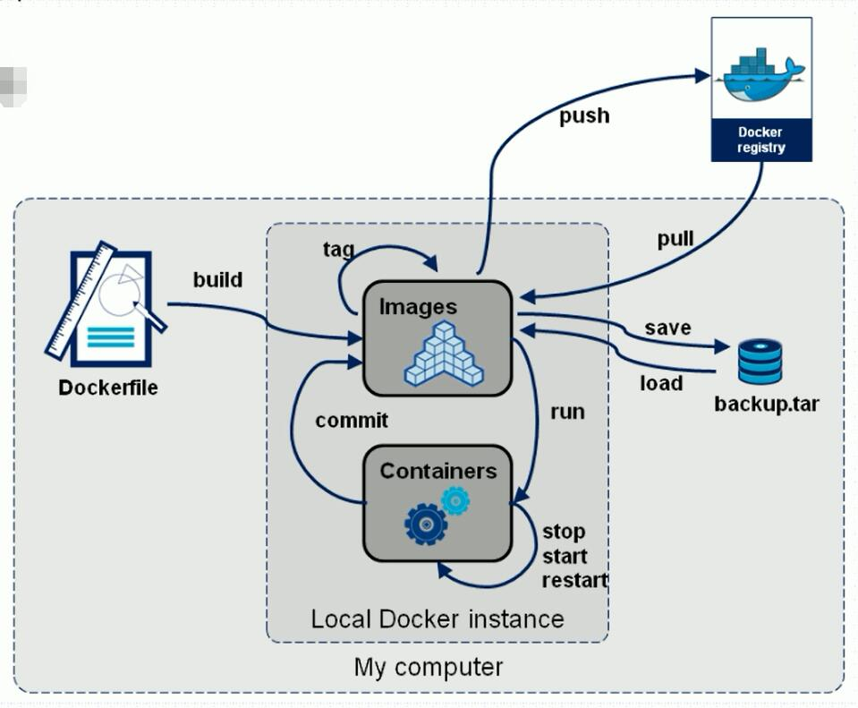
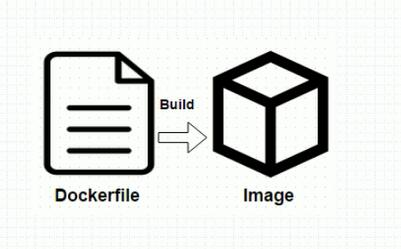

# Dockerfile

* 镜像生成的途径
    1. Dockerfile制作
    2. 基于容器制作(直接在容器中制作)
      

* Dockerfile只是构建Docker映像的源代码
    1. Docker可以通过读取Dockerfile中的指令来自动构建图像
    2. Dockerfile是一个文本文档，包含用户可以在命令行上调用的所有命令来组装一个图像
    3. 使用docker构建用户可以创建一个自动构建，该构建可以连续执行多个命令行指令
      

* Dockerfile的文件格式
    1. 格式(Format)
        * `# Comment` 以`#`开头的为注释信息
        * `INSTRUCTION arguments` 指令和参数
    2. Dockerfile的指令不区分大小写
        * 通常都会将指令写成大写，以便于区分指令和参数。
    3. Docker按顺序在Dockerfile中运行指令
    4. 第一个指令必须是“FROM”，以便指定要从中构建的基本映像

* 环境替代(Environment replacement)
    1. Environment变量(使用ENV语句声明)也可以在某些指令中用作Dockerfile要解释的变量
    2. Dockerfile中使用`$variable_name`或`${variable_name}`标注环境变量
    3. `${variable_name)`语法还支持一些标准的bash修饰符
        * `${variable:-word}` 如果variable有值，那么使用variable的值，如果没有就使用word字符串作为值
        * `${variable:+word}` 如果variable有值，那么使用word字符串作为值，如果没有设置就是variable值，即空值。

## Dockerfile的指令

1. **FROM 指令**
    * FROM指令是最重要的一个且必须为Dockerfile文件开篇的第一个非注释行，用于为映像文件构建过程指定基准镜像，后续的指令运行与此基准镜像所提供的运行环境
    * 实践中，基准镜像可以是任何可用镜像文件，默认情况下，`docker build`会在docker主机上查找指定的镜像文件，在其不存在时，则会从Docker Hub Registry上拉取所需的镜像文件
        * 如果找不到指定的镜像文件，docker build会返回一个错误信息
    * 语法：
        * `FROM <repository>[:<tag>]`或`<FROM <resository>@<digest>`
            * `<reposotiry>`：指定作为base image的名称
            * `<tag>`:buse image的标签，省略时默认为latest;
            * `<digest>` buse image镜像的哈希码

    ````sh
    # 在任意目录中创建Dockerfile文件
    [root@gdy img1]# vim Dockerfile
    ````

2. **MAINTANIER 指令**(depreacted，作者信息)
    * 用于让Dockerfile制作者提供本人的详细信息
    * Dockerfile 并不限制MAINTAINER指令可能出现的位置，但推荐将其放置于FROM指令之后
    * 语法：`MAINTAINER <authtor's detail>`
        * `<authtor's detail>`可以是任何文本信息，单通常会使用作者名称及邮件地址
            1. 示例：`MAINTAINER "xdd <xdd@xdd.com>"`
3. **LABEL 指令**(docker1.7后的语法)指定元数据
    * 语法：`LABEL <key>=<value> <key>=<value> <key>=<value> ...`
4. **COPY 指令**
    * 用于从Docker主机复制文件至创建的新映像文件
    * 语法 `COPY <src> ... <dest>`或`COPY ["<src>",..."<dest>"]`
        * `<src>`:要复制的源文件或目录，支持使用通配符
        * `<dest>`:目标路径，即正在创建的image的文件系统路径;建议为`<dest>`使用绝对路径，否则，COPY指定则以`WORKDIR`为其实路径；
    * 文件复制准则
        * `<src>`必须是build上下文中的路径，不能是其父目录中的文件
        * 如果`<src>`是目录，则其内部文件或子目录会被递归复制，但`<src>`目录自身不会被复制
        * 如果指定了多个`<src>`,或在`<src>`中使用了通配符，则`<dest>`必须是一个目录，且必须以`/`结尾
        * 如果`<dest>`事先不存在，它将会被自动创建，这包括其父目录路径

    * 测试dockerfile文件内容为：

        ````shell
        # Description: test image
        FROM busybox:latest
        MAINTAINER "xdd <xdd@xdd.com>"
        # LABEL maintainer="xdd <xdd@xdd.com>"

        # 指定环境路径
        # WORKDIR=/data/
        # 复制单个文件
        COPY index.html /data/web/html/
        # 复制目录下的所有文件
        COPY yum.repos.d /etc/yum.repos.d/
        ````

        * `docker build -t tinyhttpd:v0.1-1 ./` #更具当前目录下的dockerfile文件制作镜像
        * `docker run --name t1 --rm tinyhttpd:v0.1-1 cat /data/web/html/index.html` #可以测试镜像中文件是否已经存在
5. **ADD 命令**
    * ADD命令类似于COPY命令，ADD支持使用TAR文件和URL路径
    * 语法：`ADD <src> ... <dest>`或`ADD ["<src>",..."<dest>"]`
    * 操作准则
        1. 同COPY指令
        2. 如果`<src>`为URL且<dest>不以`/`结尾，则`<src>`指定的文件将被下载并直接创建为`<dest>`;如果`<dest>`以`/`结尾，则文件名URL指定的文件将被直接下载并保存为`<dest>/<filename>`
        3. 如果`<src>`是一个本地系统上的压缩格式的tar文件，它将被展开为一个目录，其行为类似于`tar -x`命令；然而，通过URL获取到的tar文件将不会自动展开；
        4. 如果`<src>`有多个，或其间接或直接使用了通配符，则`<dest>`必须是一个以`/`结尾的目录路径；如果`<dest>`不以`/`结尾，则其被视作一个普通文件，`<src>`的内容将被直接写入到`<dest>`;
6. **VOLUME 命令**(指定卷)
    * 用于在image中创建一个挂载点目录，以挂载Docker host上的卷或其它容器上的卷
    * 语法：`VOLUME <mountpoint>`或`VOLUME ["<mountpoint>"]`
    * 如果挂载点目录路径下此前有文件存在，docker run 命令会在卷挂载完成后将此前的所有文件复制到新挂载的卷中
7. **EXPOSE 命令**
    * 用于为容器打开指定要监听的端口以实现与外部通信
    * 指定暴露出的端口会绑定宿主机的随机端口
    * 语法：`EXPOSE <port>[/<protocol>] [<port>[/<protocol>] ...]`
        * `<protocol>`用于指定传输层协议，可为tcp或udp二者之一，默认为TCP协议
    * EXPOSE指令可一次指定多个端口，例如`EXPOSE 11211/udp 11211/tcp`
        1. 指定暴露端口后的容器可以使用`-P`选项暴露端口
            * `docker run --name t2 --rm -P tinyhttpd:v0.1-7 /bin/httpd -f -h /data/web/html`
            * `docker port t2` 可以查看t2暴露的端口信息
8. **ENV 命令**
    * 用于为镜像定义所需要的环境变量，并可被Dockerfile文件中位于其后的其它指定(如ENV、ADD、COPY等)所调用
    * 调用格式为`$variable_name`或`${variable_name}`
    * 语法：`ENV <key> <value>`或`ENV <key>=<value> ...`
    * 第一种格式中，`<key>`之后的所有内容均被视作其`<value>`的组成部分，因此，一次只能设置一个变量；
    * 第二种格式可用一次设置多个变量，每个变量为一个`<key>=<value>`的键值对，如果`<value>`中包含空格，可以以反斜线`(\)`进行转义，也可通过对`<value>`加引号进行标识；另外，反斜线也可用于续行；
    * 定义多个变量时，建议使用第二种方式，以便在同一层中完成所有功能
9. **RUN 命令**
    * 用于指定docker build过程中运行的程序，其可以是任何命令
    * 语法：`RUN <command>`或`RUN ["<executable>","<paraml>","<param2>"]`
    * 第一种格式中，`<command>`通常是一个shell命令，且以"/bin/sh -c"来运行它，这意味着此进程在容器中的PID不为1，不能接收Unix信号，因此，当时用`docker stop <container>`命令停止容器时，此进程接收不到SIGTERM信号；
    * 第二种语法格式中的参数是一个JSON格式的数组，其中`<executable>`为要运行的命令，后面的`<paramN>`为传递给命令的选项或参数；然而，此种格式指定的命令不会以"/bin/sh -c"来发起，因此常见的shell操作如变量替换以及通配符`(?.*等)`替换将不会进行；不过，如果要运行的命令依赖于此shell特性的话，可以将其替换为类似下面的格式。
        * `RUN ["/bin/bash","-c","<executable>","<param1>"]`
    * 注意：如果要在shell中使程序获取主进程，可以使用`exec COMMAND`来执行命令。
        * Json数组中，要使用双引号
    * 简单示例，在dockerfile文件中使用：

        ````sh
        # Description: test image
        FROM busybox:latest
        MAINTAINER "xdd <xdd@xdd.com>"
        # LABEL maintainer="xdd <xdd@xdd.com>"

        ENV DOC_ROOT=/data/web/html/ \
            WEB_SERVER_PACKAGE="nginx-1.15.2.tar.gz"

        # 指定环境路径
        #WORKDIR=/
        #LABEL IMGDIR="/data/web/html/"

        COPY index.html ${DOC_ROOT:-/data/web/html/}
        COPY yum.repos.d /etc/yum.repos.d/
        ADD http://nginx.org/download/${WEB_SERVER_PACKAGE} /usr/local/src/
        #ADD ${WEB_SERVER_PACKAGE} /usr/local/src/
        # 设定容器的工作目录
        WORKERDIR /usr/local/

        RUN cd /usr/local/src && \
            tar -xf ${WEB_SERVER_PACKAGE} && \
            mv nginx-1.15.2 webserver

        # 绑定本地文件，使用docker托管的目录挂载到镜像下的/data/mysql/目录中
        VOLUME /data/mysql/

        # 运行容器时使用-P会暴露的端口
        EXPOSE 80/tcp
        ````

10. **CMD 命令**
    * 类似于RUN指令，CMD指令也可用于运行任何命令或应用程序，不过，二者的运行时间点不同
        * **RUN指定运行与映像文件构建的过程中，而CMD指令运行与基于Dockerfile构建出的新映像文件启动一个容器时**
        * CMD指令的首要目的在于为启动的容器指定默认要运行的程序，且其运行结束后，容器也将终止；不过，CMD指定的命令其可以被docker run的命令行选项所覆盖
        * 在Dockerfile中可以存在多个CMD指令，但仅最后一个会生效
    * 语法：
        * `CMD <command>`或
            * 会自动运行成shell的子进程，进程id不是1，然后在做进程切换转换为id为1的进程
        * `CMD ["<executable>","<param1>","<param2>"]`或
            * 会直接启动一个id为1的进程，即超管进程。并不会是shell的子进程，即不支持shell环境变量。除非启动shell执行
        * `CMD ["<param1>","<param2>"]`
    * 前两种语法 格式的意义同RUN
    * 第三种则用于为ENTRYPOINT指令提供默认参数
11. **ENTRYPOINT 命令**
    * 类似CMD指令的功能，用于为容器指定默认运行程序，从而使得容器像是一个单独的可执行程序
    * 与CMD不同的是，由ENTRYPOINT启动的程序不会被docker run命令行指定的参数所覆盖，而且，这些命令行参数会被当作参数传递给ENTRYPOINT指定指定的程序
        * 不过，`docker run`命令的`--entrypoint`选项的参数可覆盖ENTRYPOINT指令指定的程序
    * 语法`ENTRYPOINT <command>`或`ENTRYPOINT ["<executable>","<param1>","<param2>"]`
    * docker run命令传入的命令参数会覆盖CMD指令的内容并且附加到ENTRYPOINT命令最后做为其参数使用
    * Dockerfile文件中也可以存在多个ENTRYPOINT指令，但仅有最后一条会生效。

