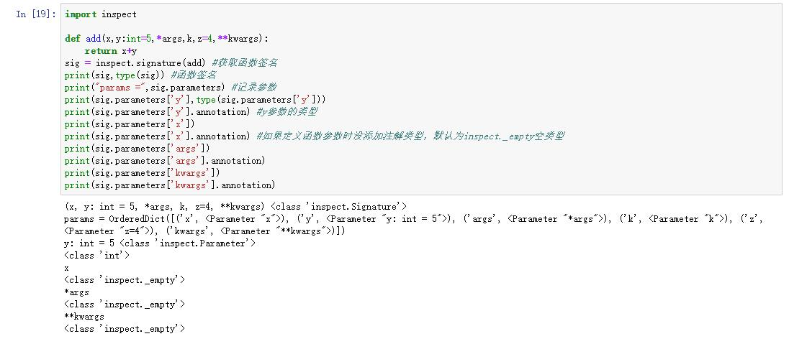

## python常用模块简介
#### functools模块
* update_wrapper #修改装饰函数的属性
    * 原码如下：
    ````python
    WRAPPER_ASSIGNMENTS = ('__module__', '__name__', '__qualname__', '__doc__',
                        '__annotations__')
    WRAPPER_UPDATES = ('__dict__',)
    def update_wrapper(wrapper,
                    wrapped,
                    assigned = WRAPPER_ASSIGNMENTS,
                    updated = WRAPPER_UPDATES):
        for attr in assigned:
            try:
                value = getattr(wrapped, attr)
            except AttributeError:
                pass
            else:
                setattr(wrapper, attr, value)
        for attr in updated:
            getattr(wrapper, attr).update(getattr(wrapped, attr, {})) #用wrapped的字典__dict__更新wrapper的字典__dict__
       
        wrapper.__wrapped__ = wrapped #新增一个属性，记录原函数
        return wrapper 
    ````
* wraps 结合update_wrapper修改装饰函数的属性
    *原码如下：
    ````python
    def wraps(wrapped,
            assigned = WRAPPER_ASSIGNMENTS,
            updated = WRAPPER_UPDATES):
        return partial(update_wrapper, wrapped=wrapped,
                    assigned=assigned, updated=updated)
    ````

* reduce(function,sequence[,initial])->value #缩减计算
    * function 函数，
    * sequence 可迭代对象，需要做递减计算的可迭代对象
    * initial 初始值，如果没有，默认从sequence中取出第一个值做初始值。
    * 相关原码：
    ````python
    def reduce(function, iterable, initializer=None):
        it = iter(iterable)
        if initializer is None:
            value = next(it)
        else:
            value = initializer
        for element in it:
            value = function(value, element)
        return value
    ````
* partial->function #偏函数,吧函数部分参数固定下来，相当于为部分的参数添加了一个固定的默认值，形成一个新的函数并返回。
    * partial生成的新函数是对原函数的封装。
    * 伪代码示例
    ````python
    def partial(func, *args, **keywords):
        def newfunc(*fargs, **fkeywords):
            newkeywords = keywords.copy()  #
            newkeywords.update(fkeywords) #更新关键字参数
            return func(*args, *fargs, **newkeywords) #注意，调用原函数时，先放的是位置参数，然后放的是再次传入的位置参数，最后放的是更新后的关键字参数
        newfunc.func = func  #新增一个属性，记录原函数
        newfunc.args = args #新增一个属性，记录位置参数
        newfunc.keywords = keywords  #新增一个属性记录关键字参数
        return newfunc #返回内建函数。
    ````
#### inspect模块
* signature(callable)-><class 'inspect.Signature'> 获取签名(函数签名包含了一个函数的信息，包括函数名，它的产生类型、它所在的类和名称空间及其他信息)
    * 签名返回类型为inspect.Signature类型
        * parameters属性，记录了函数中定义是注解和参数。parameters实际上是一个字典。
            * annotation 可以获取parameters对应value值的类型，即定义是注解说明的类型。
    * 简单示例
    ````python
    import inspect

    def add(x,y:int=5,*args,k,z=4,**kwargs):
        return x+y
    sig = inspect.signature(add) #获取函数签名
    print(sig,type(sig)) #函数签名
    print("params =",sig.parameters) #记录参数
    print(sig.parameters['y'],type(sig.parameters['y']))
    print(sig.parameters['y'].annotation) #y参数的类型
    print(sig.parameters['x'])
    print(sig.parameters['x'].annotation) #如果定义函数参数时没添加注解类型，默认为inspect._empty空类型
    print(sig.parameters['args'])
    print(sig.parameters['args'].annotation) 
    print(sig.parameters['kwargs'])
    print(sig.parameters['kwargs'].annotation)
    ````  
      
* isfunction(name)-> True|False #是否是函数
* ismethod(name)-> True|False #是否是类方法
* isgenerator(name)-> True|False #是否是生成器对象
* isgeneratorfunction(name)-> True|False #是否是生成器函数
* isclass(name)-> True|False #是否是类
* ismodule(name)-> True|False #是否是模块
* isbuiltin(name)-> True|False #是否是内建对象
* Parameter 对象，是一个类
    * 类的属性有name,annotation,default,empty,kind保存在元组中是可读的
    * name:参数名字
    * annotation:参数注解。(有时候可能没有定义)
    * default:参数缺省值，(有时候可能没有定义)
    * empty:特殊类，用来标记default属性或者注释annotation属性的空值
    * kind:实参如何绑定到形参，就是形参的类型
        * POSITIONAL_ONLY,值必须是位置参数提供
        * POSITIONAL_OR_KEYWORD,值可以作为关键字或者位置参数提供
        * VAR_POSITIONAL,可变位置参数，对应*args
        * KEYWORD_ONLY,keyword-only参数，对应* 或者 *args之后出现的费可变关键字参数
        * VAR_KEYWORD,可变关键字参数，对应**kwargs
