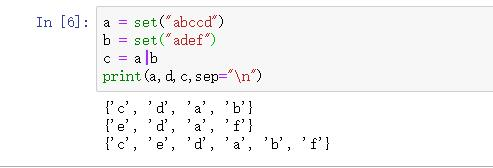

# set 和hash
### set集合   
* 概念：set是可变的、无序的、不重复的元素集合。set的元素及元素里面的元素不能出现不可哈希类型。（即set的元素要求必须可以hash）
    * 常用的不可hash类型有list、set、bytearray
    * set的元素不可索引，但可以迭代
* set的定义：  
    * 例如： s1 = set()
    * 例如： s2 = set(range(5))
    * 例如： s3 = {'a',2,2,3,'abc'} 等价于set = {'a',2,3,'abc'}。set里面的元素不能重复。
    * 注意：空set不能使用{}直接定义，而是直接使用set()定义。{}定义的是空字典dict  
* set常用操作
    * add(elem) 返回值None #注意只能一次增加一个元素，如果元素存在，则不会添加
    * update(*others) #合并其他元素到set集合中来，others必须是可迭代对象。返回值None 就地修改
    * remove(elem) 从set中移除一个元素，元素不存在，抛出keyError异常
    * deiscard(elem)从set中移除一个元素，元素不存在什么都不做。
    * pop()--->item 随机的从集合中移除一个元素，并返回移除的元素。空集合调用返回keyError异常
    * clear()  移除所有元素
* set和list的效率对比
    * 因为set集合存储元素是先根据元素求出对应的hash值，然后放在对应hash值的内存编号中。所以删除或修改元素。只需要根据元素求出其对应的hash值后找到对应位置做操作。正是这样的结构设计保证了set内元素是不能重复的。也保证了set集合中添加和删除元素的效率是$O(1)$
    * list是线性结构。在用索引查找时在内存中可以直接偏移就找到对应的索引位置，所以list使用索引非常快，而正是因为这样。在添加和删除元素时，会发生其他不必要的元素移动。所有list查找，删除，添加元素。相对于set集合比较慢。
    * 例如：  
      
* 常用的可hash类型
    * 数值类型 int、float、complex
    * 布尔型 True、False
    * 字符串string、bytes
    * 元组tuple 
    * None  

# 集合
    * 全集：（并集U、union的意思）所有元素的集合。
    * 子集：（subset和超子集superset）一个集合A所有元素都在另一个集合B内，A是B的子集，B是A的超集
    * 真子集和真超集：A是B的子集，且A不等于B,A就是B的真子集，B是A的真超集
    * 并集：多个集合合并的结果
    * 交集：多个集合的公共部分
    * 差集：集合中除去和其他集合公共部分  
## 集合运算符  
    * 并集运算符：|
        * 【|】 并集运算符（用union(*others)也可以）（会返回一个新的集合）
        * 【|=】 等同于update方法。多个集合和并，就地修改
        * 并集：将两个集合A和B的所有元素合并到一起
    * 交集运算符： &
        * 【&】等同于intersection 返回多个集合的交集。（会返回新的集合）
        * 【&=】等同于intersection_update获取和多个集合的交集，并就地修改。
        * 交集：集合A和B，由属于B的元素组成的集合
    * 差集运算符： -
        * 【-】等同difference(*others) 返回和多个集合的差集，会返回一个新的集合
        * 【-=】等同difference_update(*others) 获取和多个集合的差集并就地修改
        * 差集：集合A和B,由所有属A且不属于B的元素组成的集合
    * 对称差集： ^
        * 【^】等同于symmetric_differece(other)返回一个新的集合（和另一个集合的差集）
        * 【^=】等同于symmetric_differece_update(other)获取和另一个集合的差集并就地修改
        * 对称差集：集合A和B，由所有不属于A和B的交集元素组成的集合。【(A-B)U(B-A)】
    * 【<=】相当于 issubset(other)  判断当前集合是否是另一个集合的子集
        * 例如： set1 < set2 #判断set1是否是set2的真子集
    * 【>=】相当于issuperset(other) 判断当前集合是否是other的超集
        * 例如： set1 > set2 潘森set1是否是set2的真超集
    * isdisjoint(other) 集合是否有交集。当前集合和另外一个集合没有交集就返回true  

## 简单示例：  

* 并集运算   
````python  
a = set("abccd")
b = set("adef")
c = a|b
print(a,d,c,sep="\n")
````  
  
* 交集运算
````python  
a = set("abccd")
b = set("adef")
c = a&b
print(a,d,c,sep="\n")
````  

* 差集运算
````python
a = set("abccd")
b = set("adef")
c = a - b
print(a,d,c,sep="\n")
````  
  

* 对称差集运算
````python
a = set("abccd")
b = set("adef")
c = a ^ b
print(a,d,c,sep="\n")
````  

