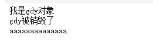
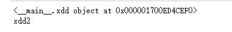

## 类
* 使用class关键字定义
* 类中的方法必须要接收一个参数，通常我们将这个参数名称定义为self。
    * self 表示调用者当前对象的引用。
    * 可以通过self访问当前对象的属性
    * 可以通过self调用当前对象的其他方法。
* 注意同一类中的方法相互调用只能通过self实现，再通过self调用类中方法时，默认第一个参数self不需要传入。
* 例如：定义一个只包含方法的类
````python
class Xdd:
    def show(self):
        print("我是xdd类中的方法")

#创建xdd类
xddclass = Xdd()
#调用类中的show方法
xddclass.show()
```` 
* 例如：类中调用自己方法
````python
import sys
class xdd:
    def show(self):
        sys.stdout.writelines("我是show方法")
    def ect(self):
        sys.stdout.writelines("我是ect方法")
        
    def text(self):
        self.show()
#创建xdd类
a = xdd()
#调用类中text方法
a.text()
````  
#### __init__方法，
* 作用：类的初始化和属性定义
* 在使用类名()时，是对类进行了初始化，默认会调用类中的__init__(self)方法。
* __init__(self)方法默认是在类初始化时自动调用，是专门用来定义一个类具有哪些属性。
* 使用【**self.属性名 = 属性的初始值**】 就可以为当前类**定义属性**
* 在类创建后，创建的类就会有该属性。
* 如果在需要在创建类时，为类定义初始值，可以在__init__方法定义时添加参数，在类创建时就可以传入初始值
````python
class xdd:
    def __init__(self,name="我是xdd类"):
        self.name = name
        self.size = "你猜我有多大"
    def show(self):
        sys.stdout.writelines("我是show方法\n")
#创建xdd类
xddclass = xdd()
xddclass.show()
print(xddclass.name)
#定义对象的临时属性
xddclass.privename = "我是当前对象的临时属性"
print(xddclass.privename)

#带参数的初始化方法定义类
xddclass2 = xdd("xddclass2")
print(xddclass2.name)
````
* **注意：使用【对象名称.属性名称 = 属性的初始值】可以为创建的类对象定义临时属性**   
#### 类中的私有属性和私有方法
* 方法名称中使用**两个下划线(__)**开头的方法为类的私有方法
    * 私有方法：对象不希望公开的方法
    * 私有方法只能在自己类中被使用。不能被外界使用。
* 属性名称中使用**两个下划线(__)**开头的属性为类的私有属性。
    * 私有属性：对象不希望公开的属性
    * 私有属性只能在类中被使用。不能被外界使用。  
* 注意：**Python中没有真正的私有属性和私有方法。**
    * python中的私有属性，和私有方法，只是被编译器编译时改变了私有属性和私有方法的名称，名称改变为【_类名+私有方法】【_类名+私有属性名】使用，这样的名称依旧可以访问到私有方法和私有属性。
````python
class xdd:
    def __init__(self,name = "xdd"):
        self.name = name
        self.__name = "私有name"  #定义私有属性
    def __show(self): #定义私有方法
        print("我是{}对象".format(self.name))

#创建xdd对象
xdd1 = xdd("xdd1")
#访问私有属性
print(xdd1._xdd__name)
#访问私有方法
xdd1._xdd__show()
````  
* 执行结果为：  


#### __del__方法，
* 作用：类被销毁(类对象的引用地址变为0时)时执行的方法。
* __del__(self)在类被销毁时，系统自动执行。即类对象的引用地址变为0时自动调用。
* 如果希望在类被销毁时，做一些事情，可以在__del__(self)方法中,做一些事情。
````python
class xdd:
    def __init__(self,name = "xdd"):
        self.name = name
    def show(self):
        print("我是{}对象".format(self.name))
    def __del__(self):
        sys.stdout.writelines("{}被销毁了\n".format(self.name))
#创建xdd对象
gdy = xdd("gdy")
gdy.show()
#使用del关键字删除gdy对象
del gdy #注意使用del删除对象，只能使得gdy所指向的对象引用地址减一，如果del后该对象的引用地址依然不为0，则不会调用__del__方法
print("aaaaaaaaaaaaaa")
````  
* 执行结果如下  
  
#### __str__方法。
* 相当于java中的toString方法，方法必须返回一个str类型的字符串
* 在类对象被转为str类型时调用。返回对象的str类型。
* 如果没有定义__str__方法，默认会调用父类的__str__方法。
    * 父类的__str__方法返回值为：“__main__.{} object at {}”.format(类名,类在内存中的内存地址(16进制表示))
````python
class xdd:
    def __init__(self,name = "xdd"):
        self.name = name
    def show(self):
        print("我是{}对象".format(self.name))
    def __del__(self):
        sys.stdout.writelines("{}被销毁了\n".format(self.name))

class xdd2:
    def __init__(self,name = "xdd"):
        self.name = name
    def show(self):
        print("我是{}对象".format(self.name))
    def __del__(self):
        sys.stdout.writelines("{}被销毁了\n".format(self.name))
    def __str__(self):
        return self.name
#创建xdd对象
xdd1 = xdd("xdd1")
xdd2 = xdd2("xdd2")
print(xdd1)
print(xdd2)
````  
* 输出结果为：  
    


