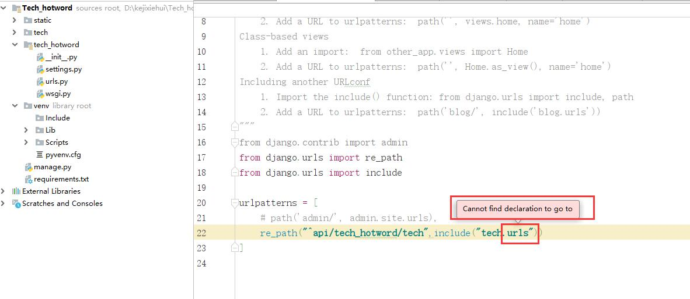
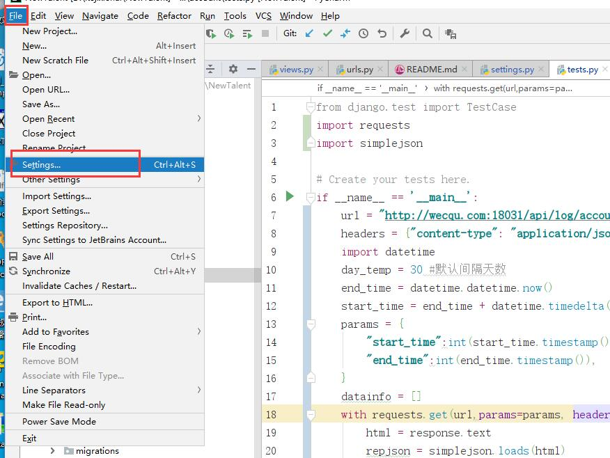
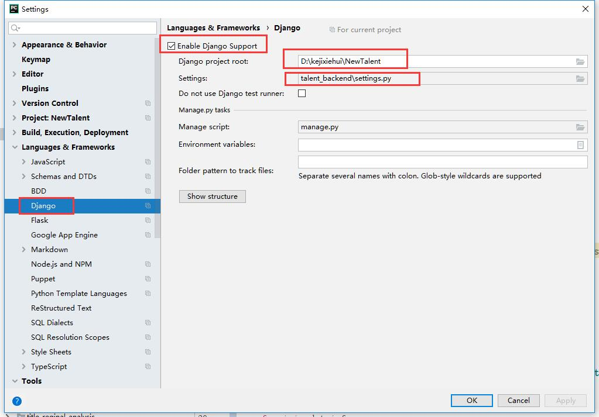

# pycharm中django项目报Cannot find declaration to go to问题

[toc]

## 问题描述

在pycharm中的python django项目，按住ctrl+鼠标左键无法跳转到指定代码。
网上大部分描述的是源码的跳转问题。本次描述的是如下如所示.(无法跳转到指定文件)

## 解决办法

在pycharm中setting中指定改项目为django项目，并配置路径。  
一次找到如下设置：  
file-->Settings-->Languages....--->Django

