@[toc]

# Git的使用

## Git的由来

Linux内核代码需要版本管理工具管理代码，2002年开始，使用的是BitMover公司的BitKeeper这个商用软件。但 是Linux社区崇尚的是自由软件相悖。  

2005年，Andrew Tridgell对BitKeeper的协议进行逆向工程，BitKeeper作者决定收回无偿使用授权。磋商无果， Linus又找不到合适的版本管理工具，决定自行开发分布式版本管理工具，一个月后，Linux内核代码被Git接管。  

2008年，基于WEB使用Git进行版本控制的软件托管服务的网站GitHub上线。  

2016年5月9日，11年后，BitKeeper开源，发布在了GitHub上。  

2018年6月4日，微软宣布，通过75亿美元的股票交易收购代码托管平台GitHub。  

## git的安装

[https://git-scm.com/downloads](https://git-scm.com/downloads )下载对应操作系统的git客户端版本

* Linux上安装
    1. 从RHEL上安装非常简单
        >yum install git
* windows上安装
    1. 下载对应版本的32位或64位版本，点击安装即可
    2. windows上安装后点击鼠标右键菜单中的`Git Bash Here`可以在当前目录打开git操作命令窗口。
        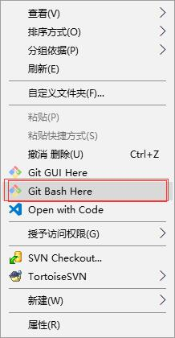  
    3. 使用`git --version`可以查看当前git的版本信息
        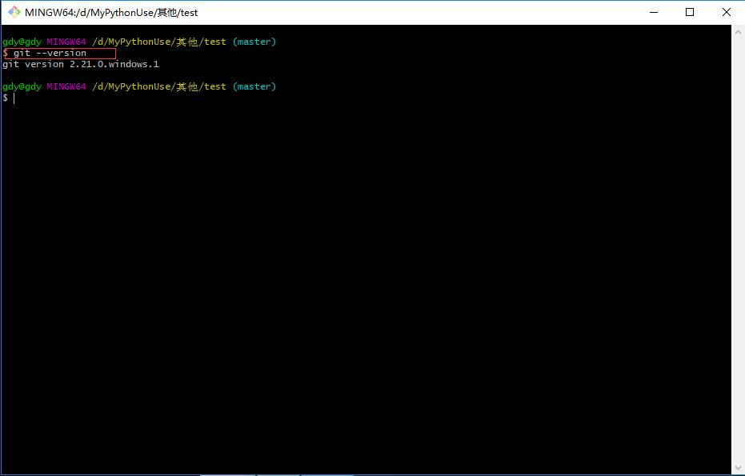  

## git的存储图解

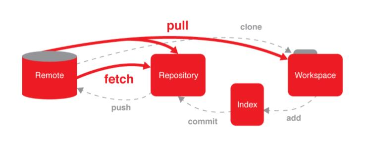  

说明：

|名称|意义|解释|
|:---|:---|:---|
Remote|远程版本库|网络上的另一个版本库，可以和本地库交互
Repository|创库、版本库|git初始化后，会在当前目录生成一个.git目录，这就是版本库
index|索引|介于工作区和版本库之间，暂存修改的，(暂存区)
Workspace|工作空间、版本库|.git文件所在的目录就是工作区,一般是项目的根目录

* git init,可以为当前目录构建git版本管理
    1. 在版本库中，新建一个文件，那么这个文件在Workspace(工作区)中
    2. 使用`git add filename`将filename文件添加到index(暂存区)中
    3. 使用`git commit filename`将filename文件从index(暂存区)添加到创库(Repository)中。
    4. 使用`git push` 将本地仓库(Repository)添加到远程仓库Remote中。

## git的使用

* 操作类

|命令|意义|
|:----|:---|
`git init`|初始化当前目录，为当前目录添加版本管理(初始化一个版本库)
`git add filename`|将filename文件加入版本管理
`git commit filename[-m "注释"]`|将filename从index(暂存区)添加一个到本地厂库(Repository)中。-m 可选参数，为当前操作添加注解。
`git push`|将本地仓库(Repository)添加到远程仓库Remote中。

* 查看信息类

|命令|意义|
|:---|:---|
`git status [-s|--short]`|查看状态, -s段格式输出
`git log`|查看版本库里面提交的历史记录
`git reflog`|显示commit的信息，只要HEAD发生变化，就可以在这里看到

### 常用操作

`git add filename` #单个文件添加  
    * 这一步是吧文件的**当前变化**增加到索引中，也就是以后这个文件需要版本库来跟踪管理。**注意这不是提交**。此时，文件还可以继续修改，还可以添加新的被跟踪文件。一定要add才能把这些改变加入到索引中  

`git add .` #批量添加文件  
    * .点号，代表当前目录，这条命令将**递归**添加当前目录及其子目录所有文件  
    * 只要是目录，就会递归添加该目录下的文件和子目录。  

`git status` #查看状态  
    * -s,--short #段格式输出  

`git commit -m "为本次提交添加备注"` #提交更改到版本库  
    * -m 填写本次日志消息，**必须写**。工作中，程序员应该对每一次提交写明做了什么改动

### 1.初始化一个版本库

* 使用命令 `git init` 可以初始化一个版本库
* 会在当前目录中增加一个.git目录，不要自行修改这个目录里面的文件。当前目录一般是项目的根目录。

1. 选择一个目录在该目录下代开`Git Bash Here`，输入命令`git init`可以为该目录添版本管理
    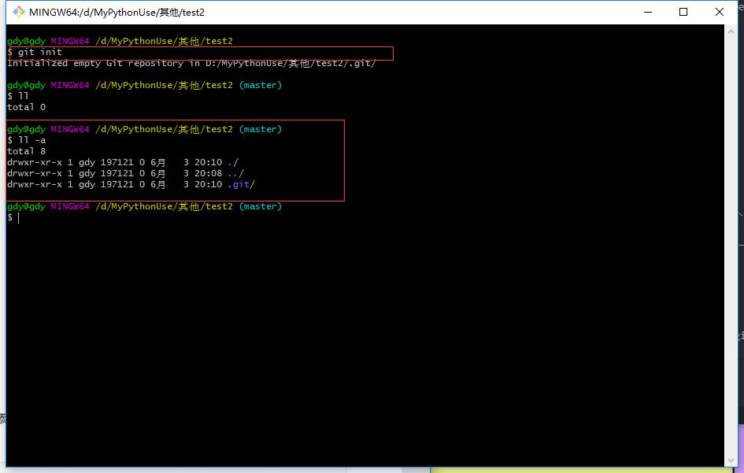  

### 2. 添加文件到版本库中

* 注意，如果已经添加文件到版本库后，如果文件再次被修改，需要再次add添加和再次commit

1. 在管理目录下面新建一个文件abc.html
    >touch abc.html
2. 查看状态
    >git status  

    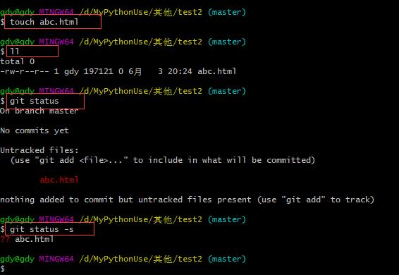  
3. 添加abc.html到管理目录中,再次查看可以看到文件字符颜色为绿色，前面描述为new file
    >git add abc.html  

    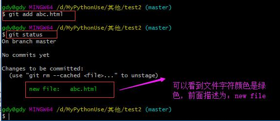  

4. 添加abc.html到本地创库中
    >git commit abc.html -m "1. 第一次提交"  

    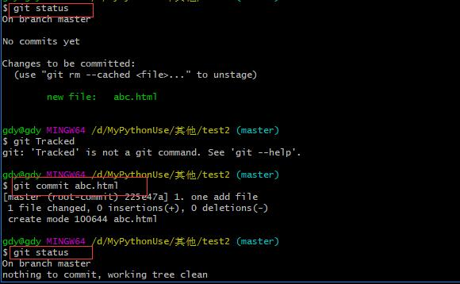  

## Git的文件分类

* 使用git status可以查看git管理的目录状态，通常有如下特征：
    1. 红色，前面没文件描述：表示文件未添加到git管理库中，即文件未管理
    2. new file(绿色):表示该文件为一个新文件，在index索引库中。还未提交到Repository仓库
* Untracked files:没有跟踪的文件
* 追踪的Tracked,已经加入版本库的文件
* 未追踪的Untracked,未加入到版本库的未被管理的文件
* 忽略的ignored,git不在关注的文件，例如一些临时文件

注意：如果在版本管理目录中需要对一些文件不做版本管理，生成一个`.gitignore`文件在管理目录的根目录下。文件内容为不需要管理的文件。(如果需要对某个目录不做版本管理，目录以/结尾)

````gitignore
*.ipynb
__pycache__/
.python-version
````  

* python项目中常用的忽略文件下载地址[https://github.com/github/gitignore/blob/master/Python.gitignore](https://github.com/github/gitignore/blob/master/Python.gitignore)

* 其它语言的在这里找 [https://github.com/github/gitignore](https://github.com/github/gitignore)

## 文件的生命周期

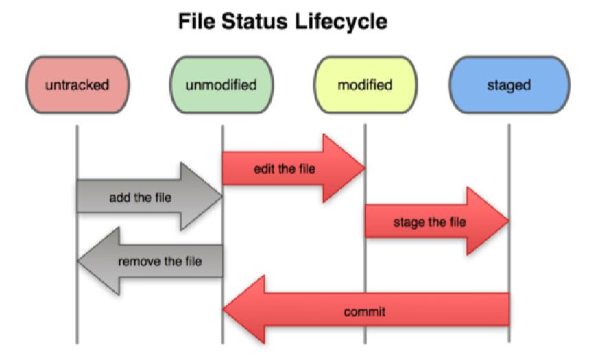  

1. 文件add后，就成为**可跟踪文件的未修改状态unmodified**。
2. 修改后，文件就变成**modified**状态。
3. 再次add后，将变化提交到索引，状态变为**staged**。
4. commit后，提交成功，文件状态从staged变回**unmodifiled**

## git的提交

* git的提交分为两个步骤：  
    1. **暂存变更**：add作用是把新文件或者文件新的改动添加到一个暂存区stage,也就是加入到index中
    2. **提交变更**：commit提交的是暂存区中的改动，而不是物理文件目前的改动，提交到当前分支，默认是master分支  

git的提交过程中，也可以直接使用commit将两步合成一步。  
>git commit index.html  
如果改动了一批文件，一个个写名字很麻烦，使用下面命令  
>git commit -a  
-a,-all参数，会把所有**跟踪的文件**的该东自动暂存，然后commit。上面命令未提交message,会出现一个类似vi命令的操作界面，需要编写message之后，才行。也可以使用下面的命令，把message信息一并填写了  
>git commit -a -m "message"  

## 增补

假如第一次提交后，忘记加入一个文件about.html

````git
$ touch about.htm
$ git add about.htm
$ git commit --amend
[master 40dcd33] Second Commit amend
 Committer: python <python@nodex.(none)> 
Your name and email address were configured automatically based
on your username and hostname. Please check that they are accurate.
You can suppress this message by setting them explicitly:

    git config --global user.name "Your Name"
    git config --global user.email you@example.com

If the identity used for this commit is wrong, you can fix it with:

    git commit --amend --author='Your Name <you@example.com>'

 1 files changed, 1 insertions(+), 1 deletions(-)
create mode 100644 about.htm
````

* `--amend`修改，通过创建一个新的commit来replace当前分支的顶部。  
注意：也可以在命令中继续使用-m选项直接提交message。
* `git log`查看一下版本库里面提交的历史记录，可以看见修改amend后之前的上一次提交记录不见了。
* `git reflog`可以看到真实的操作记录。  

## diff比较差异

查看各种差异  

* `git diff` #查看被跟踪文件未暂存的修改，比较暂存区和工作区
* `git diff -cached` #查看被跟踪文件暂存的修改，比较暂存区和上一次commit的差异
* `git diff HEAD` #查看被跟踪文件，比较工作区和上一次commit的差异。HEAD指代最后一次commit(实质是HEAD指针所指向的版本位置)
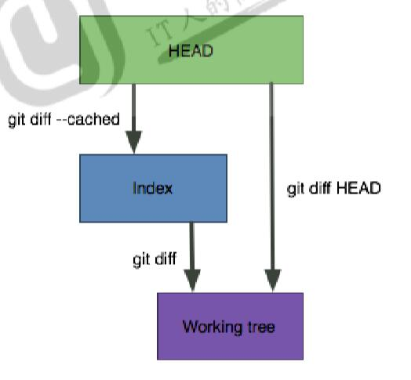  

示例代码：  
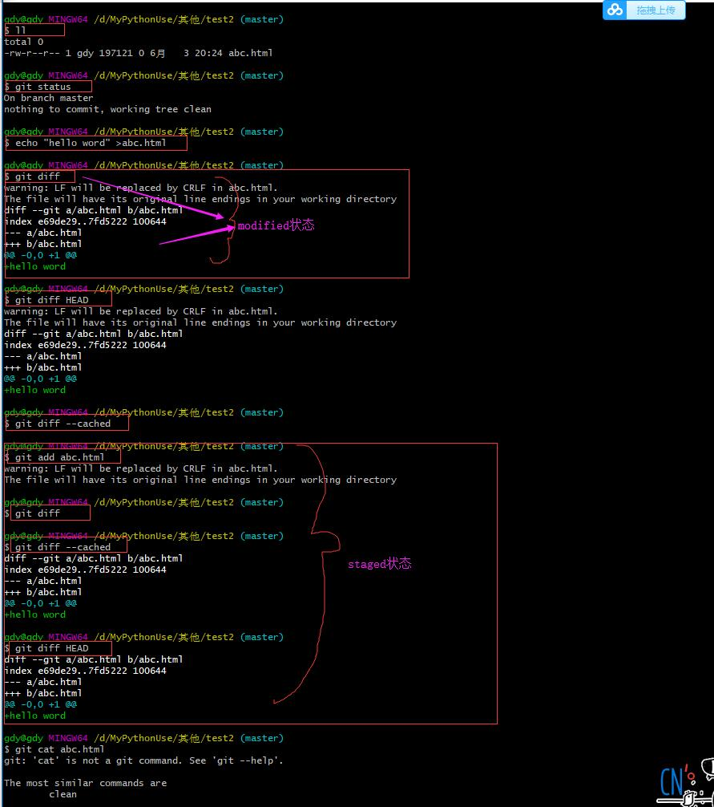  
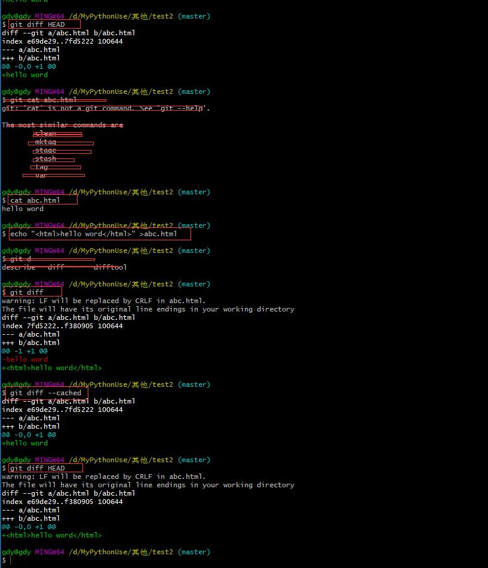  

## HEAD

* HEAD可以看做是一个游标，一般是指向当前分支最后一次提交。
* HEAD的值存储在.git/HEAD文件中。是个ID
* HEAD,指代最后一次commit
* HEAD^,指代上一次提交
* HEAD^^,指代上上一次提交
* 上n次提交，表示为HEAD-n

## 检出checkout和重置

checkout 用于切换分支，或恢复工作区文件。
**注意：checkout会重写工作区，这个命令还是较为危险的。**


