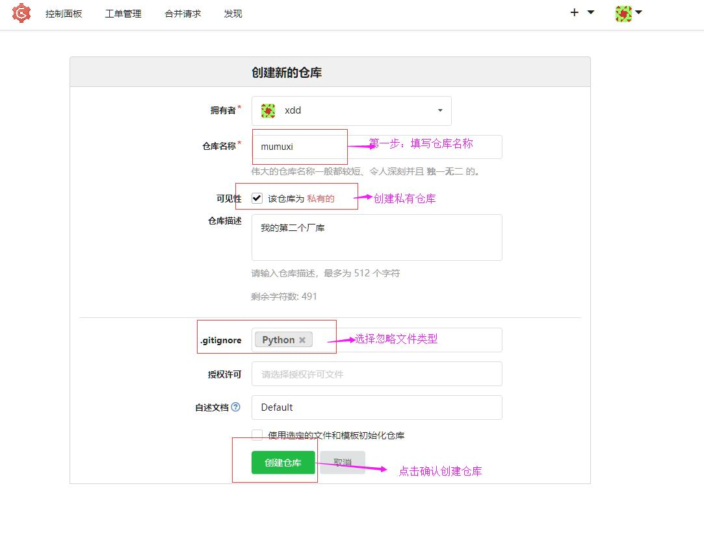
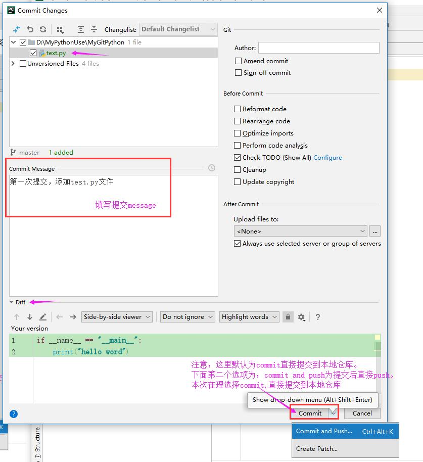

@[toc]

# Pycharm中使用Git

## 1.使用Git私服创建cmdb项目版本库

* 在服务上注册用户后登陆  
  
* 填写厂库信息  
  
* 添加本地ssh密钥  
  
* 获取远程仓库地址：`git@192.168.61.108:xdd/mumuxi.git`  
* 使用pycharm创建一个项目  
  
* 选择项目目录，填入远程版本库地址`git@192.168.61.108:xdd/mumuxi.git`，Test测试一下  
  
* 在项目中新建一个python文件  
  
* 编写代码：  

````python
if __name__ == "__main__":
    print("hello word")
````

* 提交代码  
  
* 填写提交信息(这里可以选择**提交**或**提交并推送**。本次选择**提交**)  
  
* 提交到远程厂库(vcs->git->push)  
  
  
* 提交成功后可以查看远程仓库中的变化：  
  

## 暂存stash

|命令|说明|
|:---|:---|
`git stash filename`|暂时存储最后一次**提交后**的变化，放入栈中
`git stash pop`|从栈中取出刚才保存的变化，并合并

* 新加一个文件并再次提交dispatcher.py  

````python
class Dispatcher:
    cmds = {}
    def reg(self,cmd,fn):
        pass
    def run(self):
        pass
````

* commit提交一下后，并完善分发器代码  

````python
class Dispatcher:
    cmds = {}
    def reg(self,cmd,fn):
        self.cmds[cmd] = fn

    def run(self):
        pass

    def defaultfn(self):
        print("Unknown Command")
````

* 这时候发现text.py急需完善代码，但是分发器模块还没有完成不想提交。这时候讲究需要stash了。  
  
  
* 执行完成，可以看到工作区回到了上次提交的样子。修改急需修改的文件test.py修改完成后提交。  
  
  
* 提交急需修改的文件  
  
* 完成后`unstash pop`恢复刚才完成一半的文件。  
  
  
* 恢复后可以看到，紧急修复的文件还在。而之前临时保存的文件已经恢复了。(dispatcher.py文件又变成了刚才修改过的样子，继续完成代码，提交。 )  
  
  

应用场景  
开发中，当前手中的工作没有完成，需要中断当前工作来完成其他请求，例如修复Bug。 已完成的工作内容提交不合适，可能还要需要大的调整，但是紧急请求又不能不做，就需要stash存储未完成的工 作（上次提交后做的修改）。  

## 分支branch

* 注：以下的操作都在Pycharm中完成，其它IDE都可以实现类似的功能，Git命令操作较为麻烦，不再演示  

多人协作一起开发，开发项目中不同的独立的功能，这些功能可能需要好几天才能完成，又或者定制版本，往往需要一个不同的定制需求。  
代码中至少有一个分支，就是主干分支或称主分支Master，默认都是在主分支上开发。  

### 分支名

* 分支名在版本库中必须唯一  
* 不能以`-`开头  
* 可以使用`/`，但是不能以它结尾，被它分割的名称不能以`.`开头  
* 不能使用两个连续的`..`  
* 不能包含任何空白字符、Git的特殊符号  

### 单分支

  

* 图中绿色节点表示每一次提交commit  
项目往往是并行多人开发的，都在主分支上克隆，然后修改提交，那么主分支就会有存在大量的冲突。甚至有一些 不完善代码提交，主分支就混乱不堪，不可维护了。  

### 多分支

  

创建分支  
需要指明从什么分支上创建什么名字的分支。版本控制的Log标签页  

  

* 在最后最后一次提交分支上用鼠标点击右键，创建NewBranch..新的分支  

  
  

* 到目前就在master上拉出一个分支并切换到了这个新的分支dev上开发，修改test.py，后并提交  
  

* push到服务器看看  
  
* 可以看到服务器上已经多出一个分支  
  


